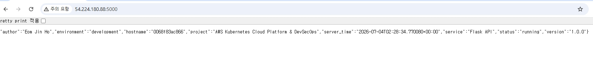
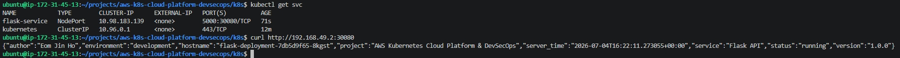

# AWS 기반 Kubernetes Cloud Platform 구축 및 DevSecOps 보안 자동화

<p align="center">


</p>

<p align="center">


</p>

---

## 프로젝트 소개

본 프로젝트는 AWS EC2 환경에서 Kubernetes(Minikube) 기반 Cloud Platform을 직접 구축하고 운영하는 개인 프로젝트입니다.

GitHub Actions와 ArgoCD를 활용하여 GitOps 기반 CI/CD 자동 배포 환경을 구성하고, Prometheus/Grafana를 이용한 모니터링 환경과 Trivy, Kubernetes Secret, ConfigMap, NetworkPolicy를 적용하여 DevSecOps 보안 자동화를 구현하는 것을 목표로 합니다.

단순한 애플리케이션 배포가 아닌 **클라우드 플랫폼 구축 · 운영 · 자동화 · 보안** 전 과정을 직접 구현하는 것을 목표로 합니다.

---

# 프로젝트 목표

- Kubernetes 기반 Cloud Platform 구축
- Docker 기반 컨테이너 환경 구축
- GitHub Actions 기반 CI 자동화
- ArgoCD 기반 GitOps CD 구축
- Prometheus / Grafana 모니터링 구축
- DevSecOps 보안 자동화 구현
- Self-Healing 검증

---

# 프로젝트 운영 전략

## Git Workflow

```text
Windows
        │
        ▼
GitHub
        ▲
        │
EC2
```

- Windows : README, 문서, 스크린샷 관리
- EC2 : 애플리케이션 코드 및 Docker/Kubernetes 구축
- GitHub : Source of Truth

### Branch Strategy

main
        │
feature/dayX
        │
Implement
        │
Commit
        │
Push
        │
Documentation
        │
Merge
        ▼
main

---

# 설계 의사결정 (Design Decisions)

## 왜 EC2를 선택했는가?

Amazon EKS를 바로 사용하는 대신 EC2 기반에서 Kubernetes를 직접 구축하여 클러스터 구성과 운영 원리를 이해하는 것을 목표로 하였습니다.

---

## 왜 Minikube를 선택했는가?

관리형 Kubernetes 서비스(EKS)보다 Kubernetes의 동작 원리를 학습하고 직접 구축하기 위해 Minikube를 선택하였습니다.

향후에는 동일한 구성을 Amazon EKS로 확장할 계획입니다.

---

## 왜 GitHub Actions를 선택했는가?

GitHub Repository와 자연스럽게 연동되며 코드 변경 시 자동으로 Docker 이미지를 빌드하고 Docker Hub에 Push하는 CI 환경을 구축하기 위함입니다.

---

## 왜 ArgoCD를 선택했는가?

Git Repository를 Single Source of Truth로 사용하는 GitOps 방식을 구현하기 위해 선택하였습니다.

---

## 왜 Prometheus / Grafana를 선택했는가?

Kubernetes 환경에서 가장 널리 사용되는 오픈소스 모니터링 플랫폼이며 Pod 상태, CPU, Memory 등을 실시간으로 확인하기 위해 선택하였습니다.

---

## 왜 Trivy를 선택했는가?

Docker Image의 취약점을 자동으로 검사하여 DevSecOps 파이프라인에 보안 검사를 포함하기 위해 선택하였습니다.

---

# 프로젝트 진행 현황

| Day | 내용 | 상태 |
|------|------|------|
| Day1 | AWS EC2 / Docker / Flask | ✅ 완료 |
| Day2 | Kubernetes Cluster / Deployment / Service | ✅ 완료 |
| Day3 | GitHub Actions CI / Docker Hub | ✅ 완료 |
| Day4 | ArgoCD (GitOps CD) | ⚪ 예정 |
| Day5 | Prometheus / Grafana Monitoring | ⚪ 예정 |
| Day6 | DevSecOps Security | ⚪ 예정 |
| Day7 | Documentation & Portfolio | ⚪ 예정 |

---

# 프로젝트 아키텍처

> 프로젝트 완료 후 draw.io Architecture Diagram을 추가할 예정입니다.

```text
Developer

↓

GitHub

↓

GitHub Actions

↓

Docker Hub

↓

ArgoCD

↓

Minikube

↓

Flask

↓

Prometheus

↓

Grafana
```

---

# 프로젝트 디렉터리 구조

```text
aws-k8s-cloud-platform-devsecops/

├── app/
├── k8s/
├── .github/
├── argocd/
├── monitoring/
├── scripts/
├── docs/
├── README.md
├── LICENSE
└── .gitignore
```

---

# 개발 환경

| 항목 | 내용 |
|------|------|
| OS | Ubuntu 24.04 LTS |
| Cloud | AWS EC2 (t3.medium) |
| Storage | Amazon EBS 20GB (gp3) |
| Container Runtime | Docker CE |
| Kubernetes | Minikube v1.38.1 |
| CLI | kubectl v1.36 |
| IDE | VS Code Remote SSH |
| SCM | Git / GitHub |
| CI | GitHub Actions |
| Git Workflow | Feature Branch Strategy |

---

# DAY1

## 구현 목표

- AWS EC2(Ubuntu) 환경 구축
- Docker Engine 설치
- Docker 공식 Repository 구성
- Flask API 개발
- Docker Image 생성
- Docker Container 실행
- Flask API 외부 접속 확인

---

## 구현 결과

✅ AWS EC2 생성

✅ GitHub Repository 생성

✅ Remote SSH 환경 구축

✅ Docker 공식 Repository 등록

✅ Docker Engine 설치

✅ Docker 권한 설정

✅ Flask API 개발

✅ Docker Image 생성

✅ Docker Container 실행

✅ Flask API 외부 접속 성공

---

## 주요 구현 결과




---

## Git Commit

```text
feat(init): initialize project structure and documentation

feat(day1): add flask api and dockerfile
```

---

## DAY1 회고

Docker 설치부터 Flask API 컨테이너 실행까지의 전체 과정을 직접 구축하였다.

Docker 공식 Repository를 사용하여 최신 Docker Engine을 설치하였으며, Docker Permission 문제를 해결하면서 Linux Group Permission 구조를 함께 이해하였다.

또한 Remote SSH 기반 개발 환경을 구축하여 로컬 Windows와 EC2를 GitHub를 중심으로 연동하는 개발 환경을 구성하였다.


# DAY2

## 구현 목표

- GitHub SSH 인증 전환
- Feature Branch 전략 적용
- Minikube 설치
- kubectl 설치
- Kubernetes Cluster 구축
- Deployment 생성
- Service(NodePort) 생성
- Flask API를 Kubernetes Pod 환경으로 이전
- Kubernetes Self-Healing 검증

---

## 구현 결과

✅ GitHub SSH 인증 전환

✅ Feature Branch 전략 적용

✅ Minikube 설치

✅ kubectl 설치

✅ AWS EBS 20GB 온라인 확장

✅ Linux FileSystem 확장

✅ Kubernetes Cluster 구축

✅ Node Ready 확인

✅ Deployment 생성

✅ ReplicaSet 생성

✅ Pod 생성

✅ Service(NodePort) 생성

✅ Kubernetes Self-Healing 확인

✅ Kubernetes Service를 통한 Flask API 응답 확인

✅ Kubernetes ImagePull 오류 해결

## 주요 구현 결과




## Git Commit

```text
feat(day2): build kubernetes deployment and service
```

## DAY2 회고

Docker 환경에서 실행되던 Flask 애플리케이션을 Kubernetes 환경으로 이전하였다.

Minikube 기반 Kubernetes Cluster를 구축하고 Deployment, ReplicaSet, Pod, Service를 직접 구성하였다.

또한 AWS EBS 온라인 확장과 Linux 파일시스템 확장을 경험하였으며, ImagePull 오류를 해결하면서 Docker Image와 Kubernetes 이미지 관리 방식의 차이를 이해할 수 있었다.


# DAY3

## 구현 목표

- GitHub Actions CI Pipeline 구축
- Docker Hub Repository 생성
- GitHub Secrets 등록
- Docker Image 자동 Build
- Docker Image 자동 Push
- Docker Hub Image 검증

---

## 구현 결과

✅ Docker Hub Repository 생성

✅ GitHub Secrets 등록

✅ GitHub Actions Workflow 작성

✅ Docker Build 자동화

✅ Docker Hub Push 성공

✅ Docker Pull 검증

✅ Docker Container 실행 검증

✅ GitHub Hosted Runner 기반 CI Pipeline 검증


## CI Pipeline

```text
Developer

↓

Git Push

↓

GitHub Repository

↓

GitHub Actions

↓

Docker Build

↓

Docker Push

↓

Docker Hub

↓

Image Validation
```


## 주요 구현 결과


## Git Commit

```text
feat(day3): configure github actions ci pipeline
docs(day3): update documentation
```


## DAY3 회고

GitHub Actions 기반 CI Pipeline을 구축하여 Git Push만으로 Docker Image Build와 Docker Hub Push가 자동으로 수행되는 환경을 구성하였다. 또한 Docker Hub에서 이미지를 다시 Pull하여 컨테이너 실행까지 검증함으로써 CI 결과물이 실제 운영 가능한 상태임을 확인하였다.


# 현재까지 구현 흐름

```text
DAY1

AWS EC2

↓

Docker

↓

Flask

────────────────────────

DAY2

Docker

↓

Kubernetes

↓

Deployment

↓

Service

────────────────────────

DAY3

Git Push

↓

GitHub Actions

↓

Docker Hub

↓

Image Validation
```


# Next Step

DAY4에서는 다음 내용을 구현할 예정입니다.

- ArgoCD 설치
- GitOps 기반 CD 구축
- Docker Hub Image 자동 배포
- Kubernetes Deployment 자동 동기화
