# AWS 기반 Kubernetes Cloud Platform 구축 및 DevSecOps 보안 자동화

<p align="center">


</p>

<p align="center">


</p>

---

# Project Overview

본 프로젝트는 AWS EC2 환경에서 Docker와 Kubernetes(Minikube)를 기반으로 Cloud Platform을 직접 구축하고, GitHub Actions와 ArgoCD를 연계한 GitOps 기반 CI/CD 파이프라인을 구현한 개인 프로젝트입니다.

또한 Prometheus·Grafana 기반 Monitoring 플랫폼과 Trivy Security Scan, Kubernetes Secret, ConfigMap, NetworkPolicy를 적용하여 DevSecOps 보안 자동화 환경까지 구축하였습니다.

단순한 애플리케이션 배포가 아닌 **클라우드 인프라 구축 → 컨테이너 오케스트레이션 → CI/CD 자동화 → GitOps → Monitoring → DevSecOps 보안 자동화**까지 Cloud Platform의 전체 라이프사이클을 직접 구현하고 운영하는 것을 목표로 하였습니다.

## Tech Stack

| Category | Technology |
|-----------|------------|
| Cloud | AWS EC2 |
| OS | Ubuntu 24.04 LTS |
| Container | Docker CE |
| Orchestration | Kubernetes (Minikube) |
| CI | GitHub Actions |
| CD | ArgoCD (GitOps) |
| Monitoring | Prometheus, Grafana |
| Security | Trivy, Secret, ConfigMap, NetworkPolicy |
| Language | Python |
| Framework | Flask |
| SCM | Git, GitHub |

---

# Architecture

본 프로젝트는 AWS EC2 기반 Kubernetes 플랫폼에 GitHub Actions 기반 CI, ArgoCD 기반 GitOps CD, Prometheus/Grafana Monitoring, Trivy 기반 DevSecOps Security를 통합하여 구축하였습니다.

<p align="center">
  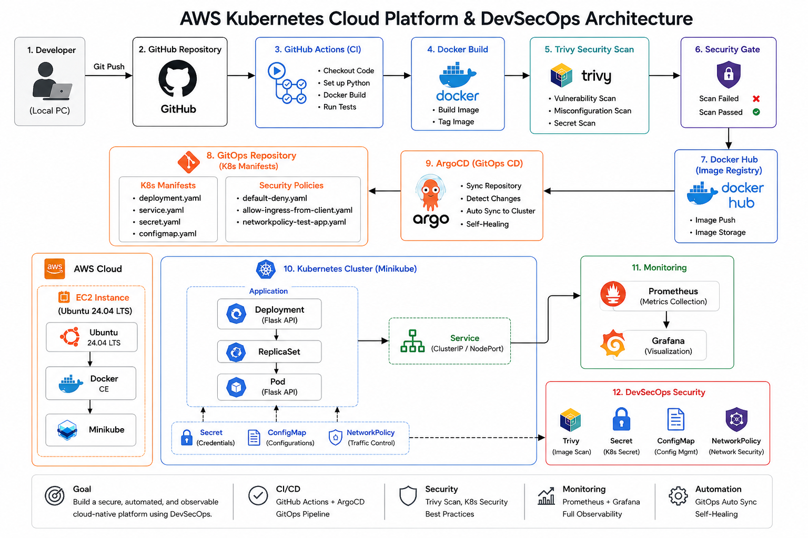
</p>

> **Architecture Overview**
>
> - AWS EC2 기반 Kubernetes(Minikube) 클러스터 구축
> - GitHub Actions 기반 CI 및 Docker Hub Image Registry 연동
> - ArgoCD 기반 GitOps Continuous Delivery 구현
> - Prometheus & Grafana 기반 Monitoring 플랫폼 구축
> - Trivy, Secret, ConfigMap, NetworkPolicy를 적용한 DevSecOps 보안 자동화

---

# Project Highlights

- Built Kubernetes Cloud Platform on AWS EC2
- Implemented GitHub Actions CI Pipeline
- Built GitOps Continuous Delivery with ArgoCD
- Implemented Prometheus & Grafana Monitoring
- Applied DevSecOps Security Automation
- Solved Real-world Kubernetes Troubleshooting


---


# Project Timeline

| Day | Topic | Status |
|------|--------|--------|
| DAY1 | Infrastructure & Container | ✅ |
| DAY2 | Kubernetes Platform | ✅ |
| DAY3 | Continuous Integration | ✅ |
| DAY4 | GitOps Continuous Delivery | ✅ |
| DAY5 | Monitoring & Observability | ✅ |
| DAY6 | DevSecOps Security | ✅ |
| DAY7 | Documentation & Portfolio | ✅ |


## Implementation Flow

```text
Infrastructure  
↓  
Container  
↓  
Kubernetes  
↓  
Continuous Integration  
↓  
GitOps Continuous Delivery  
↓  
Monitoring  
↓  
DevSecOps Security  
↓  
Documentation
```


---

# Key Features

## ☁️ Cloud Platform

- AWS EC2 기반 Kubernetes(Minikube) Cloud Platform 구축
- Docker 기반 Flask 애플리케이션 컨테이너화
- Kubernetes Deployment, Service 및 Self-Healing 검증
- GitHub Feature Branch 기반 프로젝트 운영

---

## 🚀 CI/CD Automation

- GitHub Actions 기반 CI Pipeline 구축
- Docker Image 자동 Build 및 Docker Hub Push
- GitOps 기반 ArgoCD Continuous Delivery 구현
- Git Push만으로 Kubernetes 자동 동기화 검증

---

## 📊 Monitoring & Observability

- Prometheus 기반 Metrics 수집
- Grafana Dashboard 구축
- Node Exporter 및 kube-state-metrics 구성
- Kubernetes Cluster 및 Node 실시간 모니터링

---

## 🔒 DevSecOps Security

- Trivy 기반 Container Image 취약점 분석
- GitHub Actions Security Gate 구축
- Kubernetes Secret 및 ConfigMap 적용
- Calico CNI 기반 NetworkPolicy 구현
- Pod 간 통신 제어 및 최소 권한(Least Privilege) 검증

---

## 📚 Documentation

- 프로젝트 단계별 기술 문서 작성 (DAY1 ~ DAY6)
- Master Document 기반 설계 및 운영 문서 관리
- Troubleshooting 및 문제 해결 과정 기록
- GitHub Portfolio 및 README 지속 개선


---


# Major Troubleshooting

| Issue | Root Cause | Solution |
|-------|------------|----------|
| Docker Permission Denied | Docker Group Permission | Added user to docker group and reloaded session |
| ErrImageNeverPull | imagePullPolicy configuration | Updated imagePullPolicy and rebuilt image |
| ArgoCD Auto Sync Failed | Target Revision mismatch | Changed Target Revision to active feature branch |
| Initial OutOfSync | Missing Tracking Annotation | Performed initial Manual Sync |
| Kubernetes API Server Timeout | EC2 resource shortage | Upgraded EC2 from t3.medium to t3.large |
| Grafana / ArgoCD NodePort Access Failed | Minikube Docker Driver networking limitation | Used kubectl port-forward for dashboard access |
| NetworkPolicy Not Working | Default CNI limitation | Rebuilt Minikube with Calico CNI |
| GitOps Branch Synchronization | Deleted feature branch | Updated ArgoCD Target Revision |

## Key Takeaways

- Understood Kubernetes platform architecture by building it from scratch.
- Experienced GitOps-based Continuous Delivery using ArgoCD.
- Built an end-to-end CI/CD pipeline with GitHub Actions.
- Implemented monitoring using Prometheus and Grafana.
- Applied DevSecOps security automation with Trivy and Kubernetes Security resources.
- Improved troubleshooting skills by resolving real-world Kubernetes and infrastructure issues.


---

# Development Workflow

## Git Workflow

```text
Windows
        │
        ▼
GitHub
        ▲
        │
EC2
```

- Windows : README, 문서, 스크린샷 관리
- EC2 : 애플리케이션 코드 및 Docker/Kubernetes 구축
- GitHub : Source of Truth

### Branch Strategy

main
        │
feature/dayX
        │
Implement
        │
Commit
        │
Push
        │
Documentation
        │
Merge
        ▼
main

---


# Design Decisions

## 왜 EC2를 선택했는가?

Amazon EKS를 바로 사용하는 대신 EC2 기반에서 Kubernetes를 직접 구축하여 클러스터 구성과 운영 원리를 이해하는 것을 목표로 하였습니다.

---

## 왜 Minikube를 선택했는가?

관리형 Kubernetes 서비스(EKS)보다 Kubernetes의 동작 원리를 학습하고 직접 구축하기 위해 Minikube를 선택하였습니다.

향후에는 동일한 구성을 Amazon EKS로 확장할 계획입니다.

---

## 왜 GitHub Actions를 선택했는가?

GitHub Repository와 자연스럽게 연동되며 코드 변경 시 자동으로 Docker 이미지를 빌드하고 Docker Hub에 Push하는 CI 환경을 구축하기 위함입니다.

---

## 왜 ArgoCD를 선택했는가?

Git Repository를 Single Source of Truth로 사용하는 GitOps 방식을 구현하기 위해 선택하였습니다.

---

## 왜 Prometheus / Grafana를 선택했는가?

Kubernetes 환경에서 가장 널리 사용되는 오픈소스 모니터링 플랫폼이며 Pod 상태, CPU, Memory 등을 실시간으로 확인하기 위해 선택하였습니다.

---

## 왜 Trivy를 선택했는가?

Docker Image의 취약점을 자동으로 검사하여 DevSecOps 파이프라인에 보안 검사를 포함하기 위해 선택하였습니다.

---

## 왜 Kubernetes Secret을 선택했는가?

애플리케이션 코드와 민감한 설정 정보를 분리하기 위해 Kubernetes Secret을 적용하였습니다.

실제 운영 환경에서는 AWS Secrets Manager, HashiCorp Vault 등을 사용하지만 본 프로젝트에서는 Kubernetes Secret의 동작 원리와 환경 변수 주입 방식을 검증하는 것을 목표로 하였습니다.

---

## 왜 ConfigMap을 선택했는가?

애플리케이션의 일반 설정(LOG_LEVEL, APP_REGION 등)을 코드와 분리하여 관리하기 위해 ConfigMap을 적용하였습니다.

이를 통해 운영 환경에서 설정 변경 시 애플리케이션 이미지를 다시 빌드하지 않아도 되는 구조를 구현하였습니다.

---

## 왜 NetworkPolicy를 선택했는가?

Kubernetes Pod 간 통신을 최소 권한 원칙(Least Privilege)에 따라 제어하기 위해 NetworkPolicy를 적용하였습니다.

Calico CNI를 이용하여 실제 통신 허용 및 차단을 검증하였으며, 허용된 Pod만 접근 가능한 화이트리스트 기반 정책을 구현하였습니다.

---


# Development Environment

| 항목 | 내용 |
|------|------|
| OS | Ubuntu 24.04 LTS |
| Cloud | AWS EC2 (t3.medium → t3.large) |
| Storage | Amazon EBS 20GB (gp3) |
| Container Runtime | Docker CE |
| Kubernetes | Minikube v1.38.1 |
| CLI | kubectl v1.36 |
| IDE | VS Code Remote SSH |
| SCM | Git / GitHub |
| CI | GitHub Actions |
| Git Workflow | Feature Branch Strategy |
| Security Scan | Trivy v0.72.0 |
| CNI | Calico |

---

# Project Directory

```text
aws-k8s-cloud-platform-devsecops

├── app                 # Flask Application
├── k8s                 # Kubernetes Manifests
├── argocd              # GitOps Configuration
├── security            # DevSecOps Security Resources
├── .github/workflows   # CI/CD Pipelines
├── docs
│   ├── architecture    # Architecture Diagram
│   ├── project-diary   # Daily Technical Documentation
│   ├── screenshots     # Project Screenshots
│   ├── trouble-shooting# Troubleshooting Documents
│   └── interview       # Interview Preparation
│
├── README.md
└── LICENSE
```

---

# DAY1 – Infrastructure & Container

## Key Deliverables

- AWS EC2 기반 개발 환경 구축
- Docker Engine 및 Docker Repository 구성
- Flask API 컨테이너화
- Docker Image 생성 및 Container 실행
- Flask API 외부 접속 검증

---

## Screenshots

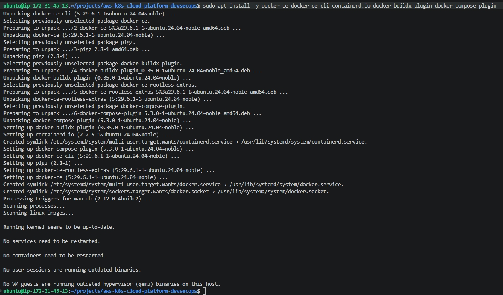

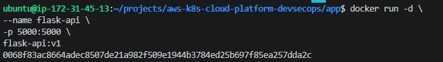


---

## Lessons Learned

Docker Engine 설치부터 Flask API 컨테이너 실행까지 직접 구축하며 Docker Image와 Container의 동작 원리를 이해하였다.

또한 Docker Permission 문제를 해결하며 Linux 사용자 및 Group Permission 구조를 학습하였고, Remote SSH 기반 개발 환경을 구성하여 Windows와 EC2를 GitHub 중심으로 운영하는 개발 환경을 구축하였다.

---

## Detail Documentation

📄 Technical Documentation

- [DAY1 – Infrastructure & Container](docs/project-diary/day1/day1.md)


# DAY2 – Kubernetes Platform

## Key Deliverables

- GitHub SSH 인증 및 Feature Branch 전략 적용
- Minikube 기반 Kubernetes Cluster 구축
- Deployment 및 Service 생성
- Flask 애플리케이션의 Kubernetes 환경 이전
- Kubernetes Self-Healing 및 Service 통신 검증
- AWS EBS 온라인 확장 및 ImagePull 문제 해결

---

## Screenshots

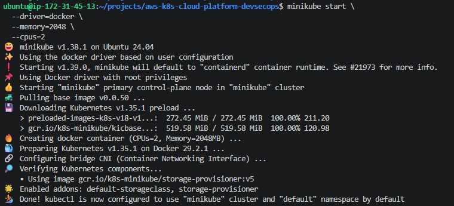

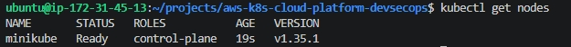

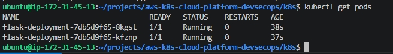


---

## Lessons Learned

기존 Docker 환경에서 실행되던 Flask 애플리케이션을 Kubernetes 환경으로 이전하며 Deployment, ReplicaSet, Pod, Service의 동작 원리를 이해하였다.

또한 AWS EBS 온라인 확장과 Linux 파일시스템 확장을 직접 수행하였으며, ImagePull 오류를 해결하면서 Docker Image와 Kubernetes Image 관리 방식의 차이와 Kubernetes Self-Healing 메커니즘을 학습하였다.

---

## Detail Documentation

📄 Technical Documentation

- [DAY2 – Kubernetes Platform](docs/project-diary/day2/day2.md)


# DAY3 – Continuous Integration

## Key Deliverables

- GitHub Actions 기반 CI Pipeline 구축
- Docker Hub Repository 및 GitHub Secrets 구성
- Docker Image 자동 Build 및 Push 구현
- GitHub Hosted Runner 기반 CI 환경 구축
- Docker Hub Image Pull 및 Container 실행 검증

---

## CI Pipeline

```text
Developer

↓

Git Push

↓

GitHub Repository

↓

GitHub Actions

↓

Docker Build

↓

Docker Push

↓

Docker Hub

↓

Image Validation
```

---

## Screenshots

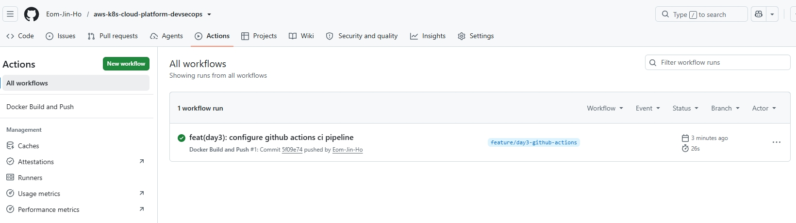

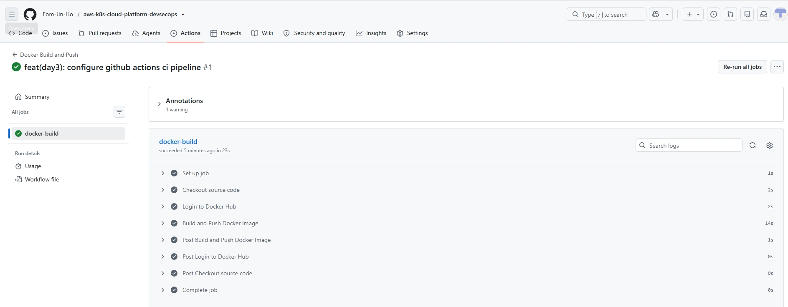

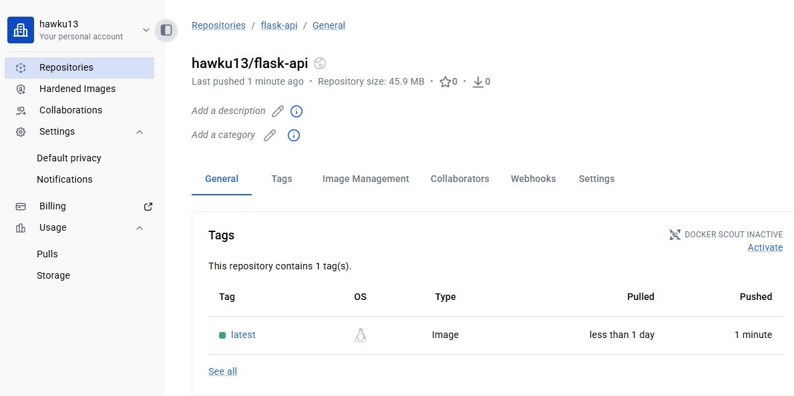

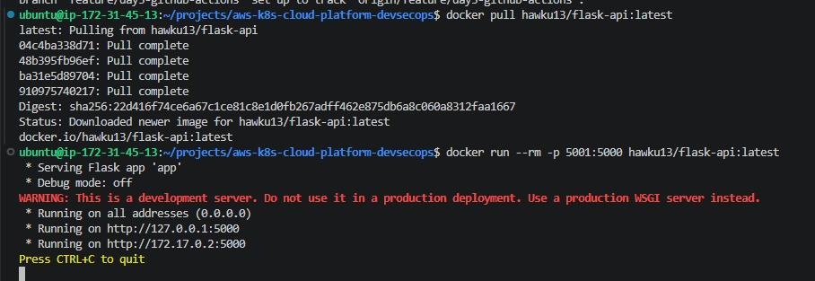

---

## Lessons Learned

GitHub Actions를 이용하여 Git Push만으로 Docker Image Build와 Docker Hub Push가 자동으로 수행되는 CI(Continuous Integration) 환경을 구축하였다.

또한 GitHub Hosted Runner의 동작 원리를 이해하고, Docker Hub에서 이미지를 다시 Pull하여 컨테이너 실행까지 검증함으로써 CI 파이프라인의 결과물이 실제 운영 가능한 상태임을 확인하였다.

---

## Detail Documentation

📄 Technical Documentation

- [DAY3 – Continuous Integration](docs/project-diary/day3/day3.md)


# DAY4 – GitOps Continuous Delivery

## Key Deliverables

- ArgoCD 기반 GitOps 환경 구축
- Git Repository와 Kubernetes Cluster 연동
- Kubernetes Application 생성
- Manual Sync 및 Auto Sync 검증
- Git 변경 사항의 Kubernetes 자동 반영 검증
- Desired State와 Actual State 동기화 확인

---

## GitOps Architecture

```text
Developer

↓

Git Push

↓

GitHub Repository

↓

GitHub Actions

↓

Docker Hub

↓

ArgoCD

↓

Sync

↓

Deployment

↓

ReplicaSet

↓

Pod
```

---

## Screenshots

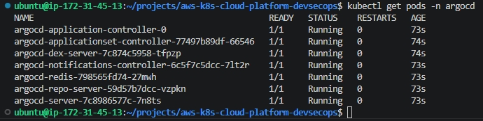

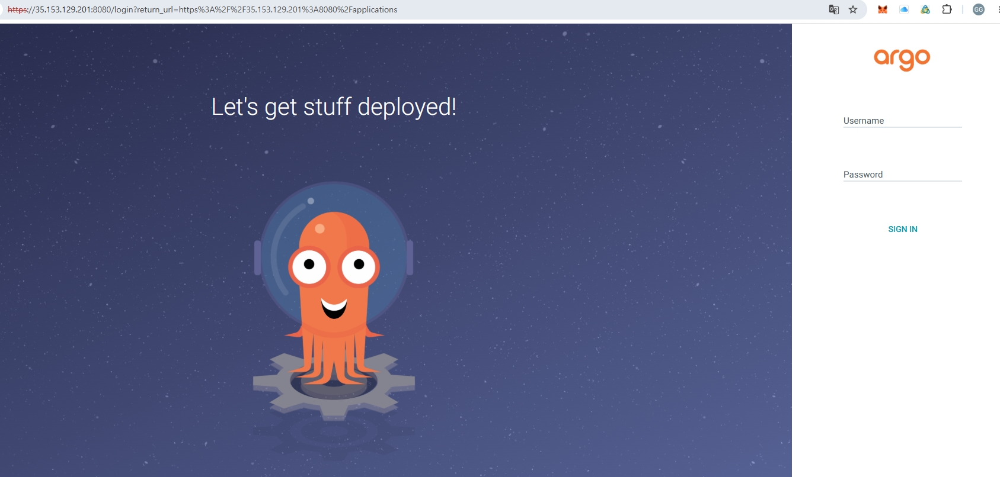

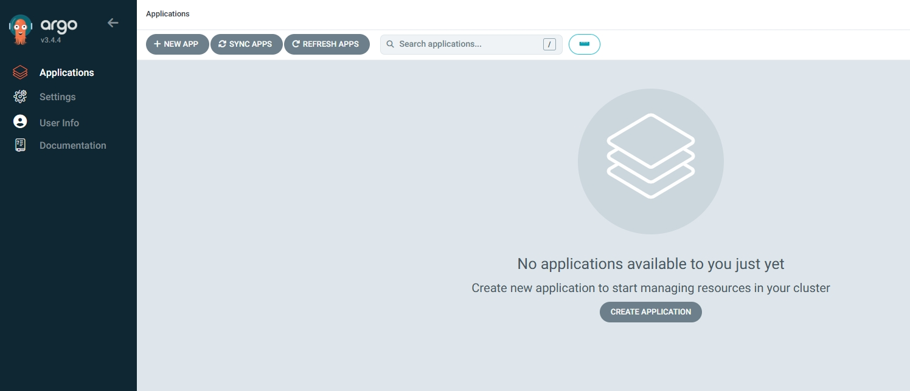

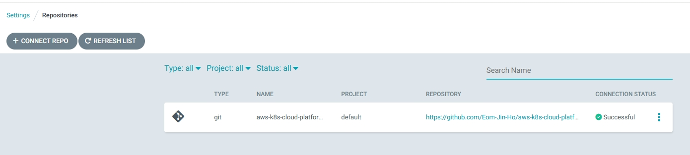

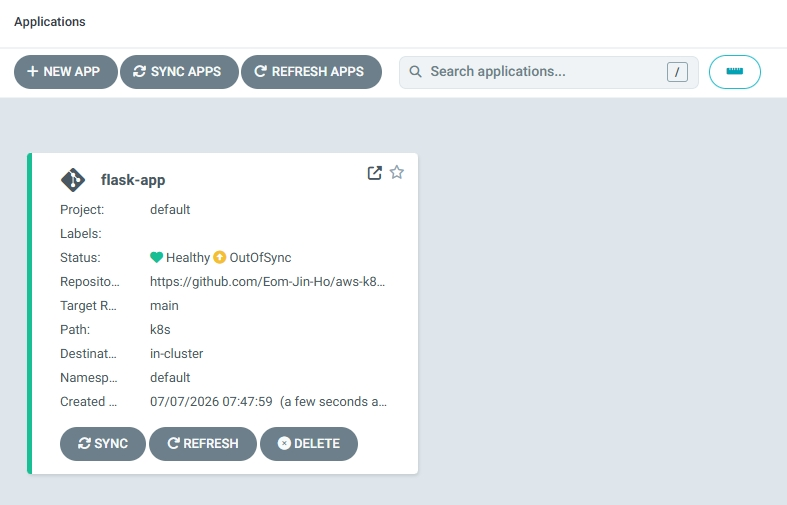

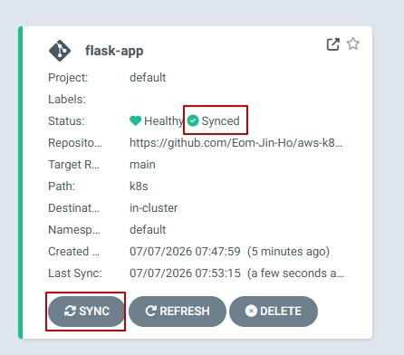

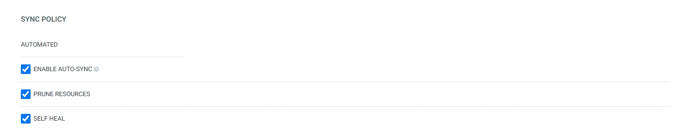

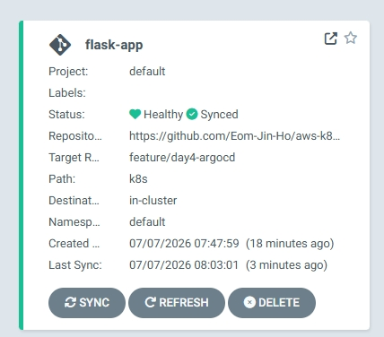

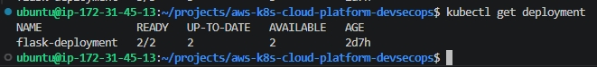

---

## Lessons Learned

ArgoCD를 구축하여 Git Repository를 Single Source of Truth로 사용하는 GitOps 기반 Continuous Delivery 환경을 구현하였다.

GitHub Repository와 Kubernetes Cluster를 연결하고 Manual Sync와 Auto Sync를 모두 검증하면서 Git 변경 사항이 Kubernetes Deployment와 Pod에 자동으로 반영되는 GitOps 운영 방식을 이해하였다.

또한 Target Revision과 Desired State, Actual State의 개념을 직접 검증하며 GitOps 기반 Kubernetes 운영 원리를 체득하였다.

---

## Detail Documentation

📄 Technical Documentation

- [DAY4 – GitOps Continuous Delivery](docs/project-diary/day4/day4.md)


# DAY5 – Monitoring & Observability

## Key Deliverables

- Prometheus 기반 Monitoring 플랫폼 구축
- Grafana Dashboard 구성
- Prometheus Operator 및 kube-prometheus-stack 적용
- Node Exporter와 kube-state-metrics 구성
- Kubernetes Cluster 및 Node Monitoring 검증
- Kubernetes API Server 장애 분석 및 복구

---

## Monitoring Architecture

```text
             Kubernetes Cluster

          ┌────────┴────────┐
          │                 │

     Linux Node      Kubernetes API

          │                 │

   Node Exporter   kube-state-metrics

          └────────┬────────┘

                   │

              Prometheus

                   │

               Grafana

                   │

              Dashboard

                   │

              Administrator
```

---

## Screenshots


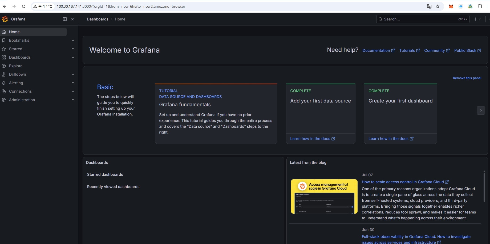

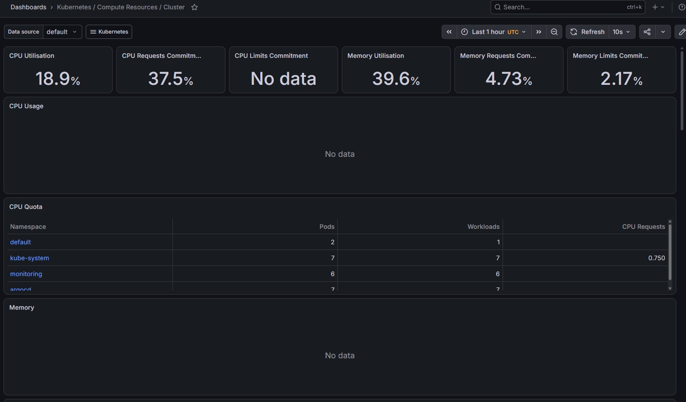

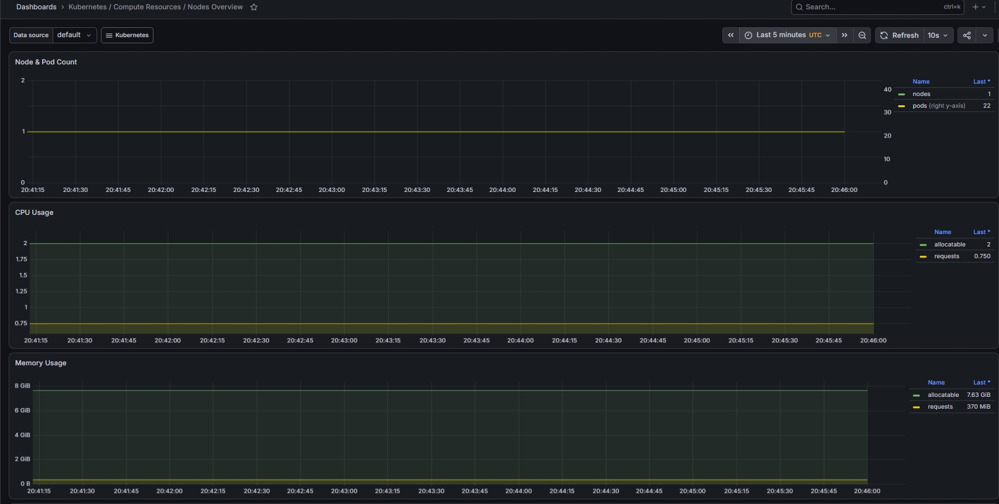

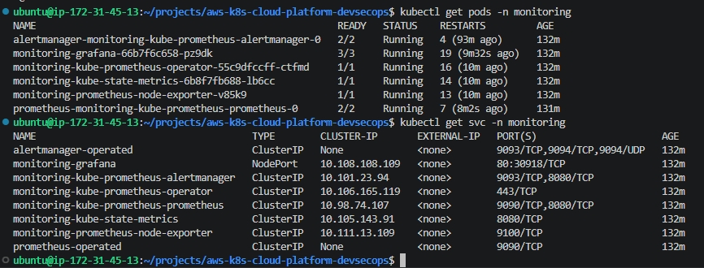

---

## Lessons Learned

Prometheus와 Grafana를 이용하여 Kubernetes Monitoring 플랫폼을 구축하고, Node Exporter와 kube-state-metrics를 통해 Cluster와 Node의 상태를 실시간으로 수집하고 시각화하였다.

또한 Monitoring Stack 구축 과정에서 Kubernetes API Server 장애를 직접 분석하고 EC2 인스턴스를 증설하여 문제를 해결하면서 운영 환경에서 발생할 수 있는 장애 분석과 복구 과정을 경험하였다.

이를 통해 프로젝트를 구축(Build) 중심에서 운영(Operation) 관점까지 확장하며 Monitoring 플랫폼의 중요성을 이해할 수 있었다.

---

## Detail Documentation

📄 Technical Documentation

- [DAY5 – Monitoring & Observability](docs/project-diary/day5/day5.md)

---

# DAY6 – DevSecOps Security

## Key Deliverables

- Trivy 기반 Container Image Security Scan 구축
- GitHub Actions Security Gate 적용
- HIGH / CRITICAL 취약점 자동 차단 검증
- Kubernetes Secret 및 ConfigMap 적용
- Calico CNI 기반 NetworkPolicy 구성
- Pod 간 통신 제어 및 DevSecOps 보안 자동화 구현

---

## DevSecOps Architecture

```text
Developer

↓

Git Push

↓

GitHub Repository

↓

GitHub Actions

↓

Docker Build

↓

Trivy Scan

↓

Security Gate

↓

Docker Hub

↓

ArgoCD

↓

Kubernetes

        │

Secret

ConfigMap

NetworkPolicy

↓

Pod (Flask)
```

---

## Screenshots

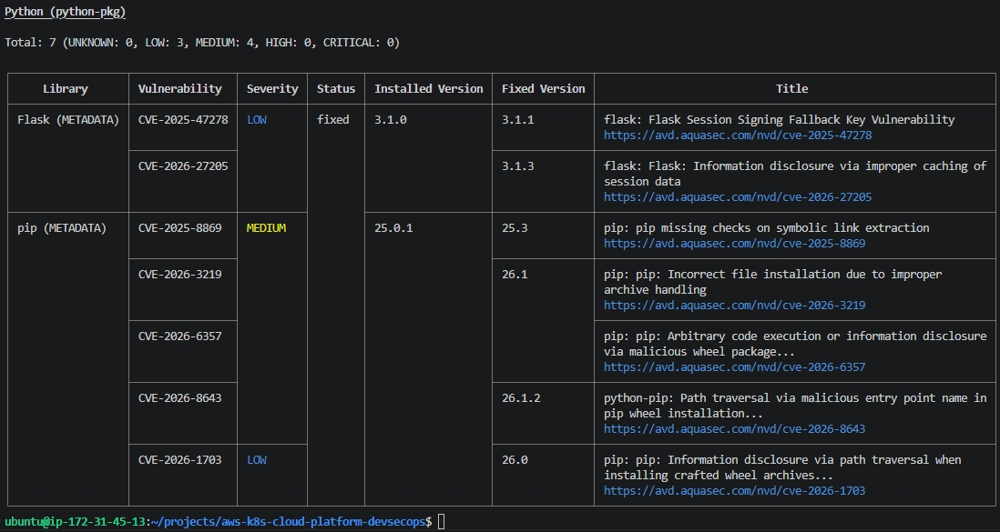

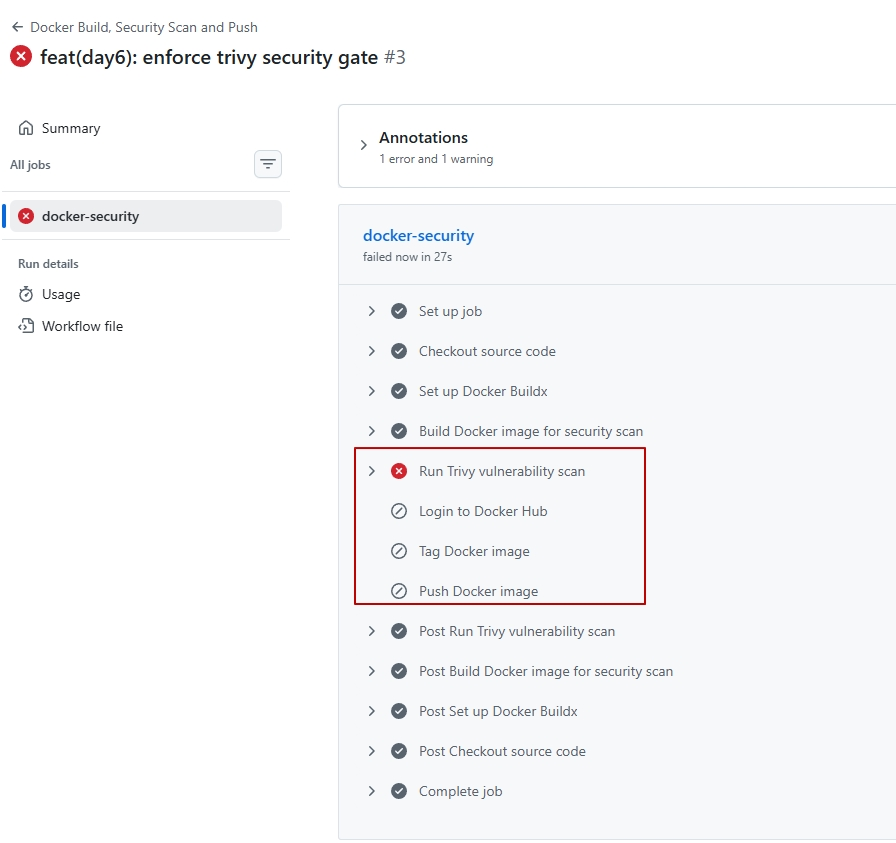

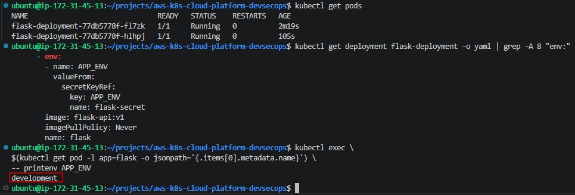

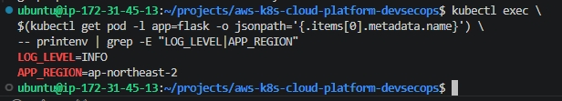

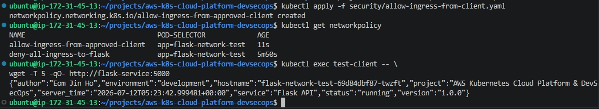

---

## Lessons Learned

Trivy를 이용한 Container Image 취약점 분석과 GitHub Actions Security Gate를 통해 CI 단계에서 보안을 자동화하는 DevSecOps 환경을 구축하였다.

또한 Kubernetes Secret과 ConfigMap을 이용하여 애플리케이션 설정과 민감한 정보를 분리하고, Calico CNI 기반 NetworkPolicy를 적용하여 Pod 간 통신을 최소 권한 원칙에 따라 제어하였다.

특히 NetworkPolicy는 Kubernetes 자체가 아닌 CNI가 실제 네트워크를 제어한다는 점을 직접 검증하며 Kubernetes 보안 구조와 DevSecOps 운영 방식을 심도 있게 이해할 수 있었다.

---

## Detail Documentation

📄 Technical Documentation

- [DAY6 – DevSecOps Security](docs/project-diary/day6/day6.md)


# Project Evolution

```text
DAY1
Infrastructure
AWS EC2
Docker
Flask API

        │
        ▼

DAY2
Container Orchestration
Kubernetes
Deployment
Service

        │
        ▼

DAY3
Continuous Integration
GitHub Actions
Docker Hub

        │
        ▼

DAY4
GitOps Continuous Delivery
ArgoCD
Auto Sync

        │
        ▼

DAY5
Monitoring & Observability
Prometheus
Grafana

        │
        ▼

DAY6
DevSecOps Security
Trivy
Security Gate
NetworkPolicy
```


# Future Improvements

- Amazon EKS Migration
- Terraform Infrastructure as Code
- AWS Secrets Manager Integration
- OPA Gatekeeper Policy Enforcement
- Falco Runtime Security
- Kubernetes Admission Controller