# DAY5 - Prometheus & Grafana 기반 Kubernetes Monitoring 구축

---

# 1. DAY5 목표

DAY5의 목표는 Kubernetes Cluster에 Prometheus와 Grafana 기반 Monitoring 플랫폼을 구축하고, Cluster 및 Node의 CPU, Memory, Pod 상태를 실시간으로 모니터링할 수 있는 운영 환경을 구성하는 것이다.

기존 DAY1부터 DAY4까지는 애플리케이션을 배포하기 위한 Infrastructure, Container, Kubernetes, CI, GitOps 기반 CD 환경을 구축하였다.

DAY5부터는 배포된 서비스를 안정적으로 운영하기 위한 Monitoring 단계로 전환하여 Kubernetes 운영 환경을 가시화(Visibility)하는 것을 목표로 한다.

또한 Prometheus Operator와 kube-prometheus-stack을 이용하여 Monitoring Stack을 표준 방식으로 구축하고, Grafana Dashboard를 통해 Kubernetes Cluster 상태를 실시간으로 확인하는 운영 환경을 구성하는 것을 목표로 한다.

구축 과정에서는 Kubernetes API Server Timeout 문제를 직접 분석하고 EC2 인스턴스 증설을 통해 문제를 해결하면서 실제 운영 환경에서 발생할 수 있는 장애 대응 경험도 함께 수행하였다.

---

# 2. DAY5 완료 목표

- Monitoring Namespace 생성
- Helm 설치
- Prometheus Community Repository 등록
- kube-prometheus-stack 설치
- Prometheus 구축
- Grafana 구축
- Prometheus Operator 구축
- Node Exporter 구축
- kube-state-metrics 구축
- Grafana Dashboard 구성
- Kubernetes Cluster Monitoring
- Kubernetes Node Monitoring
- Grafana 외부 접속 검증
- Kubernetes Monitoring 플랫폼 구축 완료

---

# 3. 구축 환경

| 항목 | 내용 |
|------|------|
| Cloud | AWS EC2 (t3.medium → t3.large) |
| OS | Ubuntu 24.04 LTS |
| Container Runtime | Docker CE |
| Kubernetes | Minikube v1.38.1 |
| Monitoring | Prometheus |
| Dashboard | Grafana |
| Package Manager | Helm v3.21.2 |
| Metrics | Prometheus Operator, Node Exporter, kube-state-metrics |
| IDE | VS Code Remote SSH |
| SCM | Git / GitHub |
| Git Workflow | Feature Branch Strategy |

> **참고**
>
> `kube-prometheus-stack` 설치 과정에서 Kubernetes API Server가 메모리 부족으로 비정상 종료되는 문제가 발생하였다.
>
> 문제 해결을 위해 EC2 인스턴스를 **t3.medium(4GB)** 에서 **t3.large(8GB)** 로 증설한 후 Monitoring 플랫폼 구축을 완료하였다.

---

# 4. 전체 아키텍처

```text
Windows (VS Code)

        │

Remote SSH

        │

AWS EC2 (Ubuntu)

        │

Docker Engine

        │

Minikube

        │

Kubernetes Cluster

        │

Prometheus Operator

        │

Prometheus

   ┌────┴────┐
   │         │

Node Exporter
kube-state-metrics

        │

Grafana

        │

Monitoring Dashboard
```

---

# 5. DAY5에서 구현한 기능

- Monitoring Namespace 생성
- Helm 설치
- Prometheus Community Repository 등록
- kube-prometheus-stack 설치
- Prometheus 구축
- Grafana 구축
- Prometheus Operator 구축
- Node Exporter 구축
- kube-state-metrics 구축
- Grafana Dashboard 구성
- Kubernetes Cluster Monitoring
- Kubernetes Node Monitoring
- Grafana 외부 접속 검증
- Monitoring 플랫폼 구축
- Kubernetes API Server Timeout 문제 해결
- EC2 인스턴스 증설 및 Monitoring 환경 안정화

---

# 6. 프로젝트 디렉터리

```text
aws-k8s-cloud-platform-devsecops

├── app
│
├── k8s
│
├── argocd
│
├── monitoring
│
├── docs
│   ├── screenshots
│   │   └── day5
│   │
│   └── project-diary
│       └── day5
│           └── day5.md
│
└── README.md
```

# 7. 구축 과정

DAY5에서는 Kubernetes Cluster를 안정적으로 운영하기 위한 Monitoring 플랫폼을 구축하였다.

기존 DAY1부터 DAY4까지는 Infrastructure, Container, Kubernetes, CI, GitOps 기반 CD 환경을 구축하였다.

DAY5에서는 Prometheus와 Grafana를 이용하여 Kubernetes Cluster 상태를 실시간으로 수집하고 시각화하는 운영 환경을 구성하였다.

또한 Helm을 이용하여 kube-prometheus-stack을 설치하고, Grafana Dashboard를 통해 Kubernetes Cluster와 Node의 리소스 상태를 모니터링하였다.

구축 과정에서는 Kubernetes API Server Timeout 문제를 직접 분석하고 EC2 인스턴스를 증설하여 문제를 해결함으로써 실제 운영 환경에서 발생할 수 있는 장애 대응 경험도 함께 수행하였다.

---

## 7-1. Monitoring Namespace 생성

### 배경

DAY4에서는 ArgoCD를 이용하여 GitOps 기반 Continuous Delivery 환경을 구축하였다.

DAY5부터는 Kubernetes Cluster를 운영하기 위한 Monitoring 플랫폼을 구축한다.

Prometheus와 Grafana는 애플리케이션이 아닌 운영(Operations)을 위한 구성 요소이므로 기존 Flask 애플리케이션이 실행 중인 Namespace와 분리하여 관리하는 것이 바람직하다.

이를 위해 Monitoring 전용 Namespace를 먼저 생성하였다.

---

### 목적

Prometheus, Grafana, Alertmanager 등 Monitoring 관련 리소스를 별도의 Namespace에서 독립적으로 관리한다.

---

### Why?

Kubernetes에서는 모든 리소드를 하나의 Namespace에서 운영할 수도 있지만, 실제 운영 환경에서는 역할에 따라 Namespace를 분리하여 관리하는 것이 일반적이다.

Monitoring 플랫폼은 장애 분석과 성능 모니터링을 담당하는 핵심 운영 시스템이므로 애플리케이션과 분리하여 관리하는 것이 유지보수와 운영 측면에서 유리하다.

이번 프로젝트에서도 Monitoring 전용 Namespace를 생성하여 운영 환경과 애플리케이션 환경을 논리적으로 분리하였다.

---

### Namespace 구성

```text
default Namespace

↓

Flask Deployment

Flask Service

────────────────────────

monitoring Namespace

↓

Prometheus

Grafana

Alertmanager

Node Exporter

kube-state-metrics
```

---

### 사용 명령어

```bash
kubectl create namespace monitoring
```

---

### 명령어 설명

| 명령어 | 설명 |
|---------|------|
| `kubectl create` | Kubernetes 리소스를 생성한다. |
| `namespace` | Namespace 리소스를 생성한다. |
| `monitoring` | Monitoring 플랫폼에서 사용할 Namespace 이름이다. |

---

### 실행 결과

`monitoring` Namespace가 정상적으로 생성되었다.

이후 설치하는 Prometheus, Grafana, Alertmanager, Node Exporter 등 모든 Monitoring 관련 리소리는 해당 Namespace에 배포하도록 구성하였다.

---

### 결과 분석

Monitoring 플랫폼을 위한 독립적인 운영 공간이 준비되었다.

애플리케이션과 운영 리소스를 분리함으로써 향후 권한 관리(RBAC), ResourceQuota, NetworkPolicy 등을 Namespace 단위로 적용할 수 있는 기반을 마련하였다.

---

### 학습 포인트

- Namespace는 Kubernetes 리소스를 논리적으로 분리하는 기능이다.
- 운영 환경에서는 애플리케이션과 운영 플랫폼을 별도의 Namespace로 분리하는 것이 일반적이다.
- Monitoring 플랫폼은 독립적인 Namespace에서 관리하는 것이 유지보수와 운영 측면에서 유리하다.

---

### 캡처

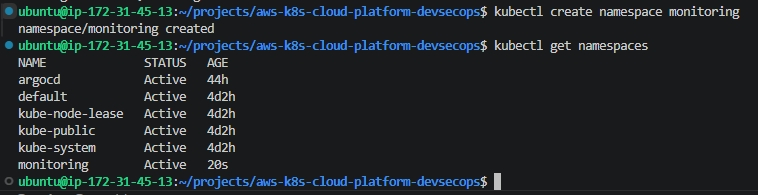

---

### 실무 TIP

기업 환경에서는 Monitoring 외에도 Ingress, Logging, Dev, Staging, Production 등 역할별로 Namespace를 분리하여 운영하는 것이 일반적이다.

이를 통해 리소스 관리와 접근 제어를 보다 효율적으로 수행할 수 있다.

---

### 운영 시 고려사항

Namespace는 Kubernetes 운영의 기본 단위이다.

프로젝트 초기부터 역할에 따라 Namespace를 분리하면 서비스가 확장되더라도 일관된 운영 구조를 유지할 수 있다.


## 7-2. Helm 설치

### 배경

Monitoring 플랫폼을 구축하기 위해서는 Prometheus와 Grafana를 Kubernetes Cluster에 설치해야 한다.

그러나 Prometheus와 Grafana는 단순한 Deployment 하나로 구성되는 애플리케이션이 아니라 Deployment, Service, ConfigMap, Secret, ServiceAccount, ClusterRole, ClusterRoleBinding, Custom Resource Definition(CRD) 등 다양한 Kubernetes 리소리로 구성된다.

이러한 리소스를 모두 YAML 파일로 직접 생성하고 관리하는 것은 매우 복잡하며 유지보수 또한 어렵다.

따라서 Kubernetes에서는 여러 리소스를 하나의 패키지(Chart) 형태로 관리하는 Helm을 이용하여 애플리케이션을 배포하는 방식을 일반적으로 사용한다.

이번 프로젝트에서도 Helm을 이용하여 Prometheus Monitoring Stack을 구축하기 위한 기반 환경을 먼저 구성하였다.

---

### 목적

Helm을 설치하여 Kubernetes 애플리케이션을 패키지 기반으로 배포하고 관리할 수 있는 환경을 구축한다.

---

### Why?

Docker에는 Docker Hub가 있고 Ubuntu에는 APT가 있는 것처럼 Kubernetes에도 애플리케이션을 손쉽게 설치하기 위한 Package Manager가 필요하다.

Helm은 Kubernetes에서 가장 널리 사용되는 Package Manager로, 여러 개의 Kubernetes 리소스를 하나의 Chart로 관리할 수 있도록 지원한다.

이번 프로젝트에서는 Helm을 이용하여 `kube-prometheus-stack`을 설치함으로써 Prometheus, Grafana, Alertmanager, Node Exporter 등을 표준 방식으로 구축하였다.

---

### Helm 동작 구조

```text
Helm Client

        │

Helm Repository

        │

Helm Chart

        │

Kubernetes Manifest 생성

        │

Kubernetes API Server

        │

Deployment / Service / ConfigMap / Secret 생성
```

---

### 사용 명령어

```bash
curl https://raw.githubusercontent.com/helm/helm/main/scripts/get-helm-3 | bash

helm version
```

---

### 명령어 설명

| 명령어 | 설명 |
|---------|------|
| `curl` | Helm 설치 스크립트를 다운로드한다. |
| `bash` | 다운로드한 설치 스크립트를 실행한다. |
| `helm version` | Helm 설치 여부와 버전을 확인한다. |

---

### 실행 결과

Helm CLI가 정상적으로 설치되었으며 `helm version` 명령을 통해 설치 버전을 확인하였다.

이를 통해 Kubernetes Monitoring 플랫폼을 설치하기 위한 Package Manager 환경 구성이 완료되었다.

---

### 결과 분석

Helm은 Kubernetes 애플리케이션을 설치하기 위한 표준 Package Manager이다.

Helm이 설치됨으로써 이후 Prometheus Community Repository 등록과 kube-prometheus-stack 설치를 수행할 수 있는 기반이 마련되었다.

---

### 학습 포인트

- Helm은 Kubernetes의 Package Manager이다.
- Helm은 여러 개의 Kubernetes 리소스를 하나의 Chart로 관리한다.
- Helm Chart를 이용하면 복잡한 Kubernetes 애플리케이션도 표준 방식으로 설치할 수 있다.
- Kubernetes 운영 환경에서는 Helm 사용이 일반적이다.

---

### 캡처

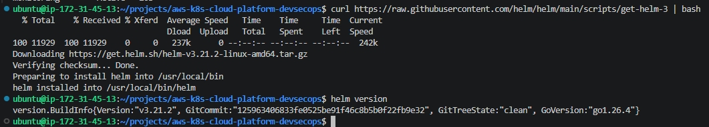

---

### 실무 TIP

실무에서는 Prometheus, Grafana뿐 아니라 ArgoCD, NGINX Ingress Controller, Cert-Manager, Harbor 등 다양한 Kubernetes 애플리케이션을 Helm으로 설치하고 관리한다.

Helm을 사용하면 설치뿐 아니라 업그레이드와 삭제도 동일한 방식으로 수행할 수 있어 운영 효율성이 크게 향상된다.

---

### 운영 시 고려사항

Helm은 Kubernetes 리소스를 직접 생성하는 것이 아니라 Helm Chart를 Kubernetes Manifest로 변환(Rendering)하여 Kubernetes API Server에 전달하는 역할을 수행한다.

따라서 Helm 자체가 Kubernetes를 대체하는 것이 아니라 Kubernetes 리소스를 보다 효율적으로 관리하기 위한 배포 도구라는 점을 이해하는 것이 중요하다.


## 7-3. Prometheus Community Repository 등록

### 배경

Helm 설치가 완료되었지만 아직 Prometheus를 설치할 수 있는 상태는 아니다.

Helm은 Kubernetes 애플리케이션을 설치하는 Package Manager이며, 실제 설치할 애플리케이션(Chart)은 별도의 Helm Repository에서 다운로드한다.

따라서 Prometheus와 Grafana를 설치하기 위해서는 먼저 Prometheus Community에서 제공하는 공식 Helm Repository를 등록해야 한다.

이번 프로젝트에서는 Prometheus Community Repository를 등록한 후 최신 Chart 정보를 동기화하여 `kube-prometheus-stack`을 설치할 준비를 완료하였다.

---

### 목적

Prometheus Community Helm Repository를 등록하여 Kubernetes Monitoring Stack을 설치할 수 있는 환경을 구성한다.

---

### Why?

Helm은 애플리케이션을 설치하는 도구이지만 설치할 패키지는 Repository를 통해 관리한다.

Ubuntu에서 `apt`를 이용하여 패키지를 설치하기 전에 저장소(Repository)를 등록하는 것과 동일한 개념이다.

Prometheus Community Repository에는 Prometheus, Grafana, Alertmanager, Node Exporter 등 다양한 Monitoring 관련 Helm Chart가 제공된다.

이번 프로젝트에서는 Kubernetes Monitoring 환경을 표준 방식으로 구축하기 위해 Prometheus Community Repository를 사용하였다.

---

### Helm Repository 구조

```text
Helm Client

        │

Helm Repository

        │

Helm Chart

        │

Helm Install

        │

Kubernetes Cluster
```

---

### 사용 명령어

```bash
helm repo add prometheus-community https://prometheus-community.github.io/helm-charts

helm repo update

helm repo list
```

---

### 명령어 설명

| 명령어 | 설명 |
|---------|------|
| `helm repo add` | 새로운 Helm Repository를 등록한다. |
| `helm repo update` | 등록된 Repository의 최신 Chart 정보를 가져온다. |
| `helm repo list` | 현재 등록된 Helm Repository 목록을 확인한다. |

---

### 실행 결과

Prometheus Community Repository가 정상적으로 등록되었으며 최신 Chart 정보를 성공적으로 동기화하였다.

또한 `helm repo list`를 통해 Repository 등록 상태를 확인하였다.

이를 통해 `kube-prometheus-stack` Chart를 설치할 수 있는 환경이 준비되었다.

---

### 결과 분석

Helm은 Repository에 저장되어 있는 Chart 정보를 기반으로 Kubernetes 애플리케이션을 설치한다.

Repository 등록이 완료됨으로써 Prometheus Monitoring Stack을 최신 버전의 Helm Chart를 이용하여 구축할 수 있는 기반이 마련되었다.

---

### 학습 포인트

- Helm Repository는 Kubernetes 애플리케이션(Chart)을 저장하는 저장소이다.
- `helm repo add`는 새로운 Repository를 등록한다.
- `helm repo update`는 최신 Chart 정보를 동기화한다.
- Helm은 Repository를 기반으로 Kubernetes 애플리케이션을 설치한다.

---

### 캡처

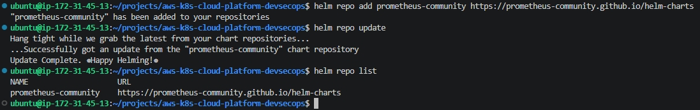

---

### 실무 TIP

실무에서는 Prometheus뿐 아니라 ArgoCD, NGINX Ingress Controller, Cert-Manager, Harbor 등도 공식 Helm Repository를 등록하여 운영한다.

Helm Repository를 사용하면 설치와 업그레이드를 표준화할 수 있으며 버전 관리도 용이하다.

---

### 운영 시 고려사항

Helm Repository는 지속적으로 새로운 Chart 버전이 배포된다.

운영 환경에서는 새로운 버전을 바로 적용하기보다 테스트 환경에서 충분히 검증한 후 운영 환경에 반영하는 것이 일반적이다.


## 7-4. kube-prometheus-stack 설치

### 배경

Monitoring 플랫폼을 구축하기 위해서는 Prometheus와 Grafana뿐 아니라 Alertmanager, Prometheus Operator, Node Exporter, kube-state-metrics 등 다양한 구성 요소가 함께 설치되어야 한다.

각 구성 요소를 개별적으로 설치하는 것도 가능하지만 Deployment, Service, ConfigMap, Secret, ServiceAccount, ClusterRole, ClusterRoleBinding, Custom Resource Definition(CRD) 등을 각각 생성해야 하므로 설치 과정이 매우 복잡해진다.

Prometheus Community에서는 이러한 Monitoring 구성 요소를 하나의 Helm Chart로 통합한 `kube-prometheus-stack`을 제공한다.

이번 프로젝트에서는 `kube-prometheus-stack`을 이용하여 Kubernetes Monitoring 플랫폼을 표준 방식으로 구축하였다.

---

### 목적

Helm을 이용하여 `kube-prometheus-stack`을 설치하고 Kubernetes Monitoring 플랫폼을 구축한다.

---

### Why?

Monitoring 환경은 Prometheus 하나만 설치한다고 완성되지 않는다.

실제 Kubernetes 운영 환경에서는 다음과 같은 여러 구성 요소가 함께 동작해야 한다.

- Prometheus
- Grafana
- Alertmanager
- Prometheus Operator
- Node Exporter
- kube-state-metrics

각 구성 요소를 직접 설치하고 연동하는 것은 매우 복잡하며 유지보수 또한 어렵다.

`kube-prometheus-stack`은 이러한 구성 요소를 하나의 Helm Chart로 제공하여 Monitoring 플랫폼을 표준 방식으로 구축할 수 있도록 지원한다.

---

### kube-prometheus-stack 구성

```text
Prometheus Operator

        │

Prometheus

        │

Alertmanager

        │

Grafana

        │

Node Exporter

        │

kube-state-metrics
```

각 구성 요소는 서로 연동되어 Kubernetes Cluster의 상태를 실시간으로 수집하고 시각화한다.

---

### 사용 명령어

```bash
helm install monitoring prometheus-community/kube-prometheus-stack \
-n monitoring
```

---

### 명령어 설명

| 명령어 | 설명 |
|---------|------|
| `helm install` | Helm Chart를 설치한다. |
| `monitoring` | Helm Release 이름이다. |
| `prometheus-community/kube-prometheus-stack` | 설치할 Helm Chart이다. |
| `-n monitoring` | monitoring Namespace에 설치한다. |

---

### 실행 결과

Helm은 `kube-prometheus-stack` Chart를 다운로드한 후 Kubernetes Cluster에 필요한 Monitoring 리소스를 자동으로 생성하였다.

설치 완료 후 Prometheus, Grafana, Alertmanager, Prometheus Operator, Node Exporter, kube-state-metrics가 monitoring Namespace에 배포되었다.

---

### 결과 분석

Helm은 Chart 내부의 Template을 Kubernetes Manifest로 Rendering한 후 Kubernetes API Server에 전달하였다.

이를 통해 Monitoring 플랫폼 전체가 하나의 Helm Release로 관리되기 시작하였다.

또한 Prometheus Operator가 설치되면서 Prometheus 관련 리소스를 자동으로 관리할 수 있는 환경이 구성되었다.

---

### 학습 포인트

- `kube-prometheus-stack`은 Kubernetes Monitoring 플랫폼을 통합 제공하는 Helm Chart이다.
- Helm은 Chart를 Kubernetes Manifest로 Rendering하여 배포한다.
- Prometheus Operator는 Prometheus 관련 리소스를 관리한다.
- Grafana는 Prometheus가 수집한 Metrics를 시각화한다.
- Node Exporter와 kube-state-metrics는 Kubernetes Metrics를 수집한다.

---

### 캡처

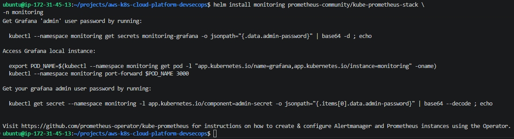

---

### 실무 TIP

기업 환경에서는 Prometheus와 Grafana를 각각 설치하기보다 `kube-prometheus-stack`을 사용하는 경우가 대부분이다.

운영 표준이 이미 반영되어 있으며 버전 관리와 업그레이드도 Helm을 통해 쉽게 수행할 수 있기 때문이다.

---

### 운영 시 고려사항

`kube-prometheus-stack`은 설치 과정에서 다수의 Kubernetes 리소스를 생성한다.

설치 직후에는 모든 Pod가 즉시 Running 상태가 되지 않을 수 있으며 이미지 다운로드와 초기화 과정이 완료될 때까지 일정 시간이 소요될 수 있다.

또한 Monitoring Stack은 CPU와 Memory를 지속적으로 사용하는 운영 플랫폼이므로 Kubernetes Cluster의 리소스를 충분히 확보하는 것이 중요하다.

## 7-5. Kubernetes API Server Timeout 발생

### 배경

`kube-prometheus-stack` 설치가 완료된 후 Monitoring 구성 요소를 확인하기 위해 Kubernetes Cluster 상태를 조회하였다.

그러나 `kubectl get pods`, `kubectl get nodes` 등의 명령을 수행하는 과정에서 Kubernetes API Server와 정상적으로 통신하지 못하는 문제가 발생하였다.

Monitoring Stack은 Prometheus, Grafana, Alertmanager, Prometheus Operator, Node Exporter, kube-state-metrics 등 다양한 구성 요소를 동시에 생성하므로 일반적인 Kubernetes 애플리케이션보다 많은 시스템 리소스를 요구한다.

---

### 문제

Monitoring Stack 설치 후 다음과 같은 오류가 발생하였다.

```text
Unable to connect to the server:
net/http: TLS handshake timeout
```

이후 `kubectl` 명령을 수행하더라도 Kubernetes API Server와 정상적으로 통신하지 못하는 상태가 지속되었다.

---

### 원인 분석

초기에는 Kubernetes 설정이나 Helm 설치 문제를 의심하였다.

그러나 메모리 사용량과 Kubernetes 상태를 추가로 확인한 결과 Monitoring Stack 설치 과정에서 Control Plane의 리소스 사용량이 급격히 증가하였고, 기존 EC2 인스턴스(t3.medium)의 메모리가 부족하여 Kubernetes API Server가 정상적으로 응답하지 못한 것으로 판단하였다.

Monitoring 플랫폼은 지속적으로 Metrics를 수집하고 저장하는 운영 시스템이므로 일반적인 애플리케이션보다 많은 CPU와 Memory를 요구한다.

특히 Prometheus Operator와 Prometheus 초기 구동 과정에서 API Server의 부하가 크게 증가하면서 TLS Handshake Timeout이 발생하였다.

---

### 장애 발생 흐름

```text
kube-prometheus-stack 설치

        │

Monitoring 구성 요소 생성

        │

Control Plane 부하 증가

        │

Kubernetes API Server 응답 지연

        │

TLS Handshake Timeout 발생
```

---

### 확인 명령어

```bash
kubectl get pods -n monitoring

kubectl get nodes

free -h
```

---

### 실행 결과

Monitoring Pod 일부는 생성되었지만 Kubernetes API Server와의 통신이 불안정하여 `kubectl` 명령이 정상적으로 수행되지 않았다.

메모리 사용량을 확인한 결과 EC2 인스턴스의 가용 메모리가 매우 부족한 상태였으며 Kubernetes API Server가 정상적으로 동작하지 않는 것을 확인하였다.

---

### 결과 분석

Monitoring Stack 설치 자체에는 문제가 없었지만 Kubernetes Control Plane을 운영하기 위한 시스템 리소스가 부족하였다.

Monitoring 플랫폼은 일반 애플리케이션보다 높은 시스템 자원을 요구하므로 Minikube 기반 단일 Node 환경에서는 충분한 CPU와 Memory를 확보하는 것이 중요하다는 점을 확인하였다.

---

### 학습 포인트

- Monitoring 플랫폼은 일반 Kubernetes 애플리케이션보다 높은 시스템 리소스를 요구한다.
- Kubernetes API Server는 Control Plane의 핵심 구성 요소이다.
- API Server가 정상적으로 응답하지 않으면 `kubectl` 명령도 수행할 수 없다.
- Monitoring 구축 시 Cluster 리소스를 충분히 확보해야 한다.

---

### 캡처

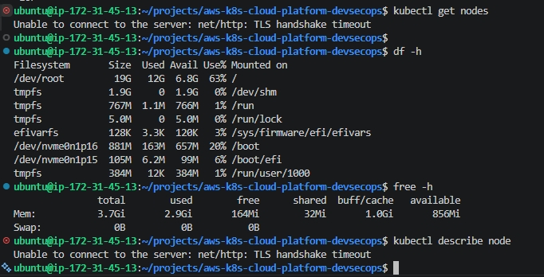

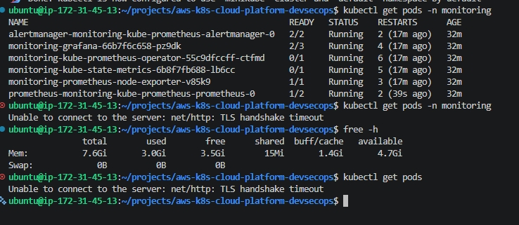

---

### 실무 TIP

Monitoring 플랫폼 구축 전에는 Node의 CPU와 Memory 용량을 먼저 검토하는 것이 좋다.

특히 Prometheus는 Metrics를 지속적으로 저장하는 특성상 Memory 사용량이 높은 편이므로 테스트 환경이라도 최소 권장 사양 이상을 확보하는 것이 안정적이다.

---

### 운영 시 고려사항

Kubernetes Control Plane은 Cluster 전체를 관리하는 핵심 구성 요소이다.

Monitoring Stack과 같이 리소리 사용량이 많은 애플리케이션을 구축할 경우에는 Node 리소스를 사전에 검토하고, 운영 환경에서는 Worker Node를 분리하거나 Control Plane에 충분한 시스템 자원을 할당하는 것이 일반적이다.


## 7-6. EC2 인스턴스 증설 및 Kubernetes API Server 복구

### 배경

Kubernetes API Server Timeout 문제를 분석한 결과 Monitoring Stack 설치 과정에서 Control Plane의 시스템 리소스가 부족하여 API Server가 정상적으로 응답하지 못하는 상태임을 확인하였다.

Prometheus, Grafana, Alertmanager, Prometheus Operator 등 Monitoring 구성 요소는 일반 애플리케이션보다 많은 CPU와 Memory를 요구하므로 기존 EC2 인스턴스(t3.medium)에서는 안정적으로 운영하기 어려웠다.

이에 따라 Kubernetes Cluster를 안정적으로 운영하기 위해 EC2 인스턴스를 증설하기로 결정하였다.

---

### 목적

EC2 인스턴스의 시스템 리소스를 확장하여 Kubernetes API Server를 정상적으로 복구하고 Monitoring 플랫폼을 안정적으로 운영할 수 있는 환경을 구축한다.

---

### Why?

Monitoring 플랫폼은 지속적으로 Metrics를 수집하고 저장하는 운영 시스템이다.

특히 Prometheus는 Time Series Database(TSDB)를 메모리에 유지하면서 Metrics를 처리하기 때문에 일반적인 Kubernetes 애플리케이션보다 Memory 사용량이 높다.

기존 t3.medium 환경에서는 Monitoring Stack 구축 시 시스템 자원이 부족하여 Kubernetes Control Plane이 정상적으로 동작하지 않았으므로 보다 안정적인 운영 환경을 위해 EC2 인스턴스를 t3.large로 증설하였다.

---

### 해결 과정

이번 프로젝트에서는 다음 순서로 문제를 해결하였다.

```text
Monitoring Stack 설치

        │

API Server Timeout 발생

        │

EC2 Instance Type 변경

(t3.medium → t3.large)

        │

Minikube 재시작

        │

API Server 복구

        │

Monitoring Pod 정상 실행
```

---

### 수행 내용

- EC2 인스턴스 타입 변경
- t3.medium → t3.large 증설
- Minikube 중지
- Minikube 재시작
- Kubernetes API Server 상태 확인
- Monitoring Pod 상태 확인

---

### 사용 명령어

```bash
minikube stop

minikube start --driver=docker

minikube status

kubectl get pods -n monitoring
```

---

### 명령어 설명

| 명령어 | 설명 |
|---------|------|
| `minikube stop` | Minikube Cluster를 정상적으로 종료한다. |
| `minikube start` | 기존 Kubernetes Cluster를 다시 시작한다. |
| `minikube status` | Kubernetes Control Plane 상태를 확인한다. |
| `kubectl get pods` | Monitoring Pod 상태를 확인한다. |

---

### 실행 결과

EC2 인스턴스를 t3.large로 증설한 후 Minikube를 다시 시작하였다.

재시작 이후 Kubernetes API Server가 정상적으로 Running 상태가 되었으며 Monitoring Pod도 모두 Ready 상태로 복구되는 것을 확인하였다.

---

### 결과 분석

Monitoring Stack 설치 실패가 아니라 시스템 리소스 부족으로 인해 Kubernetes API Server가 비정상 종료된 것이 원인이었다.

EC2 인스턴스를 증설한 후 Kubernetes Control Plane이 정상적으로 복구되었으며 Prometheus, Grafana, Alertmanager 등 Monitoring 구성 요소도 모두 정상적으로 실행되는 것을 확인하였다.

이를 통해 Monitoring 플랫폼은 일반 애플리케이션보다 높은 시스템 자원을 요구한다는 점을 확인할 수 있었다.

---

### 학습 포인트

- Monitoring 플랫폼은 충분한 시스템 리소스가 필요하다.
- Kubernetes API Server는 Control Plane의 핵심 구성 요소이다.
- EC2 인스턴스 증설만으로는 이미 종료된 API Server가 자동으로 복구되지 않는다.
- Minikube를 재시작하여 Control Plane을 정상적으로 복구하였다.

---

### 캡처

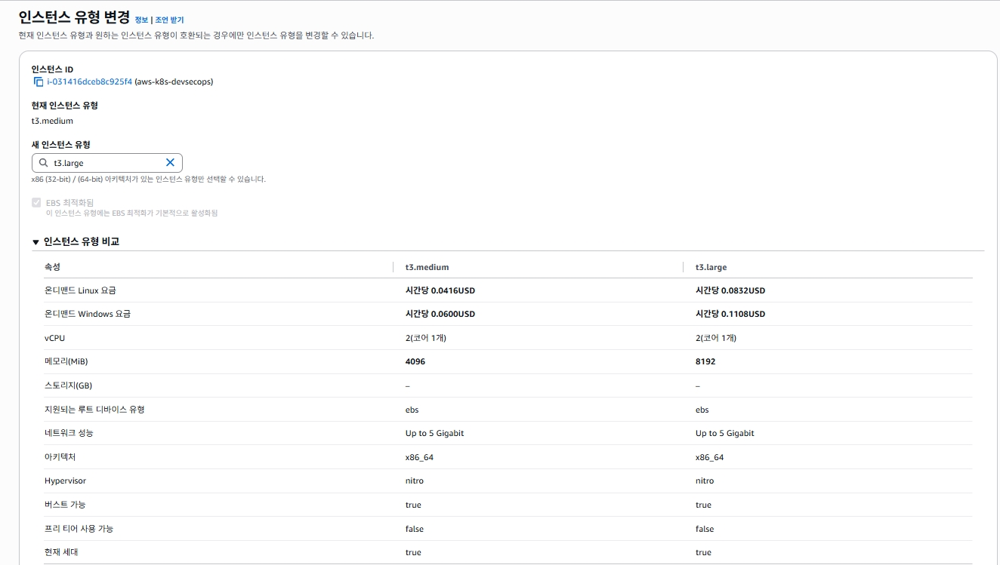

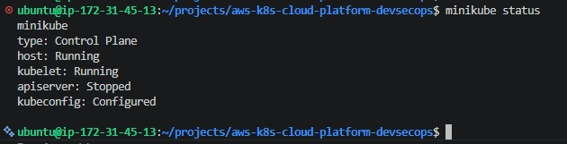


---

### 실무 TIP

Monitoring 플랫폼을 구축하기 전에는 Kubernetes Node의 CPU와 Memory 사용량을 먼저 확인하는 것이 좋다.

운영 환경에서는 Monitoring 전용 Node를 별도로 구성하거나 Control Plane과 Worker Node를 분리하여 운영하는 경우가 많다.

---

### 운영 시 고려사항

EC2 인스턴스를 증설하더라도 이미 종료된 Kubernetes API Server는 자동으로 복구되지 않는다.

Control Plane이 비정상 종료된 경우에는 Minikube 또는 Kubernetes Control Plane을 정상적으로 재기동하여 API Server 상태를 반드시 확인해야 한다.


## 7-7. Grafana Service 구성

### 배경

`kube-prometheus-stack` 설치가 완료되면서 Prometheus, Grafana, Alertmanager 등 Monitoring 구성 요소가 Kubernetes Cluster에 배포되었다.

Grafana Pod가 정상적으로 실행되더라도 외부에서 Dashboard에 접근하기 위해서는 Kubernetes Service가 함께 구성되어야 한다.

따라서 Grafana Service가 정상적으로 생성되었는지 확인하고 이후 외부 접근을 위한 구성을 진행하였다.

---

### 목적

Grafana Service 생성 여부를 확인하고 Dashboard 접근을 위한 기반 환경을 구성한다.

---

### Why?

Kubernetes에서는 Pod에 직접 접근하지 않는다.

Pod는 생성과 삭제 과정에서 IP 주소가 변경될 수 있으므로 Service를 이용하여 고정된 접근 지점을 제공한다.

Grafana 역시 Pod가 아닌 Service를 통해 접근하도록 구성하는 것이 Kubernetes의 표준 운영 방식이다.

이번 프로젝트에서는 Grafana Service를 확인한 후 NodePort와 Port Forward를 이용하여 Dashboard에 접근하였다.

---

### Grafana Service 구조

```text
Browser

        │

Grafana Service

        │

Grafana Pod
```

---

### 사용 명령어

```bash
kubectl get svc -n monitoring
```

---

### 명령어 설명

| 명령어 | 설명 |
|---------|------|
| `kubectl get svc` | Service 목록을 조회한다. |
| `-n monitoring` | monitoring Namespace의 Service를 조회한다. |

---

### 실행 결과

Monitoring Namespace에 생성된 Service 목록을 확인하였다.

Grafana뿐 아니라 Prometheus, Alertmanager, Prometheus Operator, Node Exporter, kube-state-metrics를 위한 Service도 함께 생성된 것을 확인하였다.

---

### 결과 분석

`kube-prometheus-stack`은 단순히 Grafana만 설치하는 것이 아니라 Monitoring 플랫폼 전체를 구성한다.

Helm은 각 구성 요소에 필요한 Service를 자동으로 생성하여 Kubernetes 내부 통신이 가능하도록 구성하였다.

---

### 학습 포인트

- Kubernetes에서는 Pod보다 Service를 통해 접근하는 것이 일반적이다.
- Helm은 Monitoring 구성 요소에 필요한 Service를 자동 생성한다.
- Service는 Pod IP 변경과 관계없이 동일한 접근 지점을 제공한다.

---

### 캡처

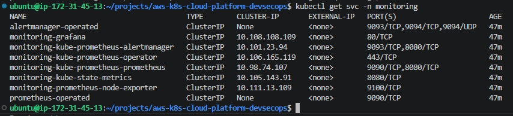

---

### 실무 TIP

운영 환경에서는 Grafana를 ClusterIP로 유지한 후 Ingress 또는 LoadBalancer를 이용하여 외부에 공개하는 경우가 많다.

---

### 운영 시 고려사항

Monitoring 시스템은 운영 정보를 제공하는 핵심 플랫폼이다.

운영 환경에서는 인증(Authentication), HTTPS, 접근 제어를 함께 적용하여 외부 접근을 최소화하는 것이 일반적이다.


## 7-8. Grafana NodePort 구성 및 외부 접근 검증

### 배경

Grafana Service는 기본적으로 `ClusterIP` 타입으로 생성되므로 Kubernetes Cluster 내부에서만 접근할 수 있다.

그러나 Monitoring Dashboard를 외부 브라우저에서도 확인하기 위해서는 Grafana Service를 외부에 노출할 필요가 있었다.

이번 프로젝트에서는 DAY4에서 ArgoCD를 구성할 때와 동일한 방식으로 Grafana Service를 NodePort로 변경하고 AWS Security Group을 이용하여 외부 접근을 검증하였다.

---

### 목적

Grafana Service를 NodePort 방식으로 변경하여 Kubernetes Cluster 외부에서도 Grafana Dashboard에 접근할 수 있도록 구성한다.

---

### Why?

`ClusterIP`는 Kubernetes 내부 통신을 위한 기본 Service 타입으로 Cluster 외부에서는 접근할 수 없다.

Monitoring 플랫폼은 운영자가 Dashboard를 통해 시스템 상태를 확인해야 하므로 외부에서 접근 가능한 Service 구성이 필요하다.

이번 프로젝트에서는 Kubernetes Service 동작 방식을 이해하기 위해 NodePort를 이용하여 Grafana를 외부에 노출하고 Public IP를 이용한 접근을 검증하였다.

---

### NodePort 구조

```text
Browser

        │

AWS Security Group

        │

EC2 Public IP

        │

NodePort

        │

Grafana Service

        │

Grafana Pod
```

---

### 사용 명령어

현재 Service 확인

```bash
kubectl get svc monitoring-grafana -n monitoring
```

Service 수정

```bash
kubectl edit svc monitoring-grafana -n monitoring
```

NodePort 확인

```bash
kubectl get svc monitoring-grafana -n monitoring
```

---

### 명령어 설명

| 명령어 | 설명 |
|---------|------|
| `kubectl get svc` | Service 정보를 조회한다. |
| `kubectl edit svc` | Service 설정을 수정한다. |
| `type: NodePort` | Service를 외부에 노출한다. |

---

### 실행 결과

Grafana Service를 `ClusterIP`에서 `NodePort`로 변경하였다.

이후 Kubernetes는 자동으로 NodePort를 생성하였으며 AWS Security Group에도 해당 포트를 추가하여 외부 접근을 시도하였다.

---

### 결과 분석

NodePort 구성 자체는 정상적으로 완료되었다.

그러나 Minikube(Docker Driver) 환경에서는 NodePort가 Docker Container 내부에서 동작하므로 AWS Security Group을 허용하더라도 EC2 Public IP를 통한 직접 접근은 정상적으로 수행되지 않았다.

이를 통해 Kubernetes Service는 정상적으로 구성되었지만 Minikube Driver 특성으로 인해 NodePort 접근 방식에는 제한이 있음을 확인하였다.

---

### 학습 포인트

- ClusterIP는 Kubernetes 내부에서만 접근할 수 있다.
- NodePort는 Kubernetes Cluster 외부 접근을 위한 Service 타입이다.
- Kubernetes는 NodePort를 자동으로 할당한다.
- Docker Driver 기반 Minikube에서는 NodePort 외부 접근에 제한이 발생할 수 있다.

---

### 캡처

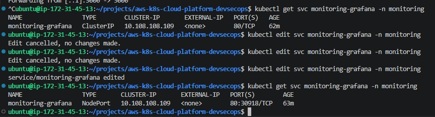

.jpg)

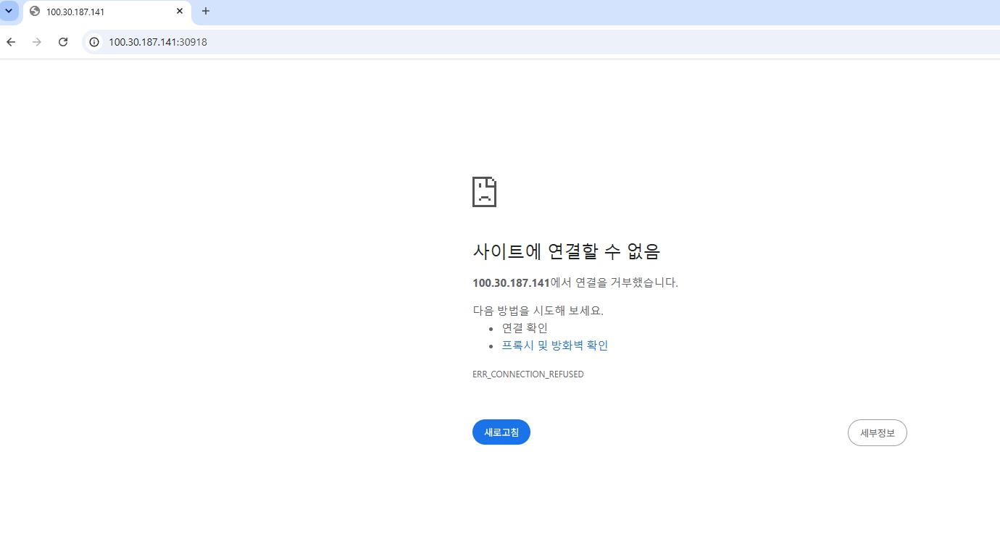

---

### 실무 TIP

운영 환경에서는 NodePort보다 Ingress Controller 또는 LoadBalancer를 이용하여 Grafana를 외부에 공개하는 경우가 많다.

NodePort는 개발 및 테스트 환경에서 주로 사용된다.

---

### 운영 시 고려사항

Docker Driver 기반 Minikube에서는 NodePort가 Host OS가 아닌 Docker Container 내부에서 동작한다.

따라서 Public IP를 이용한 직접 접근에는 제약이 발생할 수 있으며, 개발 환경에서는 Port Forward를 이용한 접근 방식이 보다 안정적이다.


## 7-9. Port Forward를 이용한 Grafana Dashboard 접근 및 Monitoring 검증

### 배경

Grafana Service를 NodePort로 변경하고 AWS Security Group을 구성하였지만 Minikube(Docker Driver) 환경에서는 EC2 Public IP를 이용한 직접 접근이 정상적으로 수행되지 않았다.

이는 Kubernetes 설정 문제가 아니라 Docker Driver 기반 Minikube의 네트워크 구조 때문이었다.

Monitoring 플랫폼이 정상적으로 구축되었는지 확인하기 위해 Kubernetes에서 제공하는 Port Forward 기능을 이용하여 Grafana Dashboard에 접속하였다.

---

### 목적

Port Forward를 이용하여 Grafana Dashboard에 접근하고 Kubernetes Monitoring 플랫폼이 정상적으로 동작하는지 검증한다.

---

### Why?

Port Forward는 Kubernetes Service 또는 Pod의 포트를 로컬 환경으로 전달하여 임시적으로 접근할 수 있도록 지원하는 기능이다.

운영 환경에서는 일반적으로 Ingress나 LoadBalancer를 사용하지만 개발 및 테스트 환경에서는 Port Forward를 이용하여 빠르게 Dashboard를 확인하는 경우가 많다.

이번 프로젝트에서는 Docker Driver 기반 Minikube 환경의 특성을 고려하여 Port Forward를 이용해 Grafana Dashboard 접속을 검증하였다.

---

### Port Forward 구조

```text
Browser

        │

EC2 Port 3000

        │

kubectl port-forward

        │

Grafana Service (80)

        │

Grafana Pod
```

---

### 사용 명령어

```bash
kubectl port-forward svc/monitoring-grafana 3000:80 \
-n monitoring \
--address 0.0.0.0
```

---

### 명령어 설명

| 명령어 | 설명 |
|---------|------|
| `kubectl port-forward` | Kubernetes 리소스와 로컬 포트를 연결한다. |
| `svc/monitoring-grafana` | Grafana Service를 대상으로 지정한다. |
| `3000:80` | EC2의 3000번 포트를 Grafana Service의 80번 포트와 연결한다. |
| `-n monitoring` | monitoring Namespace를 지정한다. |
| `--address 0.0.0.0` | 모든 네트워크 인터페이스에서 접근을 허용한다. |

---

### 실행 결과

Port Forward를 구성한 후 EC2 Public IP와 3000 포트를 이용하여 Grafana Dashboard에 정상적으로 접속하였다.

Grafana 로그인 이후 Kubernetes Cluster Dashboard와 Node Dashboard를 확인하여 Monitoring 플랫폼이 정상적으로 동작하는 것을 검증하였다.

또한 Monitoring Pod와 Service 상태를 최종 확인하여 모든 Monitoring 구성 요소가 정상적으로 실행되고 있음을 확인하였다.

---

### 결과 분석

NodePort 방식은 Docker Driver 기반 Minikube 환경의 특성으로 인해 외부 접근이 제한되었지만 Port Forward를 이용하여 Monitoring 플랫폼 접근을 정상적으로 수행하였다.

Grafana Dashboard를 통해 Kubernetes Cluster의 CPU, Memory, Node 상태를 실시간으로 확인할 수 있었으며 Monitoring 플랫폼이 정상적으로 구축되었음을 검증하였다.

---

### 학습 포인트

- Port Forward는 Kubernetes 리소스를 임시적으로 외부에 노출하는 기능이다.
- 개발 및 테스트 환경에서는 Port Forward를 자주 사용한다.
- Docker Driver 기반 Minikube에서는 Port Forward가 NodePort보다 안정적인 접근 방식을 제공한다.
- Grafana Dashboard를 통해 Kubernetes Cluster 상태를 실시간으로 확인할 수 있다.

---

### 캡처

.jpg)

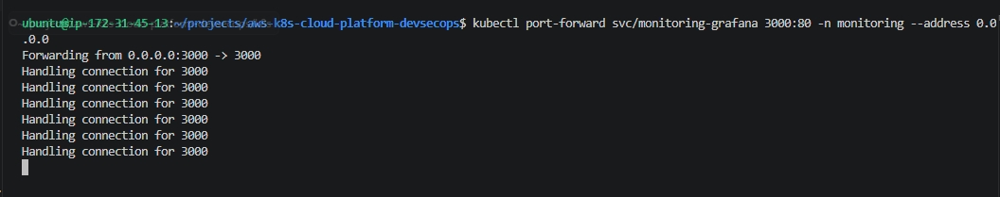

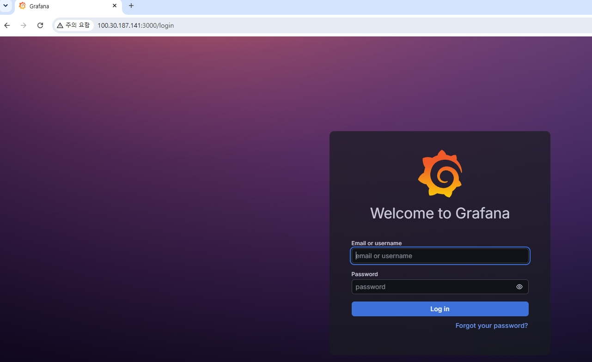


---

### 실무 TIP

Port Forward는 운영 환경보다는 개발 및 테스트 환경에서 Monitoring Dashboard를 빠르게 확인하기 위한 용도로 많이 사용된다.

운영 환경에서는 Ingress Controller, Reverse Proxy 또는 LoadBalancer를 이용하여 인증(Authentication)과 HTTPS를 함께 적용하는 것이 일반적이다.

---

### 운영 시 고려사항

Port Forward는 `kubectl` 프로세스가 실행되는 동안에만 연결이 유지된다.

터미널을 종료하거나 Port Forward 프로세스가 종료되면 Dashboard 접근도 함께 종료되므로 장시간 운영 환경에는 적합하지 않다.

이번 프로젝트에서는 Docker Driver 기반 Minikube 환경의 특성을 고려하여 Port Forward를 이용해 Monitoring 플랫폼을 검증하였다.


# 8. 핵심 기술 이해

---

## 8-1. Monitoring이란?

### Monitoring의 정의

Monitoring은 시스템, 애플리케이션, 네트워크 등의 상태를 지속적으로 수집하고 분석하여 현재 운영 상태를 실시간으로 확인하는 기술이다.

CPU, Memory, Disk, Network, Pod 상태 등의 운영 정보를 지속적으로 수집하고 시각화하여 장애를 조기에 발견하고 안정적인 서비스 운영을 지원한다.

---

### Monitoring을 사용하는 이유

서비스가 정상적으로 운영되고 있는지 확인하기 위해서는 단순히 애플리케이션이 실행되는 것만으로는 충분하지 않다.

운영 환경에서는 CPU 사용량 증가, Memory 부족, Pod 장애, Node 장애 등 다양한 문제가 발생할 수 있으므로 지속적인 상태 확인이 필요하다.

Monitoring은 이러한 운영 정보를 실시간으로 제공하여 장애를 사전에 예방하고 장애 발생 시 원인을 빠르게 분석할 수 있도록 지원한다.

---

### 이번 프로젝트에서 Monitoring 역할

DAY5에서는 Prometheus와 Grafana를 이용하여 Kubernetes Cluster Monitoring 환경을 구축하였다.

Node Exporter와 kube-state-metrics를 통해 Kubernetes Cluster의 CPU, Memory, Node, Pod 정보를 수집하고 Grafana Dashboard를 통해 실시간으로 확인하였다.

---

### Monitoring 구성

```text
Kubernetes Cluster

        │

Metrics 수집

        │

Prometheus

        │

Grafana

        │

Dashboard
```

---

### 학습 포인트

- Monitoring은 운영 상태를 지속적으로 확인하는 기술이다.
- 장애를 조기에 발견하고 원인을 분석하는 데 활용된다.
- Kubernetes 운영 환경에서는 Monitoring 플랫폼이 필수적으로 사용된다.

---

### 실무 TIP

기업 환경에서는 Monitoring을 단순히 Dashboard로만 사용하지 않는다.

Alertmanager, Slack, Email 등을 연동하여 장애 발생 시 운영자에게 자동으로 알림을 전송하는 구조를 함께 구성한다.

---

### 운영 시 고려사항

Monitoring은 운영 시스템이므로 애플리케이션보다 높은 가용성을 유지해야 한다.

Monitoring 시스템 자체가 장애가 발생하면 서비스 상태를 확인할 수 없으므로 운영 환경에서는 별도의 고가용성(HA) 구성을 적용하는 경우가 많다.


## 8-2. Helm이란?

### Helm의 정의

Helm은 Kubernetes 애플리케이션을 설치, 업그레이드, 삭제 및 버전 관리하기 위한 Kubernetes 공식 Package Manager이다.

복잡한 Kubernetes 리소스(Deployment, Service, ConfigMap, Secret 등)를 하나의 Chart로 패키징하여 일관된 방식으로 배포할 수 있도록 지원한다.

---

### Helm을 사용하는 이유

Kubernetes 애플리케이션은 일반적으로 여러 개의 YAML 파일로 구성된다.

예를 들어 Prometheus를 직접 구축하려면 Deployment, Service, ConfigMap, Secret, ServiceAccount, ClusterRole, ClusterRoleBinding, Custom Resource Definition(CRD) 등 수십 개의 리소스를 생성해야 한다.

Helm을 사용하면 이러한 리소리를 하나의 Chart로 관리할 수 있으므로 설치와 유지보수가 매우 단순해진다.

이번 프로젝트에서도 `kube-prometheus-stack` Helm Chart를 이용하여 Prometheus Monitoring 플랫폼 전체를 표준 방식으로 구축하였다.

---

### Helm 구성 요소

Helm은 크게 다음과 같은 구성 요소로 이루어진다.

| 구성 요소 | 역할 |
|-----------|------|
| Helm Client | Helm 명령어를 실행하는 CLI |
| Helm Repository | Helm Chart를 저장하는 저장소 |
| Helm Chart | Kubernetes 애플리케이션 패키지 |
| Helm Release | Kubernetes Cluster에 설치된 Chart 인스턴스 |

---

### Helm 동작 과정

```text
Helm Client

        │

Helm Repository

        │

Helm Chart

        │

Template Rendering

        │

Kubernetes Manifest

        │

Kubernetes API Server

        │

Deployment / Service / ConfigMap / Secret 생성
```

---

### 이번 프로젝트에서 Helm 역할

DAY5에서는 Helm을 이용하여 Prometheus Community Repository를 등록한 후 `kube-prometheus-stack`을 설치하였다.

Helm은 Chart 내부의 Template을 Kubernetes Manifest로 변환(Rendering)하여 Kubernetes API Server에 전달하였으며, 이를 통해 Prometheus, Grafana, Alertmanager, Node Exporter, kube-state-metrics 등 Monitoring 플랫폼 전체를 자동으로 구축하였다.

---

### Helm Chart란?

Helm Chart는 Kubernetes 애플리케이션을 설치하기 위한 패키지이다.

Chart에는 Deployment, Service, ConfigMap, Secret 등의 Kubernetes 리소스 정의와 설정값이 포함되어 있다.

이번 프로젝트에서는 `kube-prometheus-stack` Chart를 사용하여 Monitoring 플랫폼을 구축하였다.

---

### Helm Release란?

Helm Release는 Helm Chart를 Kubernetes Cluster에 설치한 실행 인스턴스를 의미한다.

동일한 Helm Chart라도 Release 이름을 다르게 지정하면 하나의 Cluster에 여러 개를 동시에 설치할 수 있다.

이번 프로젝트에서는 다음과 같이 설치하였다.

```bash
helm install monitoring prometheus-community/kube-prometheus-stack
```

여기서

```text
monitoring
```

이 Helm Release 이름이다.

---

### 학습 포인트

- Helm은 Kubernetes의 Package Manager이다.
- Helm Chart는 Kubernetes 애플리케이션 패키지이다.
- Helm Release는 설치된 Chart 인스턴스이다.
- Helm은 Chart를 Kubernetes Manifest로 Rendering하여 배포한다.

---

### 실무 TIP

실무에서는 Prometheus, Grafana뿐 아니라 ArgoCD, NGINX Ingress Controller, Cert-Manager, Harbor 등 대부분의 Kubernetes 플랫폼을 Helm으로 구축한다.

Helm을 사용하면 설치뿐 아니라 업그레이드, 롤백, 삭제도 동일한 방식으로 수행할 수 있다.

---

### 운영 시 고려사항

Helm은 Kubernetes 리소스를 생성하는 것이 아니라 Kubernetes Manifest를 자동으로 생성하여 Kubernetes API Server에 전달하는 역할을 수행한다.

또한 운영 환경에서는 Helm Chart 버전을 고정하여 사용하고, 새로운 버전은 테스트 환경에서 충분히 검증한 후 운영 환경에 적용하는 것이 일반적이다.


## 8-3. Prometheus란?

### Prometheus의 정의

Prometheus는 CNCF(Cloud Native Computing Foundation)에서 관리하는 오픈소스 Monitoring 시스템으로, 다양한 시스템과 애플리케이션의 Metrics를 수집하고 저장하는 Time Series Database(TSDB) 기반 Monitoring 플랫폼이다.

Kubernetes 환경에서 가장 널리 사용되는 Monitoring 도구이며, CPU, Memory, Network, Pod, Node 등 다양한 운영 정보를 지속적으로 수집하여 장애 분석과 성능 모니터링에 활용된다.

---

### Prometheus를 사용하는 이유

운영 환경에서는 애플리케이션이 정상적으로 실행되고 있는지뿐만 아니라 시스템 자원 사용량과 장애 발생 여부를 지속적으로 확인해야 한다.

Prometheus는 Kubernetes Cluster 내부의 다양한 Metrics를 자동으로 수집하고 저장하며, Grafana와 연동하여 실시간 Dashboard를 구성할 수 있다.

이번 프로젝트에서는 Prometheus를 이용하여 Kubernetes Cluster와 Node의 CPU, Memory, Pod 상태를 지속적으로 수집하도록 구성하였다.

---

### Prometheus 구성 요소

| 구성 요소 | 역할 |
|-----------|------|
| Prometheus Server | Metrics 수집 및 저장 |
| Exporter | Metrics 제공 |
| TSDB | Time Series Database |
| PromQL | Metrics 조회 언어 |
| Alertmanager | Alert 관리 및 알림 |

---

### Prometheus 동작 과정

```text
Node Exporter
kube-state-metrics

        │

Metrics 제공

        │

Prometheus

        │

TSDB 저장

        │

PromQL 조회

        │

Grafana Dashboard
```

---

### Pull 방식이란?

Prometheus는 Push 방식이 아니라 Pull 방식을 사용한다.

Prometheus Server가 일정한 주기(Scrape Interval)마다 Exporter에 직접 요청하여 Metrics를 가져오는 구조이다.

```text
Prometheus

        │

HTTP Request

        ▼

Exporter

        │

Metrics 응답

        ▼

Prometheus
```

이번 프로젝트에서도 Prometheus가 Node Exporter와 kube-state-metrics에 주기적으로 접근하여 Metrics를 수집하도록 구성하였다.

---

### TSDB(Time Series Database)란?

Prometheus는 수집한 Metrics를 일반적인 관계형 데이터베이스(RDBMS)가 아닌 Time Series Database(TSDB)에 저장한다.

TSDB는 시간(Time)을 기준으로 데이터를 저장하는 데이터베이스이며, CPU 사용량이나 Memory 사용량처럼 시간에 따라 계속 변화하는 데이터를 저장하는 데 최적화되어 있다.

예를 들어

```text
10:00  CPU 15%

10:01  CPU 18%

10:02  CPU 21%

10:03  CPU 19%
```

와 같이 시간 순서대로 저장한다.

Grafana는 이러한 Time Series 데이터를 이용하여 CPU와 Memory 사용량을 그래프로 시각화한다.

---

### 이번 프로젝트에서 Prometheus 역할

DAY5에서는 `kube-prometheus-stack`을 이용하여 Prometheus를 구축하였다.

Prometheus는 Node Exporter와 kube-state-metrics에서 Kubernetes Metrics를 지속적으로 수집하였으며, Grafana Dashboard를 통해 Kubernetes Cluster의 CPU, Memory, Node 상태를 실시간으로 확인할 수 있도록 구성하였다.

---

### 학습 포인트

- Prometheus는 Kubernetes Monitoring의 표준 도구이다.
- Prometheus는 Pull 방식으로 Metrics를 수집한다.
- 수집한 데이터는 TSDB(Time Series Database)에 저장된다.
- Grafana는 Prometheus의 Metrics를 시각화하는 역할을 수행한다.

---

### 실무 TIP

실무에서는 Prometheus 하나만 사용하는 것이 아니라 Alertmanager와 함께 구성하여 장애 발생 시 Slack, Email, Microsoft Teams 등으로 자동 알림을 전송하는 Monitoring 체계를 구축하는 경우가 많다.

---

### 운영 시 고려사항

Prometheus는 Metrics를 지속적으로 저장하므로 Storage와 Memory 사용량이 지속적으로 증가한다.

운영 환경에서는 Metrics 보관 기간(Retention Period), Storage 용량, Scrape Interval 등을 적절하게 설정하여 시스템 자원을 효율적으로 관리하는 것이 중요하다.


## 8-4. Prometheus Operator란?

### Prometheus Operator의 정의

Prometheus Operator는 Kubernetes 환경에서 Prometheus를 보다 효율적으로 구축하고 운영하기 위한 Kubernetes Operator이다.

Prometheus 인스턴스와 Alertmanager, ServiceMonitor, PrometheusRule 등의 Monitoring 리소스를 Kubernetes Custom Resource(CRD) 기반으로 자동 관리한다.

이를 통해 Prometheus를 단순한 애플리케이션이 아니라 Kubernetes 리소스처럼 선언적으로(Declarative) 관리할 수 있도록 지원한다.

---

### Prometheus Operator를 사용하는 이유

Prometheus를 직접 구축하면 Prometheus 설정 파일(prometheus.yml)을 수동으로 관리해야 한다.

새로운 애플리케이션을 Monitoring 대상으로 추가할 때마다 설정 파일을 수정하고 Prometheus를 다시 로드해야 하므로 운영이 복잡해진다.

Prometheus Operator는 Kubernetes API와 연동하여 ServiceMonitor와 PrometheusRule 등의 리소스를 자동으로 감지하고 Prometheus 설정을 동적으로 관리한다.

이를 통해 Monitoring 대상을 Kubernetes 리소스처럼 선언적으로 관리할 수 있다.

---

### Prometheus Operator 동작 과정

```text
ServiceMonitor

        │

Prometheus Operator

        │

Prometheus 설정 자동 생성

        │

Prometheus

        │

Metrics 수집
```

---

### ServiceMonitor란?

ServiceMonitor는 Prometheus가 어떤 Service에서 Metrics를 수집해야 하는지 정의하는 Kubernetes Custom Resource이다.

Prometheus Operator는 ServiceMonitor를 감지하여 Prometheus 설정을 자동으로 생성한다.

이번 프로젝트에서는 `kube-prometheus-stack` 설치 과정에서 ServiceMonitor가 함께 생성되어 Prometheus가 Node Exporter와 kube-state-metrics를 자동으로 Monitoring하도록 구성되었다.

---

### PrometheusRule이란?

PrometheusRule은 Alert Rule과 Recording Rule을 정의하는 Kubernetes Custom Resource이다.

Prometheus Operator는 PrometheusRule을 감지하여 Prometheus Alert Rule을 자동으로 적용한다.

운영 환경에서는 CPU 사용량이 일정 수준 이상 증가하거나 Pod가 비정상 종료되었을 때 Alertmanager와 연동하여 운영자에게 자동으로 알림을 전송하는 데 활용된다.

---

### 이번 프로젝트에서 Prometheus Operator 역할

DAY5에서는 `kube-prometheus-stack`을 설치하면서 Prometheus Operator도 함께 구축되었다.

Prometheus Operator는 Monitoring 구성 요소를 자동으로 관리하고 ServiceMonitor를 통해 Metrics 수집 대상을 자동으로 등록하였다.

이를 통해 Prometheus 설정 파일을 직접 수정하지 않고도 Kubernetes Monitoring 환경을 구축할 수 있었다.

---

### 학습 포인트

- Prometheus Operator는 Kubernetes Monitoring을 자동화하는 Operator이다.
- ServiceMonitor를 이용하여 Metrics 수집 대상을 선언적으로 관리한다.
- PrometheusRule을 이용하여 Alert Rule을 관리한다.
- Prometheus 설정을 직접 수정하지 않아도 Monitoring 환경을 운영할 수 있다.

---

### 실무 TIP

기업 환경에서는 새로운 애플리케이션이 배포될 때 ServiceMonitor만 생성하면 Prometheus Operator가 자동으로 Monitoring 대상에 등록한다.

이를 통해 Prometheus 설정 파일을 직접 수정하지 않고도 Monitoring 환경을 확장할 수 있다.

---

### 운영 시 고려사항

Prometheus Operator는 Kubernetes Custom Resource(CRD)를 기반으로 동작한다.

따라서 CRD 버전과 Prometheus Operator 버전의 호환성을 함께 고려해야 하며, 운영 환경에서는 Helm Chart 버전을 함께 관리하는 것이 일반적이다.


## 8-5. Node Exporter란?

### Node Exporter의 정의

Node Exporter는 Prometheus에서 사용하는 대표적인 Exporter 중 하나로, Linux Node의 CPU, Memory, Disk, Network, File System 등의 시스템 Metrics를 수집하여 Prometheus에 제공하는 프로그램이다.

Prometheus는 Node Exporter가 제공하는 Metrics를 주기적으로 수집(Pull)하여 Kubernetes Node의 운영 상태를 지속적으로 모니터링한다.

---

### Node Exporter를 사용하는 이유

Kubernetes에서는 Pod뿐 아니라 Node의 상태를 지속적으로 확인하는 것이 중요하다.

Node의 CPU 사용률이 높거나 Memory가 부족하면 Cluster 전체의 성능 저하나 서비스 장애로 이어질 수 있다.

Node Exporter는 운영체제 수준의 시스템 정보를 수집하여 Node 상태를 실시간으로 확인할 수 있도록 지원한다.

이번 프로젝트에서는 Node Exporter를 이용하여 Kubernetes Node의 CPU, Memory, File System 등의 Metrics를 수집하고 Grafana Dashboard를 통해 시각화하였다.

---

### Node Exporter 동작 과정

```text
Linux Node

        │

Node Exporter

        │

Metrics 제공

        │

Prometheus

        │

TSDB 저장

        │

Grafana Dashboard
```

---

### Node Exporter가 수집하는 정보

대표적으로 다음과 같은 시스템 Metrics를 수집한다.

- CPU 사용률
- Memory 사용률
- Disk 사용률
- File System 사용량
- Network Traffic
- Load Average
- Disk I/O

---

### 이번 프로젝트에서 Node Exporter 역할

DAY5에서는 `kube-prometheus-stack` 설치 과정에서 Node Exporter가 함께 배포되었다.

Prometheus는 Node Exporter에서 Kubernetes Node의 시스템 정보를 지속적으로 수집하였으며 Grafana Dashboard를 통해 CPU와 Memory 사용량을 실시간으로 확인할 수 있도록 구성하였다.

---

### Node Exporter와 kube-state-metrics 차이

Node Exporter와 kube-state-metrics는 모두 Prometheus에 Metrics를 제공하지만 수집하는 대상이 서로 다르다.

| 구성 요소 | 수집 대상 |
|-----------|-----------|
| Node Exporter | Linux Node(CPU, Memory, Disk, Network 등) |
| kube-state-metrics | Kubernetes Object(Pod, Deployment, ReplicaSet, Node 상태 등) |

즉,

Node Exporter는 운영체제(System) 정보를 수집하고,

kube-state-metrics는 Kubernetes 리소스 상태를 수집한다.

두 구성 요소를 함께 사용해야 Kubernetes Cluster를 종합적으로 모니터링할 수 있다.

---

### 학습 포인트

- Node Exporter는 운영체제 수준의 Metrics를 수집한다.
- Prometheus는 Node Exporter를 Pull 방식으로 조회한다.
- Node Exporter는 CPU, Memory, Disk, Network 등의 시스템 정보를 제공한다.
- kube-state-metrics와 함께 사용하여 Kubernetes Monitoring 환경을 구성한다.

---

### 실무 TIP

Node Exporter는 Kubernetes뿐 아니라 일반 Linux 서버에서도 가장 많이 사용하는 Monitoring Exporter이다.

Prometheus 기반 Monitoring 환경에서는 거의 필수적으로 함께 구축된다.

---

### 운영 시 고려사항

Node Exporter는 모든 Node에서 실행되므로 일반적으로 DaemonSet 형태로 배포된다.

이를 통해 Cluster에 새로운 Node가 추가되더라도 Node Exporter가 자동으로 배포되어 Monitoring 환경을 지속적으로 유지할 수 있다.


## 8-6. kube-state-metrics란?

### kube-state-metrics의 정의

kube-state-metrics는 Kubernetes API Server에서 관리하는 Kubernetes 리소스(Object)의 상태 정보를 Metrics 형태로 변환하여 Prometheus에 제공하는 Monitoring 구성 요소이다.

Node Exporter가 Linux 운영체제의 시스템 정보를 수집하는 것과 달리, kube-state-metrics는 Pod, Deployment, ReplicaSet, DaemonSet, StatefulSet, Node 등의 Kubernetes 리소스 상태를 수집한다.

---

### kube-state-metrics를 사용하는 이유

Kubernetes를 운영할 때는 CPU나 Memory 사용량뿐 아니라 Deployment의 Replica 수, Pod Running 상태, Node Ready 상태 등 Kubernetes 리소스 자체의 상태를 지속적으로 확인해야 한다.

Prometheus는 kube-state-metrics를 통해 Kubernetes API Server의 상태 정보를 Metrics 형태로 수집하며, Grafana Dashboard를 이용하여 Kubernetes Cluster의 운영 상태를 시각화할 수 있다.

이번 프로젝트에서는 kube-state-metrics를 이용하여 Kubernetes Object 상태를 Prometheus가 자동으로 수집하도록 구성하였다.

---

### kube-state-metrics 동작 과정

```text
Kubernetes API Server

        │

kube-state-metrics

        │

Metrics 제공

        │

Prometheus

        │

TSDB 저장

        │

Grafana Dashboard
```

---

### kube-state-metrics가 수집하는 정보

대표적으로 다음과 같은 Kubernetes Object 정보를 수집한다.

- Pod 상태
- Deployment 상태
- ReplicaSet 상태
- DaemonSet 상태
- StatefulSet 상태
- Node 상태
- Namespace 정보
- Persistent Volume 상태

---

### 이번 프로젝트에서 kube-state-metrics 역할

DAY5에서는 `kube-prometheus-stack` 설치 과정에서 kube-state-metrics가 함께 구축되었다.

Prometheus는 kube-state-metrics를 통해 Kubernetes Object의 상태를 지속적으로 수집하였으며 Grafana Dashboard를 통해 Pod 개수, Node 상태, Deployment 상태 등을 실시간으로 확인할 수 있도록 구성하였다.

---

### Node Exporter와 kube-state-metrics 비교

Node Exporter와 kube-state-metrics는 모두 Prometheus에 Metrics를 제공하지만 수집 대상이 서로 다르다.

| 구성 요소 | 수집 대상 |
|-----------|-----------|
| Node Exporter | Linux 운영체제(CPU, Memory, Disk, Network 등) |
| kube-state-metrics | Kubernetes Object(Pod, Deployment, ReplicaSet, Node 등) |

즉,

Node Exporter는 **운영체제(System) 상태**를 수집하고,

kube-state-metrics는 **Kubernetes 리소스 상태**를 수집한다.

두 구성 요소를 함께 사용해야 Kubernetes Cluster 전체를 종합적으로 모니터링할 수 있다.

---

### 학습 포인트

- kube-state-metrics는 Kubernetes Object 상태를 수집한다.
- Prometheus는 kube-state-metrics를 Pull 방식으로 조회한다.
- Node Exporter와 kube-state-metrics는 서로 다른 정보를 수집한다.
- Kubernetes Monitoring 환경에서는 두 구성 요소를 함께 사용하는 것이 일반적이다.

---

### 실무 TIP

실무에서는 Node Exporter와 kube-state-metrics를 함께 구축하여 운영체제와 Kubernetes 리소스를 동시에 모니터링한다.

Grafana Dashboard도 두 구성 요소의 Metrics를 함께 사용하여 Cluster 전체 상태를 시각화하는 경우가 많다.

---

### 운영 시 고려사항

kube-state-metrics는 Kubernetes API Server의 정보를 지속적으로 조회한다.

따라서 Cluster 규모가 매우 큰 환경에서는 API Server 부하를 고려하여 Metrics 수집 주기와 Prometheus Scrape Interval을 적절하게 조정하는 것이 중요하다.


## 8-7. Grafana란?

### Grafana의 정의

Grafana는 다양한 Monitoring 시스템에서 수집한 데이터를 실시간으로 시각화하는 오픈소스 Dashboard 플랫폼이다.

Prometheus, Elasticsearch, InfluxDB, Loki, MySQL 등 다양한 Data Source와 연동할 수 있으며 CPU, Memory, Network, Pod 상태 등을 Dashboard 형태로 제공한다.

Kubernetes 환경에서는 Prometheus와 함께 가장 많이 사용하는 Monitoring 시각화 도구이다.

---

### Grafana를 사용하는 이유

Prometheus는 Metrics를 수집하고 저장하는 역할을 수행하지만 데이터를 사람이 이해하기 쉬운 형태로 제공하지는 않는다.

Grafana는 Prometheus가 저장한 Metrics를 조회하여 Dashboard 형태로 시각화함으로써 운영자가 Kubernetes Cluster 상태를 직관적으로 확인할 수 있도록 지원한다.

이번 프로젝트에서는 Grafana를 이용하여 Kubernetes Cluster와 Node의 CPU, Memory, Pod 상태를 실시간으로 확인하였다.

---

### Grafana 구성 요소

Grafana는 다음과 같은 구성 요소로 이루어진다.

| 구성 요소 | 역할 |
|-----------|------|
| Data Source | 데이터를 조회하는 대상(Prometheus 등) |
| Dashboard | Metrics를 시각화하는 화면 |
| Panel | Dashboard를 구성하는 개별 그래프 또는 표 |
| Query | Data Source에서 Metrics를 조회하는 명령 |

---

### Grafana 동작 과정

```text
Node Exporter
kube-state-metrics

        │

Prometheus

        │

PromQL

        │

Grafana

        │

Dashboard

        │

Panel
```

---

### Dashboard란?

Dashboard는 여러 개의 Panel을 하나의 화면으로 구성한 Monitoring 화면이다.

운영자는 Dashboard를 통해 Kubernetes Cluster의 전체 상태를 한눈에 확인할 수 있다.

이번 프로젝트에서는 다음과 같은 Dashboard를 이용하여 Monitoring 환경을 검증하였다.

- Kubernetes Cluster Dashboard
- Kubernetes Node Dashboard

---

### Panel이란?

Panel은 Dashboard를 구성하는 가장 작은 시각화 단위이다.

CPU 사용률, Memory 사용률, Pod 개수, Node 상태 등 각각의 정보를 그래프나 표 형태로 표시한다.

하나의 Dashboard에는 여러 개의 Panel이 포함될 수 있으며 운영자는 필요한 Panel만 선택하여 Dashboard를 구성할 수 있다.

---

### Data Source란?

Data Source는 Grafana가 데이터를 조회하는 대상이다.

이번 프로젝트에서는 Prometheus를 Data Source로 등록하여 Kubernetes Metrics를 조회하였다.

Grafana는 Prometheus에 PromQL Query를 전송하고 조회 결과를 Dashboard에 시각화한다.

---

### 이번 프로젝트에서 Grafana 역할

DAY5에서는 `kube-prometheus-stack` 설치 과정에서 Grafana가 함께 구축되었다.

Grafana는 Prometheus를 Data Source로 사용하여 Kubernetes Cluster와 Node의 Metrics를 시각화하였으며 Dashboard를 통해 CPU, Memory, Node 상태를 실시간으로 확인할 수 있도록 구성하였다.

---

### 학습 포인트

- Grafana는 Monitoring 데이터를 시각화하는 Dashboard 플랫폼이다.
- Prometheus는 Metrics를 저장하고 Grafana는 이를 시각화한다.
- Dashboard는 여러 개의 Panel로 구성된다.
- Data Source를 이용하여 다양한 Monitoring 시스템과 연동할 수 있다.

---

### 실무 TIP

기업 환경에서는 Prometheus 외에도 Loki(Log), Tempo(Tracing), Elasticsearch(Log Analysis) 등을 Grafana와 함께 연동하여 통합 Observability 플랫폼을 구축하는 경우가 많다.

---

### 운영 시 고려사항

Grafana는 데이터를 직접 저장하지 않는다.

모든 Metrics는 Data Source(Prometheus)에 저장되며 Grafana는 필요한 시점에 Query를 수행하여 Dashboard를 생성한다.

따라서 Data Source의 가용성이 Grafana Dashboard의 정상 동작에 직접적인 영향을 미친다.


## 8-8. NodePort와 Port Forward 차이

### NodePort란?

NodePort는 Kubernetes Service의 한 종류로 Kubernetes Cluster 외부에서 Node의 특정 포트를 통해 Service에 접근할 수 있도록 제공하는 방식이다.

NodePort는 기본적으로 30000~32767 범위의 포트를 자동으로 할당하며 외부 사용자는 Node의 IP와 NodePort를 이용하여 애플리케이션에 접근할 수 있다.

이번 프로젝트에서는 Grafana Service를 NodePort로 변경하여 외부 접근을 구성하였다.

---

### Port Forward란?

Port Forward는 Kubernetes Service 또는 Pod의 포트를 로컬 시스템으로 임시 연결하는 기능이다.

운영 환경에서 서비스를 외부에 공개하기 위한 기능이 아니라 개발 및 테스트 환경에서 Dashboard를 빠르게 확인하거나 디버깅하기 위해 사용하는 기능이다.

Port Forward는 `kubectl` 프로세스가 실행되는 동안에만 연결이 유지되며 프로세스가 종료되면 연결도 함께 종료된다.

---

### NodePort와 Port Forward 비교

| 항목 | NodePort | Port Forward |
|------|----------|--------------|
| 접근 방식 | Node IP + NodePort | kubectl을 통한 임시 연결 |
| 사용 목적 | 외부 서비스 제공 | 개발 및 테스트 |
| 연결 유지 | 지속적 | kubectl 실행 중에만 유지 |
| 운영 환경 | 가능 | 권장하지 않음 |
| 개발 환경 | 가능 | 가장 많이 사용 |

---

### 이번 프로젝트에서 NodePort가 정상적으로 동작하지 않은 이유

이번 프로젝트에서는 Grafana Service를 NodePort로 변경하고 AWS Security Group에 NodePort를 허용하였다.

그러나 Docker Driver 기반 Minikube 환경에서는 NodePort가 Docker Container 내부에서 동작하므로 EC2 Public IP를 이용한 직접 접근이 정상적으로 수행되지 않았다.

이는 Kubernetes 설정 문제가 아니라 Docker Driver 기반 Minikube의 네트워크 구조에 따른 제한 사항이다.

---

### 해결 방법

NodePort 대신 Kubernetes Port Forward 기능을 이용하여 Grafana Dashboard에 접근하였다.

Port Forward를 이용함으로써 Monitoring 플랫폼 구축 여부를 정상적으로 검증할 수 있었다.

---

### 접근 방식 비교

#### NodePort

```text
Browser

        │

EC2 Public IP

        │

NodePort

        │

Grafana Service

        │

Grafana Pod
```

---

#### Port Forward

```text
Browser

        │

EC2 Port 3000

        │

kubectl port-forward

        │

Grafana Service

        │

Grafana Pod
```

---

### 이번 프로젝트에서 적용한 이유

DAY5에서는 Kubernetes Service 동작 방식을 이해하기 위해 NodePort를 먼저 구성하였다.

이후 Docker Driver 기반 Minikube 환경에서는 NodePort 접근이 제한된다는 점을 확인하였으며 Port Forward를 이용하여 Grafana Dashboard 접속을 완료하였다.

이를 통해 Kubernetes Service 방식과 개발 환경에서의 접근 방식을 모두 경험할 수 있었다.

---

### 학습 포인트

- NodePort는 Kubernetes Cluster 외부 접근을 위한 Service 타입이다.
- Port Forward는 개발 및 테스트를 위한 임시 연결 방식이다.
- Docker Driver 기반 Minikube에서는 NodePort 외부 접근에 제한이 발생할 수 있다.
- 개발 환경에서는 Port Forward가 가장 간단한 접근 방법이다.

---

### 실무 TIP

기업 환경에서는 NodePort를 직접 사용하는 경우보다 Ingress Controller 또는 Cloud LoadBalancer를 이용하여 서비스를 외부에 공개하는 경우가 많다.

Grafana 역시 운영 환경에서는 HTTPS와 인증(Authentication)을 함께 적용하여 운영하는 것이 일반적이다.

---

### 운영 시 고려사항

Port Forward는 운영 환경에서 장시간 사용하는 방식이 아니다.

운영 환경에서는 Ingress Controller, Reverse Proxy 또는 LoadBalancer를 이용하여 안정적인 접근 환경을 구성하고, Monitoring 시스템에는 인증과 접근 제어를 반드시 적용해야 한다.


## 8-9. Kubernetes Monitoring Architecture

### Monitoring Architecture란?

Monitoring Architecture는 Kubernetes Cluster의 운영 정보를 수집하고 저장하며 시각화하는 전체 Monitoring 구조를 의미한다.

이번 프로젝트에서는 Prometheus를 중심으로 Node Exporter와 kube-state-metrics에서 Metrics를 수집하고, Grafana Dashboard를 이용하여 Kubernetes Cluster 상태를 실시간으로 시각화하는 구조를 구축하였다.

---

### Monitoring Architecture를 사용하는 이유

운영 환경에서는 CPU, Memory, Pod, Node 등의 상태를 지속적으로 확인해야 한다.

Monitoring Architecture를 구축하면 운영자가 Kubernetes Cluster의 상태를 실시간으로 확인할 수 있으며, 장애 발생 시 원인을 빠르게 분석하고 대응할 수 있다.

또한 운영 데이터를 장기간 저장하여 시스템 성능 분석과 Capacity Planning에도 활용할 수 있다.

---

### 이번 프로젝트의 Monitoring Architecture

```text
Kubernetes Cluster

        │

 ┌──────┴──────┐
 │             │

Node Exporter
kube-state-metrics

        │

Metrics 제공

        │

Prometheus

        │

TSDB 저장

        │

PromQL

        │

Grafana

        │

Dashboard

        │

운영자(Administrator)
```

---

### 구성 요소 역할

| 구성 요소 | 역할 |
|-----------|------|
| Node Exporter | Linux Node의 시스템 Metrics 수집 |
| kube-state-metrics | Kubernetes Object 상태 수집 |
| Prometheus | Metrics 수집 및 저장 |
| TSDB | Time Series Database |
| PromQL | Metrics 조회 |
| Grafana | Dashboard 시각화 |

---

### Metrics 수집 과정

Monitoring 플랫폼은 다음과 같은 순서로 동작한다.

```text
Node Exporter

↓

CPU / Memory Metrics

↓

Prometheus

↓

TSDB 저장

↓

Grafana

↓

Dashboard
```

Kubernetes Object 상태도 동일한 방식으로 수집된다.

```text
Kubernetes API Server

↓

kube-state-metrics

↓

Prometheus

↓

Grafana Dashboard
```

---

### 이번 프로젝트에서 검증한 내용

DAY5에서는 다음 항목을 직접 확인하였다.

- Kubernetes Cluster Monitoring
- Kubernetes Node Monitoring
- Grafana Dashboard
- Prometheus Metrics 수집
- Node Exporter Metrics
- kube-state-metrics 기반 Kubernetes 상태 확인

이를 통해 Monitoring 플랫폼이 정상적으로 구축되었음을 확인하였다.

---

### 학습 포인트

- Monitoring Architecture는 Metrics 수집부터 Dashboard까지의 전체 구조를 의미한다.
- Prometheus는 Metrics를 저장하고 Grafana는 이를 시각화한다.
- Node Exporter와 kube-state-metrics는 서로 다른 Metrics를 제공한다.
- Monitoring Architecture를 통해 Kubernetes Cluster를 실시간으로 운영할 수 있다.

---

### 실무 TIP

기업 환경에서는 Monitoring Architecture에 Alertmanager를 함께 구성하여 장애 발생 시 Slack, Email, Microsoft Teams 등으로 자동 알림을 전송하는 경우가 많다.

최근에는 Loki(Log), Tempo(Tracing)를 추가하여 Metrics, Logs, Traces를 통합 관리하는 Observability 플랫폼으로 확장하는 사례도 증가하고 있다.

---

### 운영 시 고려사항

Monitoring 시스템 자체도 운영 서비스의 일부이므로 높은 가용성을 유지해야 한다.

운영 환경에서는 Prometheus 이중화(HA), Grafana 이중화, Storage 백업, Alertmanager 클러스터링 등을 함께 구성하여 Monitoring 플랫폼의 안정성을 확보하는 것이 일반적이다.


# 9. 문제 해결 (Problem Solving)

DAY5에서는 Kubernetes Monitoring 플랫폼을 구축하는 과정에서 실제 운영 환경에서도 발생할 수 있는 문제를 경험하였다.

Monitoring Stack 구축 과정에서 Kubernetes API Server가 비정상 종료되었으며, Docker Driver 기반 Minikube 환경에서는 NodePort를 이용한 외부 접근이 정상적으로 수행되지 않았다.

각 문제에 대해 원인을 분석하고 해결 과정을 정리하였다.

---

## 9-1. Kubernetes API Server TLS Handshake Timeout 발생

### 문제

`kube-prometheus-stack` 설치 이후 Kubernetes Cluster 상태를 확인하는 과정에서 다음과 같은 오류가 발생하였다.

```text
Unable to connect to the server:
net/http: TLS handshake timeout
```

`kubectl get pods`, `kubectl get nodes` 등 모든 Kubernetes API 요청이 실패하였다.

---

### 원인 분석

초기에는 Helm 설치 문제나 Kubernetes 설정 문제를 의심하였다.

그러나 시스템 리소스를 확인한 결과 Monitoring Stack 설치 과정에서 Prometheus, Grafana, Alertmanager, Prometheus Operator 등 다수의 구성 요소가 동시에 생성되면서 Control Plane의 리소스 사용량이 급격히 증가하였다.

기존 EC2 인스턴스(t3.medium)의 Memory 용량이 부족하여 Kubernetes API Server가 정상적으로 응답하지 못한 것이 원인이었다.

또한 EC2 인스턴스를 증설한 이후에도 이미 종료된 API Server는 자동으로 복구되지 않아 Minikube를 다시 시작해야 하는 상황이 발생하였다.

---

### 해결 과정

EC2 인스턴스를 `t3.medium`에서 `t3.large`로 변경하여 시스템 리소스를 확장하였다.

이후 Minikube를 중지하고 다시 시작하여 Kubernetes API Server를 정상적으로 복구하였다.

```bash
minikube stop

minikube start --driver=docker
```

재시작 이후 Monitoring Pod가 모두 Ready 상태로 복구되는 것을 확인하였다.

---

### 결과

Kubernetes API Server가 정상적으로 Running 상태가 되었으며 Monitoring 플랫폼도 정상적으로 동작하였다.

---

### 배운 점

Monitoring 플랫폼은 일반 Kubernetes 애플리케이션보다 높은 시스템 리소스를 요구한다.

Control Plane 리소스가 부족할 경우 API Server가 비정상 종료될 수 있으므로 Monitoring 구축 전 Node의 CPU와 Memory 용량을 충분히 확보하는 것이 중요하다.

---

## 9-2. Docker Driver 기반 Minikube에서 NodePort 외부 접근 실패

### 문제

Grafana Service를 NodePort로 변경하고 AWS Security Group에 NodePort를 허용하였지만 EC2 Public IP를 이용한 Grafana Dashboard 접근이 정상적으로 수행되지 않았다.

---

### 원인 분석

Grafana Service와 AWS Security Group 구성에는 문제가 없었다.

그러나 이번 프로젝트는 Docker Driver 기반 Minikube 환경을 사용하고 있었으며 NodePort가 EC2 Host가 아니라 Docker Container 내부에서 동작하는 구조였다.

따라서 AWS Security Group을 허용하더라도 EC2 Public IP를 통한 직접 접근은 정상적으로 수행되지 않았다.

---

### 해결 과정

Grafana Dashboard 검증을 위해 Kubernetes Port Forward 기능을 이용하였다.

```bash
kubectl port-forward svc/monitoring-grafana 3000:80 \
-n monitoring \
--address 0.0.0.0
```

이후 EC2 Public IP와 3000 포트를 이용하여 Grafana Dashboard에 정상적으로 접속하였다.

---

### 결과

Grafana Dashboard 접속이 정상적으로 수행되었으며 Kubernetes Cluster Monitoring 환경을 검증할 수 있었다.

---

### 배운 점

NodePort는 Kubernetes Service를 외부에 노출하는 기능이지만 Docker Driver 기반 Minikube 환경에서는 네트워크 구조에 따라 외부 접근이 제한될 수 있다.

개발 환경에서는 Port Forward가 보다 안정적인 접근 방식이며, 운영 환경에서는 Ingress Controller 또는 LoadBalancer를 이용하여 서비스를 외부에 공개하는 것이 일반적이다.


# 10. DAY5 회고

DAY5에서는 Kubernetes Cluster를 안정적으로 운영하기 위한 Monitoring 플랫폼을 구축하였다.

기존 DAY1부터 DAY4까지는 Infrastructure 구축, Container 운영, Kubernetes Cluster 구성, GitHub Actions 기반 CI, ArgoCD 기반 GitOps CD 환경을 구축하였다.

DAY5에서는 Prometheus와 Grafana를 이용하여 Kubernetes Cluster 상태를 실시간으로 모니터링할 수 있는 운영 환경을 구성함으로써 프로젝트를 구축(Build) 단계에서 운영(Operation) 단계로 확장하였다.

특히 `kube-prometheus-stack`을 이용하여 Prometheus, Grafana, Prometheus Operator, Node Exporter, kube-state-metrics를 하나의 Monitoring 플랫폼으로 구축하였으며, Grafana Dashboard를 통해 Kubernetes Cluster와 Node의 CPU, Memory 상태를 직접 확인할 수 있었다.

또한 구축 과정에서 Kubernetes API Server Timeout 문제를 직접 분석하고 EC2 인스턴스를 증설하여 문제를 해결하면서 단순한 설치를 넘어 실제 운영 환경에서 발생할 수 있는 장애를 분석하고 복구하는 경험을 수행하였다.

Docker Driver 기반 Minikube 환경에서 NodePort를 이용한 외부 접근이 제한되는 점도 직접 확인하였으며 Port Forward를 이용하여 Grafana Dashboard를 정상적으로 검증하였다.

이번 DAY5를 통해 Monitoring 플랫폼 구축뿐 아니라 Kubernetes 운영 환경에서 Monitoring이 왜 중요한지, 그리고 운영 환경에서 발생하는 문제를 어떻게 분석하고 해결하는지를 직접 경험할 수 있었다.

---

## 잘된 점

- Prometheus 기반 Monitoring 플랫폼을 성공적으로 구축하였다.
- Grafana Dashboard를 이용하여 Kubernetes Cluster 상태를 실시간으로 확인하였다.
- Helm 기반 표준 Monitoring 환경을 구축하였다.
- Kubernetes API Server 장애를 직접 분석하고 해결하였다.
- Node Exporter와 kube-state-metrics를 이용한 Monitoring 구조를 이해하였다.
- Kubernetes 운영 환경을 직접 경험하였다.

---

## 아쉬운 점

- Monitoring Stack 구축 시 필요한 시스템 리소스를 충분히 고려하지 못하여 Kubernetes API Server 장애가 발생하였다.
- Docker Driver 기반 Minikube 환경에서는 NodePort 외부 접근에 제한이 있다는 점을 구축 이후에 확인하였다.
- Pod Dashboard 일부에서는 환경에 따라 Metrics가 정상적으로 표시되지 않는 현상을 확인하였다.

---

## 개선할 점

- Monitoring 구축 전 Kubernetes Node의 CPU와 Memory 용량을 사전에 검토한다.
- Prometheus Alertmanager를 이용한 Alert 정책을 추가 구성한다.
- PromQL을 이용한 Custom Dashboard를 직접 작성한다.
- 향후 Amazon EKS 환경에서도 동일한 Monitoring 플랫폼을 구축하여 비교 검증한다.

---

## DAY5 핵심 성과

- Monitoring Namespace 구축 완료
- Helm 기반 Monitoring 환경 구축 완료
- Prometheus 구축 완료
- Grafana 구축 완료
- Prometheus Operator 구축 완료
- Node Exporter 구축 완료
- kube-state-metrics 구축 완료
- Kubernetes Cluster Monitoring 완료
- Kubernetes Node Monitoring 완료
- Kubernetes API Server 장애 해결 완료
- Grafana Dashboard 검증 완료

---

## 이번 프로젝트에서 가장 크게 배운 점

Monitoring은 단순히 CPU와 Memory를 확인하는 도구가 아니라 Kubernetes Cluster의 상태를 지속적으로 관찰하고 장애를 조기에 발견하기 위한 운영 플랫폼이라는 점을 이해하였다.

또한 Prometheus와 Grafana를 이용하여 Metrics를 수집하고 시각화하는 전체 구조를 직접 구축하면서 Kubernetes 운영 환경의 흐름을 이해할 수 있었으며, 실제 장애를 분석하고 해결하는 경험을 통해 운영 관점에서 문제를 바라보는 방법을 배울 수 있었다.


# 11. DAY6 계획

DAY6에서는 Monitoring 플랫폼을 기반으로 DevSecOps 보안 자동화 환경을 구축할 예정이다.

DAY5에서는 Kubernetes Cluster의 상태를 실시간으로 모니터링할 수 있는 운영 환경을 구축하였다.

DAY6에서는 이러한 운영 환경에 보안(Security)을 결합하여 이미지 취약점 분석, Kubernetes Secret 관리, ConfigMap, NetworkPolicy 등을 적용한 DevSecOps 환경을 구성하는 것을 목표로 한다.

또한 CI/CD Pipeline과 보안 검사를 연계하여 코드 변경부터 배포, 보안 검증까지 자동화되는 DevSecOps 파이프라인을 구축할 예정이다.

---

## DAY6 목표

- Trivy 기반 Docker Image 취약점 분석
- GitHub Actions Security Scan 구축
- Kubernetes Secret 구성
- ConfigMap 구성
- NetworkPolicy 적용
- DevSecOps 보안 자동화 구축
- Kubernetes 보안 강화

---

## DAY6 완료 목표

- Trivy Security Scan 구축 완료
- Docker Image 취약점 분석 완료
- GitHub Actions 보안 자동화 완료
- Kubernetes Secret 적용 완료
- ConfigMap 적용 완료
- NetworkPolicy 적용 완료
- DevSecOps 기반 보안 자동화 환경 구축 완료