# 1. DAY6 목표

DAY6의 목표는 Kubernetes 기반 Cloud Platform에 DevSecOps 보안 자동화 환경을 구축하는 것이다.

기존 DAY1부터 DAY5까지는 Infrastructure, Kubernetes, CI, GitOps CD, Monitoring 환경을 구축하였다.

DAY6에서는 이러한 운영 환경에 보안을 통합하여 Container Image 취약점 분석, GitHub Actions 기반 Security Scan, Kubernetes Secret, ConfigMap, NetworkPolicy를 적용함으로써 DevSecOps 기반 보안 자동화 환경을 구축하는 것을 목표로 한다.

또한 Trivy를 이용하여 Docker Image 취약점을 자동으로 분석하고, GitHub Actions의 Security Gate를 통해 위험한 이미지는 자동으로 배포되지 않도록 구성하였다.

Kubernetes 측면에서는 Secret과 ConfigMap을 이용하여 민감한 정보와 일반 설정을 분리하고, Calico CNI 기반 NetworkPolicy를 적용하여 Pod 간 통신을 최소 권한 원칙(Least Privilege)에 따라 제어하는 보안 환경을 구축하는 것을 목표로 한다.

# 2. DAY6 완료 목표

- Trivy 설치
- Docker Image 취약점 분석
- GitHub Actions Security Scan 구축
- Security Gate 적용
- HIGH / CRITICAL 취약점 차단 검증
- Kubernetes Secret 적용
- ConfigMap 적용
- Calico CNI 적용
- NetworkPolicy(Default Deny) 적용
- Allow Policy 적용
- Pod 간 통신 제어 검증
- DevSecOps 보안 자동화 구축 완료

# 3. 구축 환경

| 항목 | 내용 |
|------|------|
| Cloud | AWS EC2 (t3.large) |
| OS | Ubuntu 24.04 LTS |
| Container Runtime | Docker CE |
| Kubernetes | Minikube v1.38.1 |
| CI | GitHub Actions |
| CD | ArgoCD |
| Image Registry | Docker Hub |
| Security Scan | Trivy v0.72.0 |
| Kubernetes Security | Secret / ConfigMap / NetworkPolicy |
| CNI | Calico |
| IDE | VS Code Remote SSH |
| SCM | Git / GitHub |
| Git Workflow | Feature Branch Strategy |

# 4. 전체 아키텍처

```text
Developer

        │

Git Push

        │

GitHub Repository

        │

GitHub Actions (CI)

        │

Docker Build

        │

Trivy Security Scan

        │

Security Gate

        │

Docker Hub

        │

ArgoCD (GitOps CD)

        │

Kubernetes (Minikube)

        │

 ┌──────────────┬──────────────┐
 │              │              │

Secret      ConfigMap    NetworkPolicy

        │

Deployment

        │

Pod (Flask)
```

# 5. DAY6에서 구현한 기능

- Trivy 설치
- Docker Image 취약점 분석
- GitHub Actions Security Scan 구축
- Security Gate 적용
- HIGH / CRITICAL 취약점 차단 검증
- Kubernetes Secret 적용
- ConfigMap 적용
- Calico CNI 적용
- NetworkPolicy(Default Deny) 적용
- Allow Policy 적용
- Pod 간 통신 제어 검증
- DevSecOps 보안 자동화 구축


# 6. 프로젝트 디렉터리

```text
aws-k8s-cloud-platform-devsecops

├── app
│
├── k8s
│   ├── deployment.yaml
│   ├── service.yaml
│   ├── secret.yaml
│   └── configmap.yaml
│
├── security
│   ├── default-deny.yaml
│   ├── allow-ingress-from-client.yaml
│   ├── networkpolicy-test-app.yaml
│
├── .github
│   └── workflows
│       ├── docker-build.yml
│       └── docker-build-security.yml
│
├── docs
│
└── README.md
```

# 7. 구축 과정

DAY6에서는 Kubernetes 기반 Cloud Platform에 DevSecOps 보안 자동화 환경을 구축하였다.

기존 DAY1부터 DAY5까지는 Infrastructure, Container, Kubernetes, CI, GitOps 기반 CD, Monitoring 환경을 구축하였다.

DAY6에서는 Trivy를 이용한 Docker Image 취약점 분석과 GitHub Actions Security Scan을 통해 CI 단계에서 보안 검사를 자동화하였다.

또한 Kubernetes Secret과 ConfigMap을 이용하여 민감한 정보와 일반 설정을 분리하고, Calico CNI 기반 NetworkPolicy를 적용하여 Pod 간 통신을 최소 권한 원칙(Least Privilege)에 따라 제어하는 Kubernetes 보안 환경을 구축하였다.

구축 과정에서는 Trivy 기반 Security Gate를 적용하여 HIGH 및 CRITICAL 취약점이 존재하는 Docker Image는 자동으로 배포되지 않도록 구성하였으며, NetworkPolicy가 기본 Minikube 환경에서 동작하지 않는 원인을 분석하고 Calico CNI를 적용하여 실제 통신 차단과 허용을 검증하였다.

이를 통해 단순한 보안 기능 적용이 아닌 DevSecOps 기반 보안 자동화 파이프라인을 구축하고 검증하였다.

## 7-1. Trivy 설치

### 배경

DAY5에서는 Kubernetes Monitoring 플랫폼을 구축하여 시스템 상태를 실시간으로 확인할 수 있는 운영 환경을 구성하였다.

그러나 Monitoring만으로는 Container Image 자체의 보안 위험을 사전에 발견할 수 없다.

Container 기반 환경에서는 운영체제 패키지, 라이브러리, 오픈소스 구성 요소 등에 알려진 취약점(CVE)이 포함될 수 있으므로 애플리케이션을 배포하기 전에 보안 검사를 수행하는 과정이 필요하다.

이번 프로젝트에서는 Aqua Security에서 제공하는 Trivy를 이용하여 Docker Image 취약점을 분석하는 환경을 구축하였다.

---

### 목적

Trivy를 설치하여 Docker Image의 보안 취약점을 자동으로 분석할 수 있는 환경을 구축한다.

---

### Why?

Container Image는 애플리케이션뿐 아니라 운영체제 패키지와 다양한 라이브러리를 함께 포함한다.

이러한 구성 요소 중 알려진 보안 취약점(CVE)이 존재할 경우 운영 환경에서 공격 대상이 될 수 있다.

Trivy는 Docker Image를 분석하여 CVE 데이터베이스와 비교한 후 취약점을 자동으로 탐지하는 오픈소스 Security Scanner이다.

이번 프로젝트에서는 DevSecOps 환경을 구축하기 위해 Trivy를 CI 파이프라인에 통합하기 전에 먼저 EC2 환경에 설치하여 취약점 분석 환경을 구성하였다.

---

### Trivy 동작 구조

```text
Docker Image

        │

Trivy

        │

CVE Database

        │

취약점 분석

        │

Report 생성


```bash
sudo apt-get install wget gnupg -y

wget -qO - https://aquasecurity.github.io/trivy-repo/deb/public.key | \
gpg --dearmor | \
sudo tee /usr/share/keyrings/trivy.gpg > /dev/null

echo "deb [signed-by=/usr/share/keyrings/trivy.gpg] https://aquasecurity.github.io/trivy-repo/deb generic main" | \
sudo tee /etc/apt/sources.list.d/trivy.list

sudo apt update

sudo apt install trivy -y

trivy --version
```

| 명령어 | 설명 |
|---------|------|
| `sudo apt-get install wget gnupg -y` | Trivy 설치에 필요한 패키지를 설치한다. |
| `wget ... public.key` | Trivy 공식 Repository의 GPG Key를 다운로드한다. |
| `gpg --dearmor` | GPG Key를 APT에서 사용할 수 있는 형식으로 변환한다. |
| `tee /usr/share/keyrings/trivy.gpg` | GPG Key를 시스템 Keyring에 등록한다. |
| `echo "deb ..."` | Trivy 공식 APT Repository를 등록한다. |
| `sudo apt update` | 새롭게 등록한 Repository 정보를 갱신한다. |
| `sudo apt install trivy -y` | Trivy를 설치한다. |
| `trivy --version` | Trivy 설치 여부와 버전을 확인한다. |


## 7-2. Docker Image 취약점 분석

### 배경

Trivy 설치가 완료되었지만 단순히 Security Scanner를 설치한 것만으로는 DevSecOps 환경이 구축되었다고 보기 어렵다.

실제 운영 환경에서는 Docker Image를 배포하기 전에 알려진 보안 취약점(CVE)이 존재하는지 검사하는 과정이 필요하다.

Container Image에는 운영체제 패키지와 오픈소스 라이브러리가 함께 포함되므로 개발자가 직접 작성하지 않은 구성 요소에서도 보안 취약점이 발견될 수 있다.

이번 프로젝트에서는 Docker Hub에 저장된 Flask Docker Image를 대상으로 Trivy를 이용한 취약점 분석을 수행하였다.

---

### 목적

Docker Image를 분석하여 알려진 보안 취약점(CVE)을 확인하고 보안 위험도를 파악한다.

---

### Why?

Container Image는 운영체제 패키지와 다양한 오픈소스 라이브러리를 포함하고 있다.

이러한 구성 요소에 알려진 보안 취약점(CVE)이 존재할 경우 운영 환경에서 공격 대상이 될 수 있다.

Trivy는 Docker Image를 분석하여 설치된 패키지 정보를 CVE Database와 비교하고 취약점을 자동으로 탐지한다.

이번 프로젝트에서는 DevSecOps 보안 자동화를 구축하기 전에 현재 Docker Image의 보안 상태를 확인하기 위해 취약점 분석을 수행하였다.

---

### 취약점 분석 구조

```text
Docker Image

        │

Trivy

        │

OS Package

Library

        │

CVE Database

        │

취약점 탐지

        │

Report 생성
```

---

### 사용 명령어

```bash
docker images

trivy image hawku13/flask-api:latest
```

---

### 명령어 설명

| 명령어 | 설명 |
|---------|------|
| `docker images` | 현재 Docker Image 목록을 확인한다. |
| `trivy image hawku13/flask-api:latest` | Docker Image의 보안 취약점을 분석한다. |

---

### 실행 결과

Docker Hub에 저장된 `hawku13/flask-api:latest` 이미지를 대상으로 취약점 분석을 수행하였다.

Trivy는 운영체제 패키지와 라이브러리를 분석하여 알려진 CVE를 탐지하였으며, 취약점의 심각도를 LOW, MEDIUM, HIGH, CRITICAL 단계로 구분하여 출력하였다.

이번 분석에서는 HIGH 등급의 취약점이 탐지되었으며 이후 GitHub Actions Security Gate에서 해당 취약점을 기준으로 자동 차단 정책을 적용하였다.

---

### 결과 분석

Trivy는 단순히 취약점 개수만 출력하는 것이 아니라 CVE 번호, 심각도(Severity), 수정 가능 여부(Fixed Version)까지 함께 제공한다.

이를 통해 운영자는 어떤 취약점이 존재하는지뿐 아니라 패키지 업데이트를 통해 해결 가능한지까지 확인할 수 있다.

이번 프로젝트에서는 HIGH 취약점이 존재하는 Docker Image를 확인하고 이후 CI 단계에서 Security Gate를 적용하여 위험한 이미지는 자동으로 배포되지 않도록 구성하였다.

---

### 학습 포인트

- Trivy는 Docker Image 내부 패키지를 분석한다.
- CVE Database를 기준으로 취약점을 탐지한다.
- 취약점은 LOW, MEDIUM, HIGH, CRITICAL로 구분된다.
- DevSecOps에서는 CI 단계에서 Security Scan을 수행하는 것이 일반적이다.

---

### 캡처

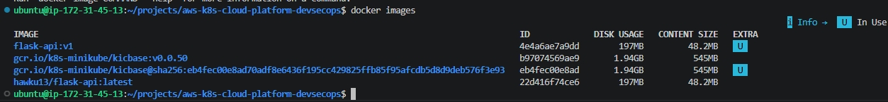

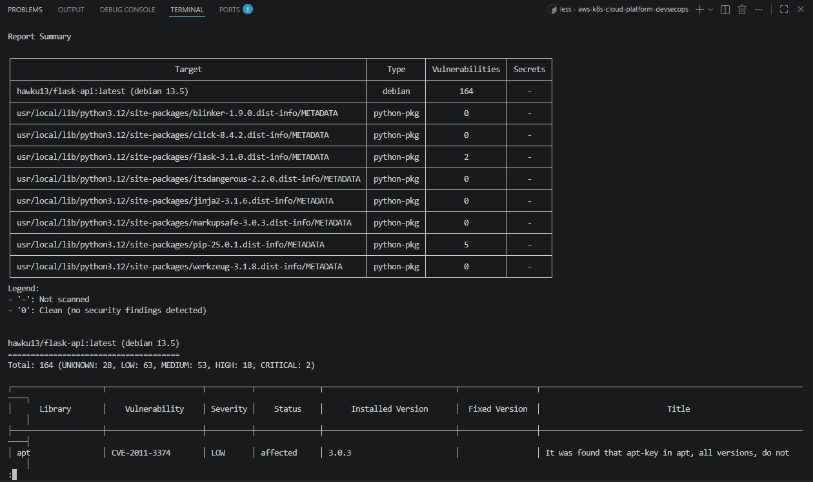


---

### 실무 TIP

실무에서는 취약점 개수를 확인하는 것보다 HIGH와 CRITICAL 등급을 우선적으로 관리하는 경우가 많다.

또한 수정 가능한(Fixed) 취약점은 운영체제 패키지와 라이브러리를 최신 버전으로 업데이트하여 해결하는 것이 일반적이다.

---

### 운영 시 고려사항

취약점 분석은 일회성 작업이 아니라 지속적으로 수행되어야 한다.

동일한 Docker Image라도 새로운 CVE가 공개될 수 있으므로 CI Pipeline에서 매 Build마다 Trivy Security Scan을 수행하여 최신 보안 상태를 유지하는 것이 중요하다.


## 7-3. GitHub Actions Security Scan 구축

### 배경

DAY3에서는 GitHub Actions를 이용하여 Docker Image를 자동으로 Build하고 Docker Hub에 Push하는 CI(Continuous Integration) 환경을 구축하였다.

그러나 기존 CI Pipeline은 Docker Image를 정상적으로 생성하는 것만 검증할 뿐, 생성된 Image에 보안 취약점이 존재하는지는 확인하지 않았다.

DevSecOps에서는 애플리케이션을 배포하기 전에 보안 검사를 자동으로 수행하여 취약한 이미지는 운영 환경으로 배포되지 않도록 하는 것이 중요하다.

이번 프로젝트에서는 GitHub Actions Workflow에 Trivy Security Scan을 추가하여 Docker Image 생성 이후 자동으로 취약점을 분석하는 보안 자동화 환경을 구축하였다.

---

### 목적

GitHub Actions CI Pipeline에 Trivy Security Scan을 통합하여 Docker Image 보안 검사를 자동화한다.

---

### Why?

기존 CI Pipeline은 Docker Image를 정상적으로 생성하는 것만 확인하였다.

하지만 정상적으로 Build된 Docker Image라도 알려진 보안 취약점(CVE)이 포함되어 있을 수 있다.

DevSecOps에서는 Build 이후 Security Scan을 수행하여 보안 위험을 사전에 확인하고 운영 환경으로 취약한 이미지가 배포되는 것을 방지한다.

이번 프로젝트에서는 GitHub Actions Workflow에 Trivy를 통합하여 Git Push만으로 자동 보안 검사가 수행되는 환경을 구축하였다.

---

### Security Scan 구조

```text
Git Push

        │

GitHub Actions

        │

Docker Build

        │

Trivy Security Scan

        │

취약점 분석

        │

Report 생성
```

---

### 사용 코드

```yaml
- name: Run Trivy Security Scan
  uses: aquasecurity/trivy-action@master
  with:
    image-ref: hawku13/flask-api:latest
    format: table
    exit-code: 0
    severity: HIGH,CRITICAL
```

---

### 코드 설명

| 항목 | 설명 |
|------|------|
| `aquasecurity/trivy-action` | GitHub Actions용 Trivy Action |
| `image-ref` | 취약점을 분석할 Docker Image |
| `format` | 출력 형식(Table) |
| `exit-code: 0` | 취약점이 발견되어도 Workflow는 계속 진행 |
| `severity` | HIGH, CRITICAL 취약점만 분석 |

---

### 실행 결과

GitHub Actions Workflow에 Trivy Security Scan Step이 추가되었다.

Git Push가 발생하면 Docker Image를 Build한 이후 Trivy가 자동으로 이미지를 분석하였으며 HIGH 및 CRITICAL 등급의 취약점을 출력하였다.

또한 취약점 분석 결과는 GitHub Actions 실행 로그를 통해 확인할 수 있었다.

---

### 결과 분석

GitHub Actions는 Docker Image Build 이후 Trivy를 실행하여 취약점을 자동으로 분석하였다.

초기에는 `exit-code: 0`으로 설정하여 취약점이 존재하더라도 Workflow는 정상적으로 완료되도록 구성하였다.

이를 통해 Security Scan 결과를 먼저 확인한 후 이후 단계에서 Security Gate를 적용하여 위험한 이미지를 자동으로 차단하는 구조로 확장하였다.

---

### 학습 포인트

- DevSecOps에서는 CI 단계에서 Security Scan을 수행한다.
- Trivy Action을 이용하면 GitHub Actions에 쉽게 통합할 수 있다.
- Security Scan은 Docker Image Build 이후 수행하는 것이 일반적이다.
- Security Scan 결과를 기반으로 Security Gate를 구성할 수 있다.

---

### 캡처

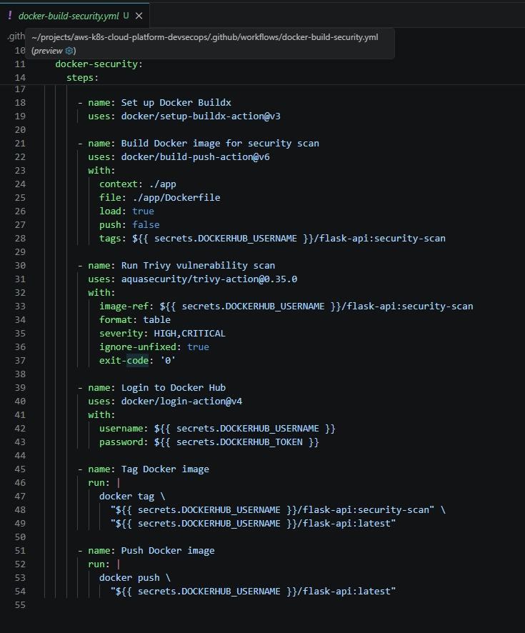

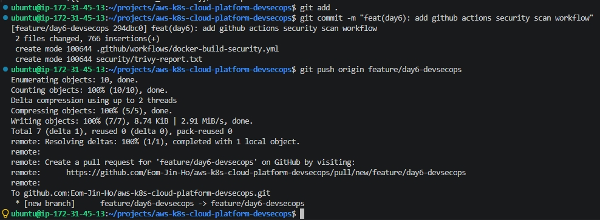

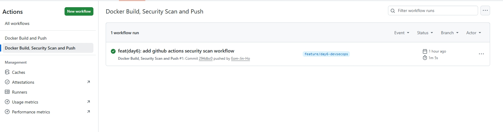

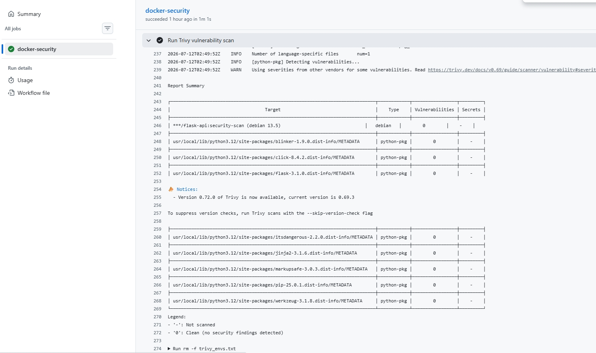

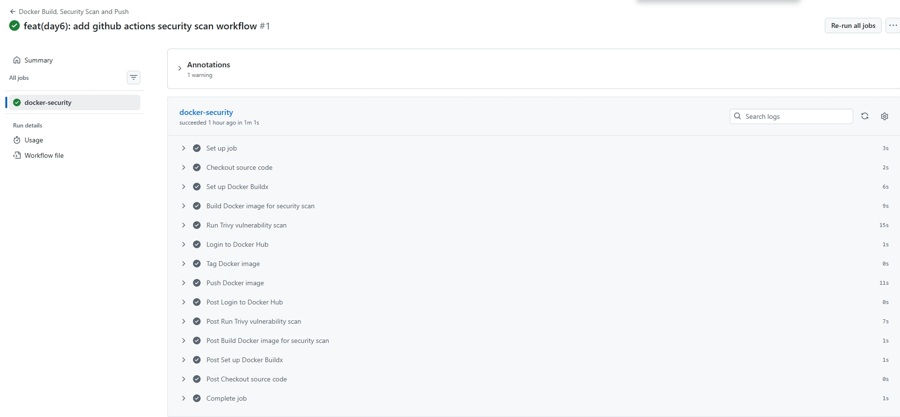

---

### 실무 TIP

실무에서는 Security Scan을 별도의 서버에서 수행하지 않고 GitHub Actions, GitLab CI, Jenkins 등의 CI Pipeline에 통합하여 자동으로 수행하는 경우가 많다.

이를 통해 개발자가 별도로 취약점 검사를 수행하지 않아도 모든 Docker Image가 동일한 기준으로 검사된다.

---

### 운영 시 고려사항

초기 구축 단계에서는 Security Scan 결과를 확인하기 위해 `exit-code: 0`으로 설정하여 Workflow가 계속 진행되도록 구성하였다.

운영 환경에서는 Security Gate를 적용하여 HIGH 및 CRITICAL 취약점이 존재하는 경우 Build를 실패시키는 정책을 함께 적용하는 것이 일반적이다.


## 7-4. Security Gate 적용

### 배경

GitHub Actions에 Trivy Security Scan을 추가하여 Docker Image의 보안 취약점을 자동으로 분석할 수 있는 환경을 구축하였다.

그러나 Security Scan 결과를 단순히 출력하는 것만으로는 DevSecOps 환경이 완성되었다고 보기 어렵다.

운영 환경에서는 HIGH 또는 CRITICAL 등급의 취약점이 발견되더라도 Build가 계속 진행되면 취약한 Docker Image가 운영 환경으로 배포될 수 있다.

이번 프로젝트에서는 Trivy의 Exit Code 기능을 이용하여 HIGH 및 CRITICAL 취약점이 발견되면 GitHub Actions Workflow를 즉시 실패시키는 Security Gate를 적용하였다.

---

### 목적

HIGH 및 CRITICAL 취약점이 존재하는 Docker Image는 CI 단계에서 자동으로 차단하여 운영 환경으로 배포되지 않도록 한다.

---

### Why?

DevSecOps의 목적은 취약점을 발견하는 것이 아니라 취약한 소프트웨어가 운영 환경에 배포되지 않도록 하는 것이다.

Security Scan은 취약점을 탐지하는 기능이며, Security Gate는 탐지된 결과를 기준으로 Build를 계속 진행할지 중단할지를 결정하는 보안 정책이다.

이번 프로젝트에서는 HIGH 및 CRITICAL 취약점이 존재하는 경우 GitHub Actions Workflow를 실패시키도록 구성하여 위험한 Docker Image가 Docker Hub까지 업로드되지 않도록 하였다.

---

### Security Gate 동작 구조

```text
Git Push

        │

GitHub Actions

        │

Docker Build

        │

Trivy Security Scan

        │

HIGH / CRITICAL 발견

        │

Security Gate

        │

Workflow Fail

        │

Docker Hub Push 중단
```

---

### 사용 코드

```yaml
- name: Run Trivy Security Gate
  uses: aquasecurity/trivy-action@master
  with:
    image-ref: hawku13/flask-api:latest
    format: table
    exit-code: 1
    severity: HIGH,CRITICAL
```

---

### 코드 설명

| 항목 | 설명 |
|---------|------|
| `image-ref` | 취약점을 분석할 Docker Image |
| `format` | 결과를 Table 형식으로 출력 |
| `exit-code: 1` | HIGH 또는 CRITICAL 취약점 발견 시 Workflow 실패 |
| `severity` | HIGH, CRITICAL 취약점만 검사 |

---

### 실행 결과

GitHub Actions Workflow에 Security Gate를 적용하였다.

Trivy가 Docker Image를 분석한 결과 HIGH 등급 취약점이 탐지되었으며 `exit-code: 1` 설정에 따라 GitHub Actions Workflow가 즉시 실패하였다.

이를 통해 취약한 Docker Image가 Docker Hub로 Push되지 않는 것을 확인하였다.

---

### 결과 분석

Security Gate는 단순히 취약점을 출력하는 것이 아니라 Build 자체를 중단하는 역할을 수행한다.

이번 프로젝트에서는 HIGH 취약점이 존재하는 Docker Image를 대상으로 Workflow가 실패하는 것을 직접 확인하였다.

이를 통해 DevSecOps 환경에서 CI 단계에서 보안 정책을 자동으로 적용하는 구조를 구축하였다.

---

### 학습 포인트

- Security Scan과 Security Gate는 서로 다른 개념이다.
- Security Scan은 취약점을 탐지한다.
- Security Gate는 취약점 기준으로 Build 진행 여부를 결정한다.
- DevSecOps에서는 CI 단계에서 Security Gate를 적용하는 것이 일반적이다.
- GitHub Actions의 Exit Code를 이용하여 Build를 제어할 수 있다.

---

### 캡처

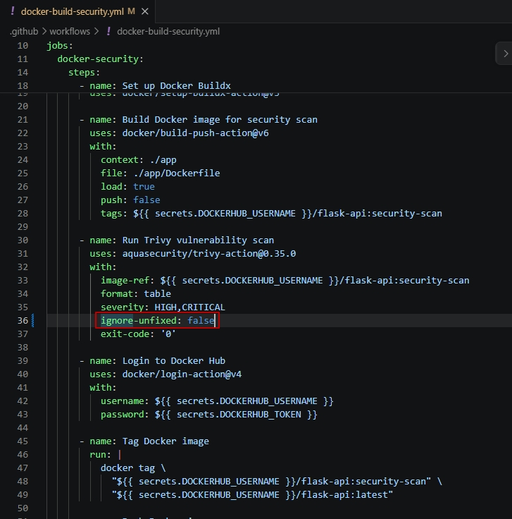

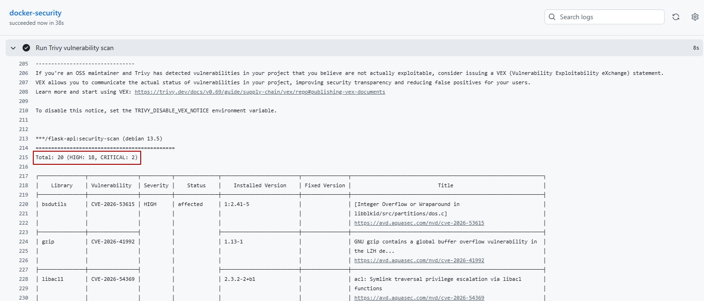

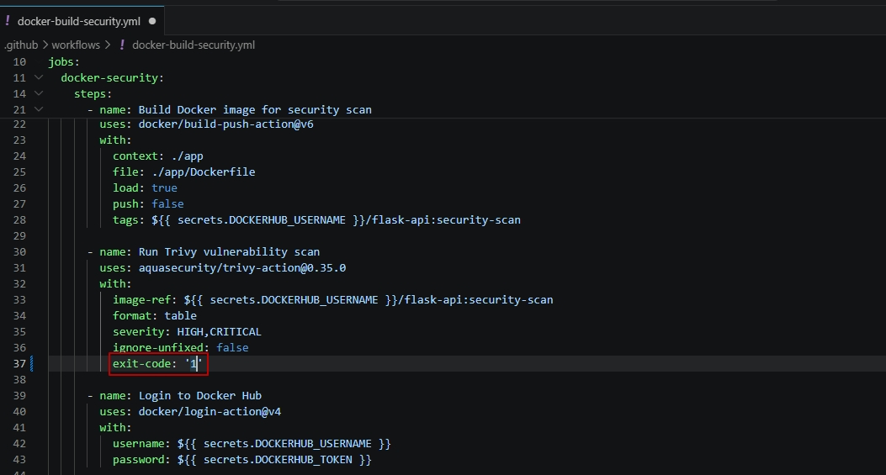


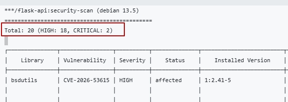

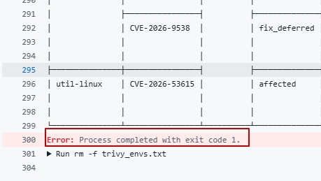

---

### 실무 TIP

기업에서는 HIGH와 CRITICAL 취약점이 존재하는 경우 CI Pipeline을 실패시키는 Security Gate를 적용하는 경우가 많다.

다만 운영 환경에서는 프로젝트 특성에 따라 MEDIUM 등급까지 차단하거나, 예외 승인 절차를 거쳐 특정 취약점을 허용하는 정책을 함께 운영하기도 한다.

---

### 운영 시 고려사항

Security Gate 기준은 프로젝트의 보안 정책에 따라 달라질 수 있다.

이번 프로젝트에서는 HIGH 및 CRITICAL 취약점을 기준으로 Workflow를 차단하도록 구성하였다.

운영 환경에서는 취약점 심각도뿐 아니라 수정 가능 여부(Fix Available), 예외 승인 정책, 위험도 평가 등을 함께 고려하여 Security Gate를 운영하는 것이 일반적이다.


## 7-5. Kubernetes Secret 적용

### 배경

DAY1부터 DAY5까지는 Flask 애플리케이션의 환경 설정을 Deployment 내부에서 직접 관리하였다.

그러나 운영 환경에서는 데이터베이스 비밀번호, API Key, Access Token과 같은 민감한 정보를 Deployment YAML이나 애플리케이션 코드에 직접 작성하는 것은 보안상 매우 위험하다.

Kubernetes에서는 이러한 민감한 정보를 Secret 리소스로 분리하여 관리하는 기능을 제공한다.

이번 프로젝트에서는 Kubernetes Secret을 생성하고 Deployment와 연동하여 환경 변수를 Pod에 주입하는 방식을 적용하였다.

---

### 목적

민감한 설정 정보를 Kubernetes Secret으로 분리하여 Pod에서 안전하게 사용할 수 있는 환경을 구축한다.

---

### Why?

애플리케이션의 민감한 정보는 소스코드와 분리하여 관리하는 것이 DevSecOps의 기본 원칙이다.

Deployment 내부에 비밀번호나 API Key를 직접 작성하면 Git Repository를 통해 외부에 노출될 위험이 존재한다.

Kubernetes Secret은 이러한 민감한 정보를 별도의 Kubernetes Resource로 관리하고 Pod 실행 시 환경 변수 형태로 전달할 수 있도록 지원한다.

이번 프로젝트에서는 Secret을 이용하여 애플리케이션 코드와 민감한 정보를 분리하는 구조를 구현하였다.

---

### Secret 동작 구조

```text
Kubernetes Secret

        │

Environment Variable

        │

Deployment

        │

Pod (Flask)

        │

Application
```

---

### 사용 명령어

```bash
echo -n "development" | base64

touch k8s/secret.yaml

kubectl apply -f k8s/secret.yaml

kubectl get secret

kubectl describe secret flask-secret
```

---

### 명령어 설명

| 명령어 | 설명 |
|---------|------|
| `echo -n "development" \| base64` | Secret 값을 Base64 형식으로 인코딩한다. |
| `touch k8s/secret.yaml` | Secret Manifest 파일을 생성한다. |
| `kubectl apply -f` | Secret을 Kubernetes에 생성한다. |
| `kubectl get secret` | 생성된 Secret 목록을 확인한다. |
| `kubectl describe secret` | Secret 상세 정보를 확인한다. |

---

### 실행 결과

Kubernetes Secret을 생성하고 Deployment에서 Secret을 참조하도록 수정하였다.

Deployment를 다시 적용한 이후 Pod 내부에서 환경 변수 `APP_ENV`가 정상적으로 주입되는 것을 확인하였다.

또한 ArgoCD Auto Sync를 통해 Secret 변경 사항이 Kubernetes Cluster에 정상적으로 반영되는 것을 검증하였다.

---

### 결과 분석

Kubernetes Secret은 민감한 정보를 Deployment와 분리하여 관리할 수 있도록 지원한다.

Pod는 Secret을 직접 참조하지 않고 Deployment를 통해 환경 변수 형태로 전달받는다.

이번 프로젝트에서는 Secret을 적용한 이후 Pod 내부에서 환경 변수가 정상적으로 주입되는 것을 확인하였으며, GitOps 환경에서도 Secret 변경 사항이 정상적으로 동기화되는 것을 검증하였다.

---

### 학습 포인트

- Kubernetes Secret은 민감한 정보를 저장하는 Kubernetes Resource이다.
- Deployment는 Secret을 참조하여 Pod에 환경 변수를 전달한다.
- Secret은 Base64 형식으로 저장되지만 암호화 기능을 제공하는 것은 아니다.
- DevSecOps에서는 애플리케이션 코드와 민감한 정보를 분리하여 관리하는 것이 기본 원칙이다.

---

### 캡처

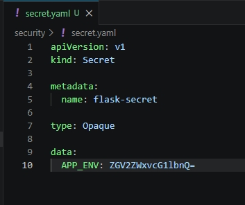

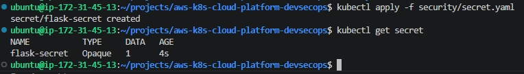

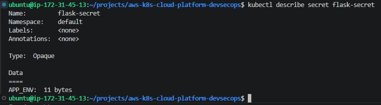

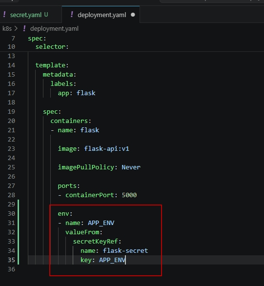

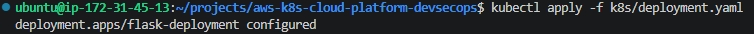

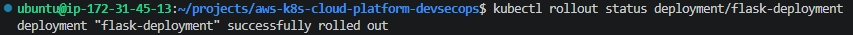

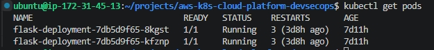


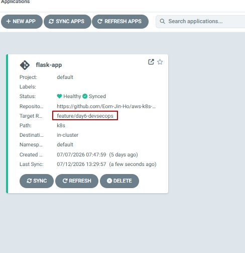

---

### 실무 TIP

Kubernetes Secret은 Base64 Encoding 형태로 저장되므로 암호화 기능을 제공하지 않는다.

실제 운영 환경에서는 AWS Secrets Manager, HashiCorp Vault, External Secrets Operator 등을 이용하여 Secret을 동적으로 생성하고 Kubernetes에 전달하는 방식을 사용하는 경우가 많다.

---

### 운영 시 고려사항

Secret Manifest를 Git Repository에 그대로 저장하면 Base64 값을 누구나 확인할 수 있다.

따라서 운영 환경에서는 Secret Manifest를 직접 Git에 저장하지 않거나 Sealed Secrets, External Secrets Operator 등을 이용하여 민감한 정보를 안전하게 관리하는 것이 일반적이다.


## 7-6. ConfigMap 적용

### 배경

Kubernetes Secret을 이용하여 민감한 정보를 애플리케이션과 분리하였다.

그러나 애플리케이션에는 비밀번호나 API Key뿐 아니라 로그 레벨(LOG_LEVEL), 리전(APP_REGION)과 같은 일반 설정 정보도 함께 존재한다.

이러한 설정은 민감한 정보가 아니므로 Secret으로 관리하기보다 ConfigMap을 이용하여 관리하는 것이 Kubernetes의 일반적인 운영 방식이다.

이번 프로젝트에서는 ConfigMap을 생성하고 Deployment와 연동하여 일반 설정을 Pod의 환경 변수로 전달하는 구조를 적용하였다.

---

### 목적

애플리케이션의 일반 설정 정보를 ConfigMap으로 분리하여 Pod에서 사용할 수 있는 환경을 구축한다.

---

### Why?

애플리케이션 설정은 크게 두 가지로 구분할 수 있다.

- 민감한 정보
- 일반 설정

민감한 정보는 Secret으로 관리하고, 일반 설정은 ConfigMap으로 분리하여 관리하면 설정 변경 시 애플리케이션 이미지를 다시 생성하지 않아도 된다.

또한 운영 환경에서는 환경별(Development, Staging, Production)로 ConfigMap만 변경하여 동일한 Docker Image를 여러 환경에서 재사용할 수 있다.

이번 프로젝트에서는 LOG_LEVEL과 APP_REGION을 ConfigMap으로 관리하여 설정과 애플리케이션을 분리하는 구조를 구현하였다.

---

### ConfigMap 동작 구조

```text
ConfigMap

        │

Environment Variable

        │

Deployment

        │

Pod (Flask)

        │

Application
```

---

### 사용 명령어

```bash
touch k8s/configmap.yaml

kubectl apply -f k8s/configmap.yaml

kubectl get configmap

kubectl describe configmap flask-config
```

---

### 명령어 설명

| 명령어 | 설명 |
|---------|------|
| `touch k8s/configmap.yaml` | ConfigMap Manifest 파일을 생성한다. |
| `kubectl apply -f` | ConfigMap을 Kubernetes에 생성한다. |
| `kubectl get configmap` | 생성된 ConfigMap 목록을 확인한다. |
| `kubectl describe configmap` | ConfigMap 상세 정보를 확인한다. |

---

### 실행 결과

ConfigMap을 생성하고 Deployment에서 ConfigMap을 참조하도록 수정하였다.

Deployment를 다시 적용한 이후 Pod 내부에서 `LOG_LEVEL`과 `APP_REGION` 환경 변수가 정상적으로 주입되는 것을 확인하였다.

이를 통해 일반 설정을 애플리케이션 코드와 분리하여 관리할 수 있는 환경을 구축하였다.

---

### 결과 분석

ConfigMap은 일반 설정 정보를 관리하기 위한 Kubernetes Resource이다.

Secret과 동일하게 Deployment를 통해 Pod에 환경 변수를 전달하지만, 민감한 정보가 아닌 일반 설정을 저장한다는 점에서 차이가 있다.

이번 프로젝트에서는 ConfigMap을 이용하여 운영 환경 설정을 애플리케이션과 분리하였으며, Pod 내부에서 환경 변수가 정상적으로 전달되는 것을 검증하였다.

---

### 학습 포인트

- ConfigMap은 일반 설정 정보를 저장하는 Kubernetes Resource이다.
- Secret은 민감한 정보를 저장하고 ConfigMap은 일반 설정을 저장한다.
- Deployment는 ConfigMap을 참조하여 Pod에 환경 변수를 전달한다.
- 설정을 ConfigMap으로 분리하면 애플리케이션 이미지를 다시 생성하지 않고 설정을 변경할 수 있다.

---

### 캡처

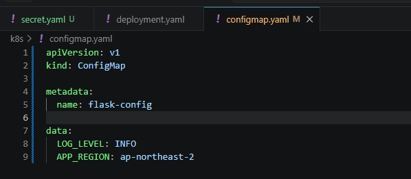

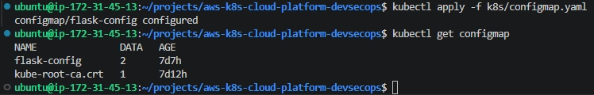

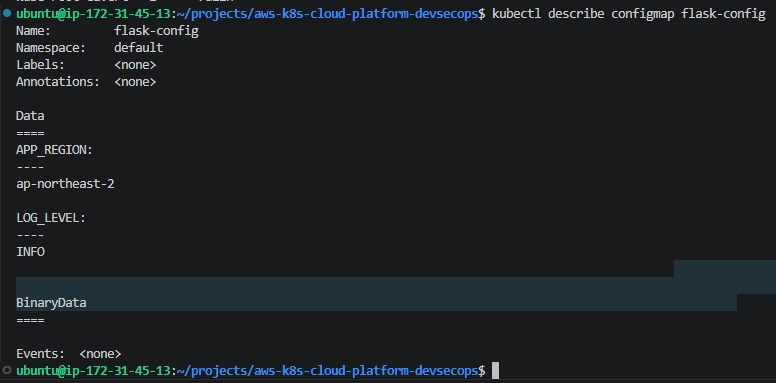

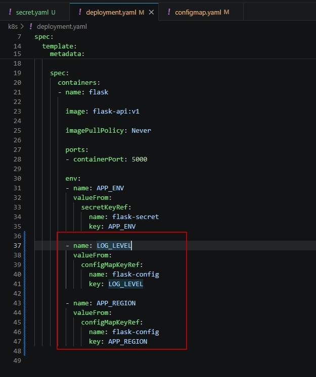


---

### 실무 TIP

운영 환경에서는 ConfigMap을 이용하여 로그 레벨, 서버 주소, 타임존, 리전 등 환경별 설정을 관리하는 경우가 많다.

동일한 Docker Image를 사용하면서 ConfigMap만 변경하여 Development, Staging, Production 환경을 구분하는 것이 일반적인 운영 방식이다.

---

### 운영 시 고려사항

ConfigMap은 보안 저장소가 아니므로 비밀번호, API Key, Access Token과 같은 민감한 정보를 저장해서는 안 된다.

민감한 정보는 Secret으로 분리하고 일반 설정만 ConfigMap으로 관리하는 것이 Kubernetes 운영의 기본 원칙이다.


## 7-7. Calico CNI 적용

### 배경

Kubernetes는 NetworkPolicy 리소스를 제공하지만 기본적으로 Kubernetes 자체가 네트워크 패킷을 제어하는 기능을 제공하지는 않는다.

초기 Minikube 환경에서 NetworkPolicy를 생성하였지만 Pod 간 통신은 계속 허용되었으며 정책이 정상적으로 적용되지 않는 것을 확인하였다.

원인을 분석한 결과 기본 Minikube 환경에서는 NetworkPolicy를 실제로 처리하는 CNI(Container Network Interface)가 구성되어 있지 않았으며, NetworkPolicy를 지원하는 Calico CNI를 적용해야 하는 것을 확인하였다.

이번 프로젝트에서는 별도의 Calico 기반 Minikube Cluster를 구성하여 NetworkPolicy를 실제로 검증하였다.

---

### 목적

Calico CNI를 적용하여 Kubernetes NetworkPolicy를 실제로 동작할 수 있는 환경을 구축한다.

---

### Why?

NetworkPolicy는 Kubernetes Resource이지만 실제 패킷을 차단하거나 허용하는 기능은 Kubernetes가 수행하지 않는다.

NetworkPolicy는 정책만 선언하며 실제 트래픽 제어는 CNI(Container Network Interface)가 담당한다.

Calico는 Kubernetes에서 가장 널리 사용되는 CNI 중 하나이며 NetworkPolicy를 iptables 또는 eBPF 기반으로 구현하여 Pod 간 통신을 제어한다.

이번 프로젝트에서는 기본 Minikube 환경에서 NetworkPolicy가 동작하지 않는 원인을 분석하고 Calico를 적용하여 실제 통신 제어를 검증하였다.

---

### NetworkPolicy 동작 구조

```text
NetworkPolicy

        │

Calico CNI

        │

iptables

        │

Linux Kernel

        │

Packet Filtering
```

---

### 사용 명령어

```bash
minikube stop

minikube start \
-p minikube-calico \
--driver=docker \
--cni=calico \
--cpus=2 \
--memory=4096

kubectl get daemonset -A

kubectl get pods -n kube-system
```

---

### 명령어 설명

| 명령어 | 설명 |
|---------|------|
| `minikube stop` | 기존 Minikube Cluster를 종료한다. |
| `minikube start --cni=calico` | Calico 기반 Minikube Cluster를 생성한다. |
| `kubectl get daemonset -A` | Calico DaemonSet 실행 여부를 확인한다. |
| `kubectl get pods -n kube-system` | Calico Pod 상태를 확인한다. |

---

### 실행 결과

Calico CNI가 정상적으로 설치되었으며 `calico-node` DaemonSet이 Running 상태인 것을 확인하였다.

이를 통해 NetworkPolicy를 실제로 적용할 수 있는 Kubernetes 보안 환경이 구성되었다.

---

### 결과 분석

기본 Minikube에서는 NetworkPolicy Manifest를 생성할 수는 있었지만 실제 트래픽은 차단되지 않았다.

Calico를 적용한 이후 NetworkPolicy가 실제 Pod 간 통신을 제어하는 것을 확인하였다.

이를 통해 NetworkPolicy는 Kubernetes 기능이 아니라 CNI가 실제 패킷을 제어한다는 점을 직접 검증하였다.

---

### 학습 포인트

- Kubernetes는 NetworkPolicy만 관리한다.
- 실제 패킷 제어는 CNI가 수행한다.
- Calico는 Kubernetes 대표 CNI이다.
- NetworkPolicy는 Calico와 함께 사용할 때 실제로 동작한다.

---

### 캡처

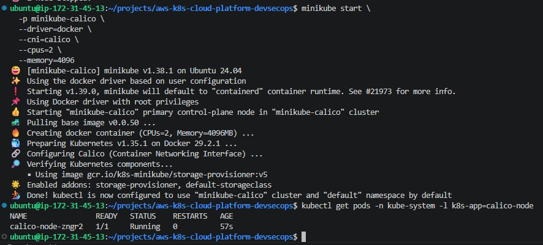

---

### 실무 TIP

실무에서는 Calico 외에도 Cilium과 같은 CNI를 많이 사용한다.

최근에는 eBPF 기반 Cilium을 사용하는 사례도 증가하고 있지만 Calico는 여전히 가장 널리 사용되는 Kubernetes NetworkPolicy 구현체 중 하나이다.

---

### 운영 시 고려사항

NetworkPolicy를 적용하기 전에 현재 Kubernetes Cluster가 NetworkPolicy를 지원하는 CNI를 사용하는지 먼저 확인해야 한다.

CNI가 NetworkPolicy를 지원하지 않는 경우 Manifest는 생성되더라도 실제 네트워크 차단은 수행되지 않는다.


## 7-8. NetworkPolicy(Default Deny) 적용

### 배경

Calico CNI를 적용하여 Kubernetes Cluster에서 NetworkPolicy를 사용할 수 있는 환경을 구축하였다.

그러나 NetworkPolicy를 적용하기 전까지는 모든 Pod가 서로 자유롭게 통신할 수 있는 상태였다.

운영 환경에서는 이러한 Default Allow 방식보다 기본적으로 모든 접근을 차단한 후 필요한 통신만 허용하는 Zero Trust 방식이 보안 측면에서 더욱 안전하다.

이번 프로젝트에서는 Default Deny NetworkPolicy를 적용하여 Flask Pod로의 모든 Ingress 트래픽을 차단하는 정책을 구성하였다.

---

### 목적

Flask Pod로 들어오는 모든 Ingress 트래픽을 기본적으로 차단하여 최소 권한 기반 네트워크 정책을 구성한다.

---

### Why?

Kubernetes는 기본적으로 모든 Pod 간 통신을 허용(Default Allow)한다.

이 방식은 개발 환경에서는 편리하지만 운영 환경에서는 불필요한 Pod 간 통신까지 허용될 수 있어 보안상 위험하다.

Default Deny 정책을 적용하면 허용되지 않은 모든 접근이 기본적으로 차단되며, 이후 필요한 Pod만 명시적으로 허용하는 White List 기반 보안 정책을 적용할 수 있다.

이번 프로젝트에서는 Default Deny 정책을 적용하여 Flask Pod로의 접근을 모두 차단한 후 이후 단계에서 허용 정책을 추가하는 방식으로 NetworkPolicy를 검증하였다.

---

### Default Deny 구조

```text
NetworkPolicy

        │

Default Deny

        │

Flask Pod

        ▲

        │

모든 Pod 접근 차단
```

---

### 사용 명령어

```bash
touch security/default-deny.yaml

kubectl apply -f security/default-deny.yaml

kubectl get networkpolicy

kubectl describe networkpolicy deny-all-ingress-to-flask

kubectl exec test-client -- \
wget -T 5 -qO- http://flask-service:5000
```

---

### 명령어 설명

| 명령어 | 설명 |
|---------|------|
| `touch security/default-deny.yaml` | Default Deny NetworkPolicy 파일을 생성한다. |
| `kubectl apply -f` | NetworkPolicy를 Kubernetes에 적용한다. |
| `kubectl get networkpolicy` | 생성된 NetworkPolicy를 확인한다. |
| `kubectl describe networkpolicy` | 정책 상세 정보를 확인한다. |
| `kubectl exec ... wget` | test-client에서 Flask Service 접근을 테스트한다. |

---

### 실행 결과

Default Deny NetworkPolicy를 적용한 이후 test-client에서 Flask Service로 접근을 시도한 결과 요청이 Timeout 되면서 통신이 차단되는 것을 확인하였다.

이를 통해 NetworkPolicy가 실제로 Pod 간 통신을 제어하는 것을 검증하였다.

---

### 결과 분석

Default Deny 정책은 Flask Pod를 대상으로 모든 Ingress 트래픽을 차단하였다.

NetworkPolicy 적용 이전에는 test-client에서 Flask Service로 정상적으로 접근할 수 있었지만 정책 적용 이후에는 동일한 요청이 Timeout 되면서 통신이 차단되었다.

이를 통해 Kubernetes NetworkPolicy가 Calico CNI를 통해 실제 패킷을 제어하는 것을 확인하였다.

---

### 학습 포인트

- Kubernetes 기본 정책은 Default Allow이다.
- Default Deny는 모든 Ingress 트래픽을 차단한다.
- Zero Trust 환경에서는 Default Deny를 기본 정책으로 사용한다.
- NetworkPolicy는 Calico를 통해 실제 네트워크를 제어한다.

---

### 캡처

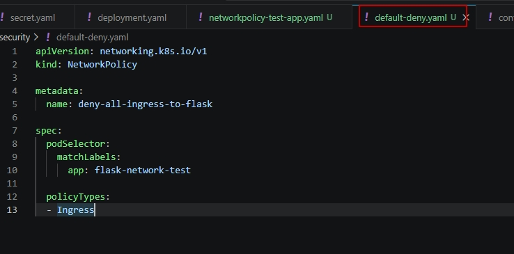

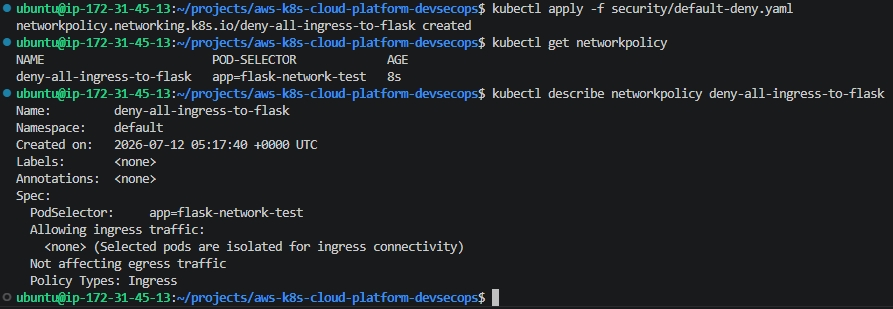

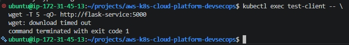

---

### 실무 TIP

기업에서는 Kubernetes Cluster 전체를 Default Deny 정책으로 시작한 후 서비스에 필요한 Pod만 명시적으로 허용하는 White List 기반 정책을 적용하는 경우가 많다.

이를 통해 불필요한 Pod 간 통신을 차단하고 내부 이동(Lateral Movement) 공격 위험을 줄일 수 있다.

---

### 운영 시 고려사항

Default Deny 정책을 적용하면 정상적인 서비스 통신도 모두 차단될 수 있다.

따라서 운영 환경에서는 애플리케이션 간 통신 관계를 충분히 분석한 후 필요한 Pod만 허용하는 정책을 함께 구성해야 한다.


## 7-9. Allow Policy 적용

### 배경

Default Deny NetworkPolicy를 적용한 이후 Flask Pod로의 모든 Ingress 트래픽이 차단되었다.

그러나 운영 환경에서는 모든 통신을 영구적으로 차단하는 것이 아니라 서비스에 필요한 애플리케이션만 선택적으로 허용해야 한다.

이를 위해 Kubernetes에서는 특정 Label을 가진 Pod만 접근을 허용하는 White List 기반 NetworkPolicy를 제공한다.

이번 프로젝트에서는 `access=allowed` Label을 가진 test-client만 Flask Pod에 접근할 수 있도록 Allow Policy를 적용하였다.

---

### 목적

특정 Pod만 Flask Pod에 접근할 수 있도록 허용하여 최소 권한 기반 NetworkPolicy를 구현한다.

---

### Why?

Default Deny 정책만 적용하면 정상적인 서비스 통신까지 모두 차단된다.

운영 환경에서는 필요한 서비스만 명시적으로 허용하는 White List 기반 접근 제어를 적용하여 보안성과 서비스 가용성을 동시에 확보한다.

이번 프로젝트에서는 `access=allowed` Label을 가진 test-client Pod만 Flask Service에 접근할 수 있도록 허용 정책을 적용하였다.

이를 통해 Kubernetes NetworkPolicy가 Label 기반으로 Pod 간 통신을 제어하는 방식을 검증하였다.

---

### Allow Policy 구조

```text
                 Flask Pod

                     ▲

                     │

             access=allowed

                     │

        ┌────────────┴────────────┐

        │                         │

test-client                 Other Pod

access=allowed              Label 없음

        │                         │

        ▼                         ▼

      허용                      차단
```

---

### 사용 명령어

```bash
kubectl label pod test-client access=allowed

kubectl get pod test-client --show-labels

kubectl apply -f security/allow-ingress-from-client.yaml

kubectl get networkpolicy

kubectl exec test-client -- \
wget -T 5 -qO- http://flask-service:5000
```

---

### 명령어 설명

| 명령어 | 설명 |
|---------|------|
| `kubectl label pod` | test-client Pod에 Label을 추가한다. |
| `kubectl get pod --show-labels` | Label 적용 여부를 확인한다. |
| `kubectl apply -f` | Allow Policy를 Kubernetes에 적용한다. |
| `kubectl get networkpolicy` | 적용된 NetworkPolicy를 확인한다. |
| `kubectl exec ... wget` | test-client에서 Flask Service 접근을 검증한다. |

---

### 실행 결과

test-client Pod에 `access=allowed` Label을 추가한 후 Allow Policy를 적용하였다.

이후 동일한 wget 요청을 수행한 결과 Flask API가 정상적으로 응답하는 것을 확인하였다.

이를 통해 Default Deny 상태에서도 허용된 Pod만 선택적으로 접근할 수 있는 것을 검증하였다.

---

### 결과 분석

NetworkPolicy는 Deny Rule을 직접 작성하는 방식이 아니라 허용할 대상을 명시하는 White List 방식으로 동작한다.

Default Deny 정책이 적용된 상태에서 `access=allowed` Label을 가진 Pod만 Flask Pod로의 접근이 허용되었으며, Label이 없는 Pod는 계속 차단되는 것을 확인하였다.

이를 통해 Kubernetes NetworkPolicy가 Label Selector를 이용하여 Pod 간 통신을 제어한다는 점을 검증하였다.

---

### 학습 포인트

- Kubernetes NetworkPolicy는 White List 방식으로 동작한다.
- Label Selector를 이용하여 허용 대상을 지정한다.
- Default Deny 이후 필요한 Pod만 허용하는 것이 일반적인 운영 방식이다.
- Pod Label은 NetworkPolicy의 중요한 식별 기준이다.

---

### 캡처

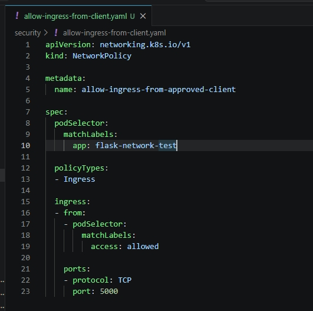


---

### 실무 TIP

실무에서는 Pod 이름이 아니라 Label을 기준으로 NetworkPolicy를 구성한다.

Deployment가 재생성되더라도 Label은 유지되므로 정책을 수정하지 않아도 지속적으로 동일한 보안 정책을 적용할 수 있다.

---

### 운영 시 고려사항

NetworkPolicy는 Pod Label을 기준으로 동작하므로 Label 관리 정책이 매우 중요하다.

운영 환경에서는 서비스별 Label Naming Rule을 정의하고 일관되게 적용하여 NetworkPolicy가 의도한 대로 동작하도록 관리하는 것이 일반적이다.


## 7-10. DevSecOps 보안 자동화 최종 검증

### 배경

DAY6에서는 Trivy를 이용한 Container Image 취약점 분석, GitHub Actions Security Scan, Security Gate, Kubernetes Secret, ConfigMap, NetworkPolicy를 단계적으로 구축하였다.

각 기능은 개별적으로 검증을 완료하였지만 DevSecOps 환경이 정상적으로 구축되었는지 확인하기 위해 전체 보안 파이프라인을 종합적으로 검증하는 과정이 필요하였다.

이번 프로젝트에서는 Git Push부터 Kubernetes Pod 보안 정책까지 전체 DevSecOps 흐름을 최종적으로 확인하였다.

---

### 목적

Container Image 보안 검사부터 Kubernetes 네트워크 보안까지 DevSecOps 보안 자동화 환경이 정상적으로 동작하는지 최종 검증한다.

---

### Why?

DevSecOps는 개별 보안 기능을 적용하는 것이 아니라 개발부터 배포까지 전체 과정에 보안을 통합하는 것을 목표로 한다.

따라서 Trivy, Security Gate, Secret, ConfigMap, NetworkPolicy가 각각 정상적으로 동작하는지뿐 아니라 하나의 DevSecOps Pipeline으로 연결되어 동작하는지 확인하는 과정이 필요하다.

이번 프로젝트에서는 전체 보안 자동화 과정을 최종 검증하여 DevSecOps 구축이 완료되었음을 확인하였다.

---

### DevSecOps Pipeline

```text
Git Push

        │

GitHub Actions

        │

Docker Build

        │

Trivy Security Scan

        │

Security Gate

        │

Docker Hub

        │

ArgoCD

        │

Kubernetes

        │

Secret

ConfigMap

NetworkPolicy

        │

Pod (Flask)
```

---

### 검증 결과

이번 프로젝트에서는 다음 항목을 모두 검증하였다.

- Trivy를 이용한 Docker Image 취약점 분석
- GitHub Actions Security Scan 자동 수행
- HIGH / CRITICAL 취약점 발생 시 Security Gate 차단
- Kubernetes Secret 환경 변수 주입
- ConfigMap 환경 변수 주입
- Calico CNI 기반 NetworkPolicy 적용
- Default Deny 정책 검증
- Allow Policy를 통한 선택적 접근 허용

---

### 결과 분석

Container Image 생성부터 Kubernetes Pod 실행까지 모든 단계에서 보안 기능이 정상적으로 동작하는 것을 확인하였다.

특히 GitHub Actions에서는 Security Scan과 Security Gate를 통해 취약한 Docker Image의 배포를 차단하였으며 Kubernetes에서는 Secret, ConfigMap, NetworkPolicy를 이용하여 애플리케이션 보안과 네트워크 보안을 강화하였다.

이를 통해 기존 CI/CD Pipeline에 Security를 통합한 DevSecOps 환경을 구축하고 검증하였다.

---

### 학습 포인트

- DevSecOps는 개발부터 배포까지 보안을 통합하는 운영 방식이다.
- Security Scan과 Security Gate는 CI 단계에서 보안을 담당한다.
- Secret과 ConfigMap은 Kubernetes 설정 보안을 담당한다.
- NetworkPolicy는 Pod 간 네트워크 보안을 담당한다.
- 각 보안 기능은 하나의 DevSecOps Pipeline으로 연결된다.

---

### 캡처


---

### 실무 TIP

기업에서는 DevSecOps를 구축할 때 CI 단계의 Security Scan뿐 아니라 Kubernetes Admission Controller, Image Signing, Runtime Security(Falco), Policy Engine(Kyverno, OPA Gatekeeper) 등을 함께 적용하여 다계층 보안 구조를 구성하는 경우가 많다.

---

### 운영 시 고려사항

DevSecOps는 한 번 구축으로 끝나는 것이 아니라 지속적으로 보안 정책을 개선해야 한다.

새로운 CVE 공개, Kubernetes 보안 정책 변경, 운영 환경 변화 등을 지속적으로 반영하여 Security Scan 기준과 NetworkPolicy 정책을 최신 상태로 유지하는 것이 중요하다.


# 8. 핵심 기술 이해

---

## 8-1. DevSecOps란?

### DevSecOps의 정의

DevSecOps(Development, Security, Operations)는 개발(Development), 보안(Security), 운영(Operations)을 하나의 파이프라인으로 통합하는 소프트웨어 개발 및 운영 방식이다.

기존 DevOps는 애플리케이션을 빠르게 개발하고 배포하는 데 초점을 맞추었다.

반면 DevSecOps는 개발부터 운영까지의 모든 단계에 보안(Security)을 함께 적용하여 안전한 소프트웨어를 지속적으로 제공하는 것을 목표로 한다.

---

### DevSecOps를 사용하는 이유

기존에는 애플리케이션을 개발한 이후 별도의 보안 점검을 수행하는 경우가 많았다.

그러나 이러한 방식은 취약점이 운영 환경까지 전달될 가능성이 있으며, 배포 이후 보안 문제를 수정하는 데 많은 비용이 발생할 수 있다.

DevSecOps는 CI/CD 파이프라인에 보안 검사를 통합하여 개발 초기 단계부터 취약점을 발견하고 수정할 수 있도록 지원한다.

이를 통해 보안 품질을 높이면서도 배포 자동화를 유지할 수 있다.

---

### DevSecOps 구성 요소

DevSecOps는 크게 다음과 같은 영역으로 구성된다.

| 영역 | 역할 |
|------|------|
| Development | 애플리케이션 개발 |
| CI | 코드 Build 및 테스트 |
| Security Scan | 취약점 분석 |
| Security Gate | 보안 정책 적용 |
| CD | Kubernetes 자동 배포 |
| Runtime Security | 운영 환경 보안 |

---

### DevSecOps Pipeline

```text
Developer

↓

Git Push

↓

GitHub Actions

↓

Docker Build

↓

Trivy Security Scan

↓

Security Gate

↓

Docker Hub

↓

ArgoCD

↓

Kubernetes
```

---

### 이번 프로젝트에서 DevSecOps

이번 프로젝트에서는 GitHub Actions 기반 CI Pipeline에 Trivy Security Scan과 Security Gate를 추가하였다.

또한 Kubernetes에서는 Secret, ConfigMap, NetworkPolicy를 적용하여 애플리케이션 보안과 네트워크 보안을 강화하였다.

이를 통해 개발부터 Kubernetes 운영까지 보안을 통합한 DevSecOps 환경을 구축하였다.

---

### 학습 포인트

- DevSecOps는 DevOps에 Security를 통합한 개념이다.
- Security는 개발 초기부터 적용하는 것이 중요하다.
- CI 단계에서 Security Scan을 수행한다.
- Kubernetes에서도 Secret, NetworkPolicy 등을 이용하여 보안을 강화한다.

---

### 실무 TIP

기업에서는 Trivy 외에도 Snyk, Prisma Cloud, Aqua Security, Checkmarx 등의 보안 도구를 CI/CD Pipeline과 연동하여 DevSecOps 환경을 구축하는 경우가 많다.

---

### 운영 시 고려사항

DevSecOps는 새로운 보안 도구를 추가하는 것이 목적이 아니라 개발부터 운영까지 동일한 보안 정책을 지속적으로 적용하는 운영 체계를 구축하는 것이 중요하다.


## 8-2. Trivy란?

### Trivy의 정의

Trivy는 Aqua Security에서 개발한 오픈소스 Security Scanner로, Container Image, File System, Git Repository, Kubernetes Cluster 등 다양한 대상의 보안 취약점을 분석할 수 있는 DevSecOps 보안 도구이다.

Container Image 내부의 운영체제 패키지와 오픈소스 라이브러리를 분석하여 알려진 보안 취약점(CVE)을 탐지하며, 현재 DevSecOps 환경에서 가장 널리 사용되는 Container Security Scanner 중 하나이다.

---

### Trivy를 사용하는 이유

Container Image에는 애플리케이션뿐 아니라 운영체제 패키지와 다양한 오픈소스 라이브러리가 함께 포함된다.

이러한 구성 요소 중 알려진 보안 취약점(CVE)이 존재할 경우 운영 환경에서 공격 대상이 될 수 있다.

Trivy는 Docker Image를 분석하여 설치된 패키지를 CVE Database와 비교하고 취약점을 자동으로 탐지한다.

이를 통해 운영 환경에 배포하기 전에 보안 위험을 사전에 확인할 수 있다.

---

### Trivy 동작 과정

```text
Docker Image

        │

Trivy

        │

OS Package

Library

        │

CVE Database

        │

취약점 분석

        │

Report 생성
```

---

### Trivy가 분석하는 대상

Trivy는 다음과 같은 다양한 대상을 분석할 수 있다.

| 분석 대상 | 설명 |
|-----------|------|
| Container Image | Docker Image 취약점 분석 |
| File System | 로컬 파일 시스템 분석 |
| Git Repository | Repository 보안 분석 |
| Kubernetes | Kubernetes Cluster 분석 |
| SBOM | Software Bill of Materials 분석 |

---

### CVE란?

CVE(Common Vulnerabilities and Exposures)는 공개된 보안 취약점에 부여되는 고유 식별 번호이다.

예를 들어

```text
CVE-2024-12345
```

와 같이 표기되며, 동일한 취약점을 여러 보안 제품에서 동일하게 식별할 수 있도록 한다.

Trivy는 이러한 CVE Database를 기반으로 Docker Image 내부 패키지의 취약점을 분석한다.

---

### Severity란?

Trivy는 탐지된 취약점을 심각도(Severity)에 따라 구분한다.

| Severity | 의미 |
|----------|------|
| LOW | 낮은 위험 |
| MEDIUM | 중간 위험 |
| HIGH | 높은 위험 |
| CRITICAL | 매우 높은 위험 |

이번 프로젝트에서는 HIGH와 CRITICAL 취약점을 기준으로 Security Gate를 적용하였다.

---

### 이번 프로젝트에서 Trivy 역할

DAY6에서는 Trivy를 GitHub Actions CI Pipeline에 통합하였다.

Docker Image Build 이후 Trivy가 자동으로 취약점을 분석하였으며 HIGH 또는 CRITICAL 취약점이 존재하는 경우 Security Gate를 통해 Workflow를 실패시키도록 구성하였다.

이를 통해 취약한 Docker Image가 Docker Hub와 Kubernetes 환경으로 배포되지 않도록 구성하였다.

---

### 학습 포인트

- Trivy는 대표적인 Container Security Scanner이다.
- Docker Image 내부 패키지를 분석한다.
- CVE Database를 이용하여 취약점을 탐지한다.
- CI Pipeline과 쉽게 통합할 수 있다.
- DevSecOps 환경에서 가장 많이 사용하는 보안 도구 중 하나이다.

---

### 실무 TIP

기업에서는 Trivy를 GitHub Actions, GitLab CI, Jenkins 등과 연동하여 Container Image가 생성될 때마다 자동으로 취약점을 검사하는 경우가 많다.

또한 Kubernetes Cluster, IaC(Terraform), SBOM 분석에도 함께 활용한다.

---

### 운영 시 고려사항

Trivy는 최신 CVE Database를 기준으로 취약점을 분석한다.

운영 환경에서는 CI Pipeline 실행 시 최신 취약점 데이터베이스를 함께 갱신하여 최신 보안 상태를 유지하는 것이 중요하다.


## 8-3. Security Scan과 Security Gate 차이

### Security Scan이란?

Security Scan은 애플리케이션이나 Container Image에 존재하는 보안 취약점을 탐지하는 과정이다.

취약점의 존재 여부를 확인하고 결과를 출력하는 것이 목적이며, 일반적으로 CVE(Common Vulnerabilities and Exposures) Database를 이용하여 알려진 취약점을 분석한다.

이번 프로젝트에서는 Trivy를 이용하여 Docker Image를 분석하고 HIGH 및 CRITICAL 취약점을 탐지하였다.

---

### Security Gate란?

Security Gate는 Security Scan 결과를 기반으로 Build를 계속 진행할지 중단할지를 결정하는 보안 정책이다.

즉 Security Scan이 취약점을 발견하는 역할이라면, Security Gate는 발견된 취약점을 기준으로 CI Pipeline을 제어하는 역할을 수행한다.

이번 프로젝트에서는 Trivy에서 HIGH 또는 CRITICAL 취약점이 발견되면 GitHub Actions Workflow를 즉시 실패시키도록 구성하였다.

---

### Security Scan과 Security Gate 비교

| 구분 | Security Scan | Security Gate |
|------|---------------|---------------|
| 목적 | 취약점 탐지 | Build 진행 여부 결정 |
| 결과 | 취약점 목록 출력 | Workflow 성공 또는 실패 |
| 역할 | 보안 분석 | 보안 정책 적용 |
| 이번 프로젝트 | Trivy Scan | GitHub Actions Exit Code |

---

### 동작 과정

```text
Git Push

        │

GitHub Actions

        │

Docker Build

        │

Trivy Security Scan

        │

HIGH / CRITICAL 탐지

        │

Security Gate

        │

Workflow Fail

        │

Docker Hub Push 차단
```

---

### Exit Code란?

Exit Code는 프로그램이 종료될 때 반환하는 상태 코드이다.

GitHub Actions는 Exit Code를 기준으로 Workflow 성공 여부를 판단한다.

이번 프로젝트에서는 다음과 같이 구성하였다.

| Exit Code | 의미 |
|-----------|------|
| 0 | 정상 종료 (Workflow 계속 진행) |
| 1 | 오류 발생 (Workflow 실패) |

초기에는

```yaml
exit-code: 0
```

으로 설정하여 취약점이 존재하더라도 Workflow가 계속 진행되도록 구성하였다.

이후 Security Gate를 적용하면서

```yaml
exit-code: 1
```

로 변경하여 HIGH 또는 CRITICAL 취약점이 발견되면 Workflow를 즉시 실패시키도록 구성하였다.

---

### 이번 프로젝트에서 Security Gate 역할

DAY6에서는 Docker Image Build 이후 Trivy Security Scan을 수행하였다.

취약점 분석 결과 HIGH 취약점이 발견되었으며 GitHub Actions는 Exit Code 1을 반환하여 Workflow를 실패시켰다.

이를 통해 취약한 Docker Image가 Docker Hub와 Kubernetes 환경으로 배포되지 않는 것을 검증하였다.

---

### 학습 포인트

- Security Scan은 취약점을 탐지하는 과정이다.
- Security Gate는 Build 진행 여부를 결정하는 정책이다.
- GitHub Actions는 Exit Code를 이용하여 Workflow를 제어한다.
- DevSecOps에서는 Security Scan과 Security Gate를 함께 적용하는 것이 일반적이다.

---

### 실무 TIP

기업에서는 HIGH와 CRITICAL 취약점뿐 아니라 프로젝트 보안 정책에 따라 MEDIUM 등급까지 Security Gate 대상으로 지정하기도 한다.

또한 예외 승인(Exception Approval) 절차를 통해 특정 CVE를 일시적으로 허용하는 정책을 함께 운영하는 경우도 많다.

---

### 운영 시 고려사항

Security Gate 기준은 프로젝트의 보안 정책과 운영 환경에 따라 달라질 수 있다.

취약점을 무조건 차단하기보다 심각도, 수정 가능 여부(Fix Available), 운영 영향도 등을 함께 고려하여 Security Gate 정책을 구성하는 것이 중요하다.


## 8-4. Kubernetes Secret이란?

### Kubernetes Secret의 정의

Kubernetes Secret은 비밀번호(Password), API Key, Access Token, 인증서(Certificate) 등 민감한 정보를 Kubernetes에서 관리하기 위한 Resource이다.

애플리케이션 코드나 Deployment Manifest 내부에 민감한 정보를 직접 작성하지 않고 Secret을 통해 Pod에 안전하게 전달할 수 있도록 지원한다.

Secret은 Pod 실행 시 환경 변수(Environment Variable) 또는 Volume 형태로 주입되어 애플리케이션에서 사용할 수 있다.

---

### Kubernetes Secret을 사용하는 이유

애플리케이션을 운영할 때는 데이터베이스 비밀번호, API Key, Access Token과 같은 민감한 정보가 필요하다.

이러한 정보를 Deployment YAML이나 애플리케이션 코드에 직접 작성하면 Git Repository를 통해 외부에 노출될 위험이 존재한다.

Kubernetes Secret을 이용하면 민감한 정보를 별도의 Kubernetes Resource로 분리하여 관리할 수 있으며 Pod가 실행될 때만 필요한 정보가 전달된다.

이번 프로젝트에서는 Secret을 이용하여 APP_ENV 값을 Pod의 환경 변수로 주입하는 구조를 구성하였다.

---

### Secret 동작 구조

```text
Kubernetes Secret

        │

Environment Variable

        │

Deployment

        │

Pod

        │

Application
```

---

### Base64 Encoding이란?

Kubernetes Secret은 데이터를 Base64 형식으로 저장한다.

예를 들어

```text
development
```

는

```text
ZGV2ZWxvcG1lbnQ=
```

로 저장된다.

그러나 Base64는 암호화(Encryption)가 아니라 단순한 인코딩(Encoding) 방식이다.

누구나 Base64 Decode를 수행하면 원래 값을 확인할 수 있다.

즉 Secret은 민감한 정보를 분리하여 관리하기 위한 기능이지 데이터를 암호화하는 기능은 아니다.

---

### 이번 프로젝트에서 Secret 역할

DAY6에서는 APP_ENV 값을 Kubernetes Secret으로 분리하였다.

Deployment는 Secret을 참조하여 Pod 실행 시 환경 변수 형태로 APP_ENV를 전달하였다.

이를 통해 애플리케이션 코드와 환경 설정을 분리하는 구조를 구현하였다.

---

### 학습 포인트

- Kubernetes Secret은 민감한 정보를 저장하는 Resource이다.
- Secret 값은 Base64 Encoding 형태로 저장된다.
- Base64는 암호화가 아니라 Encoding이다.
- Secret은 Deployment를 통해 Pod에 환경 변수로 전달된다.

---

### 실무 TIP

실무에서는 Kubernetes Secret만으로 민감한 정보를 관리하지 않는 경우가 많다.

AWS 환경에서는 AWS Secrets Manager와 External Secrets Operator를 이용하여 Secret을 동적으로 생성하고 Kubernetes에 전달하는 구조를 많이 사용한다.

또한 HashiCorp Vault와 연동하여 중앙 집중형 Secret 관리 체계를 구축하는 경우도 많다.

---

### 운영 시 고려사항

Secret Manifest를 Git Repository에 그대로 저장하면 Base64 값도 함께 저장된다.

Base64는 누구나 복호화할 수 있으므로 운영 환경에서는 Secret Manifest를 Git에 직접 저장하지 않거나 Sealed Secrets, External Secrets Operator 등을 이용하여 민감한 정보를 안전하게 관리하는 것이 일반적이다.


## 8-5. ConfigMap이란?

### ConfigMap의 정의

ConfigMap은 애플리케이션의 일반 설정(Configuration)을 Kubernetes에서 관리하기 위한 Resource이다.

로그 레벨(LOG_LEVEL), 지역(APP_REGION), 서버 주소(Server URL), 타임존(Time Zone) 등 민감하지 않은 설정 정보를 애플리케이션 코드와 분리하여 관리할 수 있도록 지원한다.

ConfigMap은 Pod 실행 시 환경 변수(Environment Variable) 또는 Volume 형태로 전달되어 애플리케이션이 사용할 수 있다.

---

### ConfigMap을 사용하는 이유

애플리케이션에는 비밀번호와 같은 민감한 정보뿐 아니라 운영 환경에 따라 변경될 수 있는 다양한 설정 정보가 존재한다.

이러한 설정을 애플리케이션 코드 내부에 직접 작성하면 환경이 변경될 때마다 Docker Image를 다시 생성해야 한다.

ConfigMap을 이용하면 애플리케이션 코드와 설정 정보를 분리할 수 있으며 동일한 Docker Image를 여러 환경에서 재사용할 수 있다.

이번 프로젝트에서는 LOG_LEVEL과 APP_REGION을 ConfigMap으로 관리하여 Pod의 환경 변수로 전달하는 구조를 구현하였다.

---

### ConfigMap 동작 구조

```text
ConfigMap

        │

Environment Variable

        │

Deployment

        │

Pod

        │

Application
```

---

### 이번 프로젝트에서 ConfigMap 역할

DAY6에서는 LOG_LEVEL과 APP_REGION을 ConfigMap으로 분리하였다.

Deployment는 ConfigMap을 참조하여 Pod 실행 시 환경 변수 형태로 설정을 전달하였다.

이를 통해 애플리케이션 코드와 운영 설정을 분리하는 구조를 구현하였다.

---

### 학습 포인트

- ConfigMap은 일반 설정 정보를 저장하는 Kubernetes Resource이다.
- ConfigMap은 Pod에 환경 변수 또는 Volume 형태로 전달할 수 있다.
- 설정과 애플리케이션을 분리하여 관리할 수 있다.
- 동일한 Docker Image를 여러 환경에서 재사용할 수 있다.

---

### 실무 TIP

실무에서는 ConfigMap을 이용하여 로그 레벨, 서버 주소, 포트 번호, Feature Flag 등 환경별 설정을 관리하는 경우가 많다.

Development, Staging, Production 환경마다 ConfigMap만 변경하여 동일한 애플리케이션 이미지를 사용할 수 있다.

---

### 운영 시 고려사항

ConfigMap은 보안 저장소가 아니다.

비밀번호, API Key, Access Token과 같은 민감한 정보는 ConfigMap이 아니라 Kubernetes Secret 또는 AWS Secrets Manager와 같은 보안 저장소를 이용하여 관리해야 한다.


## 8-6. Secret과 ConfigMap 차이

### Secret과 ConfigMap의 차이

Kubernetes에서는 설정 정보를 목적에 따라 Secret과 ConfigMap으로 구분하여 관리한다.

두 Resource 모두 Pod에 환경 변수를 전달할 수 있지만 저장 대상과 보안 목적이 서로 다르다.

---

### 비교

| 항목 | Secret | ConfigMap |
|------|---------|-----------|
| 저장 대상 | 민감한 정보 | 일반 설정 |
| 예시 | Password, API Key, Token | LOG_LEVEL, APP_REGION |
| 저장 방식 | Base64 Encoding | Plain Text |
| 목적 | 민감한 정보 분리 | 설정 정보 분리 |
| Pod 전달 | Environment Variable / Volume | Environment Variable / Volume |

---

### 이번 프로젝트에서 적용한 예

| Resource | 값 |
|-----------|----|
| Secret | APP_ENV |
| ConfigMap | LOG_LEVEL, APP_REGION |

---

### 왜 두 개를 분리하는가?

애플리케이션에는 서로 성격이 다른 설정 정보가 존재한다.

비밀번호나 API Key와 같은 민감한 정보는 Secret으로 관리해야 하며,

로그 레벨이나 리전과 같은 일반 설정은 ConfigMap으로 관리하는 것이 Kubernetes의 표준 운영 방식이다.

이를 분리하면 운영 환경에서 설정 변경이 필요한 경우 애플리케이션 이미지를 다시 생성하지 않아도 된다.

---

### 이번 프로젝트에서 검증한 내용

DAY6에서는 Secret을 이용하여 APP_ENV를 Pod에 전달하였으며,

ConfigMap을 이용하여 LOG_LEVEL과 APP_REGION을 Pod에 전달하였다.

이를 통해 민감한 정보와 일반 설정을 서로 다른 Kubernetes Resource로 분리하여 관리하는 구조를 직접 검증하였다.

---

### 학습 포인트

- Secret은 민감한 정보를 관리한다.
- ConfigMap은 일반 설정을 관리한다.
- 두 Resource 모두 Deployment를 통해 Pod에 전달된다.
- Kubernetes에서는 목적에 따라 Secret과 ConfigMap을 구분하여 사용하는 것이 일반적이다.

---

### 실무 TIP

기업에서는 Secret과 ConfigMap을 함께 사용하는 것이 일반적이다.

애플리케이션 코드는 변경하지 않고 Secret과 ConfigMap만 변경하여 환경별 설정을 관리함으로써 운영 효율성과 보안성을 동시에 확보한다.

---

### 운영 시 고려사항

Secret과 ConfigMap은 역할이 다르므로 서로 혼용해서 사용해서는 안 된다.

민감한 정보는 Secret 또는 외부 Secret Manager를 이용하여 관리하고,

일반 설정은 ConfigMap으로 분리하는 것이 Kubernetes 운영의 기본 원칙이다.


## 8-7. NetworkPolicy란?

### NetworkPolicy의 정의

NetworkPolicy는 Kubernetes Pod 간 네트워크 통신을 제어하기 위한 Kubernetes Resource이다.

Pod 간 어떤 통신을 허용하고 차단할 것인지를 선언적으로(Declarative) 정의할 수 있으며, Kubernetes 환경에서 네트워크 보안을 강화하기 위해 사용된다.

NetworkPolicy는 Pod를 대상으로 Ingress(수신)와 Egress(송신) 트래픽을 제어할 수 있다.

---

### NetworkPolicy를 사용하는 이유

기본적으로 Kubernetes는 모든 Pod 간 통신을 허용(Default Allow)한다.

이러한 구조는 개발 환경에서는 편리하지만 운영 환경에서는 불필요한 Pod 간 통신까지 허용되어 내부 이동(Lateral Movement) 공격에 노출될 수 있다.

NetworkPolicy를 적용하면 서비스에 필요한 통신만 허용하고 나머지 모든 통신을 차단하여 최소 권한(Least Privilege) 기반 네트워크 보안 정책을 구성할 수 있다.

---

### NetworkPolicy 동작 구조

```text
Pod

        │

NetworkPolicy

        │

Ingress / Egress

        │

Pod
```

---

### Ingress와 Egress

| 정책 | 의미 |
|------|------|
| Ingress | Pod로 들어오는 트래픽 제어 |
| Egress | Pod에서 나가는 트래픽 제어 |

이번 프로젝트에서는 Flask Pod에 대한 Ingress 정책을 적용하였다.

---

### 이번 프로젝트에서 NetworkPolicy 역할

DAY6에서는 Flask Pod를 대상으로 Default Deny 정책을 적용하여 모든 접근을 차단하였다.

이후 Allow Policy를 추가하여 특정 Label을 가진 Pod만 접근할 수 있도록 구성하였다.

이를 통해 Kubernetes Pod 간 통신을 Label 기반으로 제어하는 구조를 검증하였다.

---

### 학습 포인트

- NetworkPolicy는 Pod 간 네트워크 통신을 제어한다.
- Ingress와 Egress를 각각 설정할 수 있다.
- Label Selector를 이용하여 허용 대상을 지정한다.
- Kubernetes 네트워크 보안의 핵심 기능이다.

---

### 실무 TIP

운영 환경에서는 Namespace 단위 NetworkPolicy와 함께 적용하여 서비스 간 접근 범위를 최소화하는 경우가 많다.

---

### 운영 시 고려사항

NetworkPolicy는 Pod가 아닌 Label을 기준으로 적용된다.

따라서 Label 관리 정책을 일관되게 유지하는 것이 중요하다.


## 8-8. Calico CNI란?

### Calico의 정의

Calico는 Kubernetes에서 가장 널리 사용되는 CNI(Container Network Interface) 중 하나이다.

Pod 네트워크를 구성하는 기능뿐 아니라 NetworkPolicy를 실제로 적용하여 Pod 간 통신을 제어하는 역할도 수행한다.

---

### Calico를 사용하는 이유

Kubernetes는 NetworkPolicy Resource를 제공하지만 실제 패킷을 차단하거나 허용하는 기능은 제공하지 않는다.

NetworkPolicy는 정책만 선언하며 실제 패킷 제어는 CNI가 수행한다.

Calico는 이러한 정책을 Linux iptables 또는 eBPF 규칙으로 변환하여 실제 네트워크 트래픽을 제어한다.

---

### Calico 동작 구조

```text
NetworkPolicy

        │

Calico

        │

iptables

        │

Linux Kernel

        │

Packet Filtering
```

---

### 이번 프로젝트에서 Calico 역할

초기 Minikube 환경에서는 NetworkPolicy를 생성하였지만 통신은 계속 허용되었다.

원인을 분석한 결과 NetworkPolicy를 처리하는 CNI가 없었으며, Calico를 적용한 이후 Default Deny와 Allow Policy가 정상적으로 동작하는 것을 확인하였다.

---

### 학습 포인트

- Calico는 Kubernetes 대표 CNI이다.
- NetworkPolicy를 실제로 적용한다.
- iptables 또는 eBPF 기반으로 패킷을 제어한다.
- Kubernetes와 별도로 동작하는 네트워크 구성 요소이다.

---

### 실무 TIP

최근에는 eBPF 기반 Cilium도 많이 사용되지만 Calico 역시 가장 널리 사용되는 Kubernetes CNI 중 하나이다.

---

### 운영 시 고려사항

NetworkPolicy 적용 전 현재 Cluster가 NetworkPolicy를 지원하는 CNI를 사용하는지 먼저 확인해야 한다.


## 8-9. Default Deny와 White List 정책

### Default Deny란?

Default Deny는 모든 접근을 기본적으로 차단한 후 필요한 접근만 허용하는 보안 정책이다.

Zero Trust 보안 모델에서 가장 기본이 되는 접근 제어 방식이다.

---

### White List 방식이란?

White List 방식은 허용할 대상만 명시적으로 등록하는 방식이다.

Kubernetes NetworkPolicy는 기본적으로 White List 방식으로 동작한다.

즉 허용되지 않은 모든 Pod는 자동으로 차단된다.

---

### 이번 프로젝트에서 적용한 정책

```text
Default Deny

↓

모든 Pod 차단

↓

Allow Policy

↓

access=allowed

↓

Flask 접근 허용
```

---

### 이번 프로젝트에서 검증한 내용

- 정책 적용 전 통신 성공
- Default Deny 적용 후 통신 차단
- Allow Policy 적용 후 허용된 Pod만 통신 성공

이를 통해 Kubernetes NetworkPolicy가 White List 기반으로 동작하는 것을 직접 검증하였다.

---

### 학습 포인트

- Default Deny는 Zero Trust 보안의 기본 정책이다.
- Kubernetes는 White List 방식으로 동작한다.
- 허용되지 않은 Pod는 자동으로 차단된다.

---

### 실무 TIP

기업에서는 Namespace 전체를 Default Deny 정책으로 시작한 후 필요한 서비스만 허용하는 방식이 일반적이다.

---

### 운영 시 고려사항

서비스 간 통신 관계를 충분히 분석한 후 Allow Policy를 구성해야 정상 서비스에 영향을 주지 않는다.


## 8-10. DevSecOps Pipeline

### DevSecOps Pipeline이란?

DevSecOps Pipeline은 개발부터 운영까지의 모든 과정에 보안을 통합한 자동화 파이프라인이다.

기존 DevOps Pipeline에 Security Scan과 Security Gate를 추가하여 안전한 소프트웨어만 운영 환경으로 배포하도록 구성한다.

---

### 이번 프로젝트 Pipeline

```text
Developer

↓

Git Push

↓

GitHub Actions

↓

Docker Build

↓

Trivy Security Scan

↓

Security Gate

↓

Docker Hub

↓

ArgoCD

↓

Kubernetes

↓

Secret

↓

ConfigMap

↓

NetworkPolicy

↓

Pod
```

---

### 이번 프로젝트에서 검증한 내용

- Docker Build 자동화
- Trivy Security Scan
- Security Gate
- GitOps 자동 배포
- Kubernetes 보안 정책 적용

---

### 학습 포인트

- DevSecOps는 CI/CD와 Security를 통합한다.
- Security는 개발 초기부터 적용한다.
- CI와 Kubernetes 보안을 하나의 Pipeline으로 연결할 수 있다.

---

### 실무 TIP

기업에서는 Image Signing, Admission Controller, Runtime Security까지 함께 구성하여 DevSecOps를 확장하는 경우가 많다.


## 8-11. Kubernetes Security Architecture

### Kubernetes Security Architecture

이번 프로젝트에서는 Kubernetes 보안을 다음과 같은 구조로 구성하였다.

```text
Git Push

        │

GitHub Actions

        │

Docker Build

        │

Trivy

        │

Security Gate

        │

Docker Hub

        │

ArgoCD

        │

Deployment

        │

Secret

ConfigMap

NetworkPolicy

        │

Pod (Flask)
```

---

### 각 구성 요소 역할

| 구성 요소 | 역할 |
|-----------|------|
| Trivy | Container Image 취약점 분석 |
| Security Gate | 취약한 Image 차단 |
| Secret | 민감한 정보 관리 |
| ConfigMap | 일반 설정 관리 |
| NetworkPolicy | Pod 간 네트워크 보안 |
| Calico | NetworkPolicy 실제 적용 |

---

### 이번 프로젝트에서 얻은 결과

Container Image 생성부터 Kubernetes Pod 실행까지 모든 과정에 보안을 적용하였다.

이를 통해 기존 CI/CD 환경을 DevSecOps 기반 보안 자동화 환경으로 확장하였다.

---

### 학습 포인트

- Kubernetes 보안은 하나의 기능이 아니라 여러 보안 요소가 함께 동작한다.
- Secret, ConfigMap, NetworkPolicy는 서로 다른 보안 목적을 가진다.
- DevSecOps는 CI와 Kubernetes 보안을 하나의 구조로 통합한다.

---

### 실무 TIP

운영 환경에서는 Admission Controller, OPA Gatekeeper, Kyverno, Runtime Security(Falco) 등을 추가하여 Kubernetes 보안을 더욱 강화한다.


# 9. Problem Solving

DAY6에서는 DevSecOps 보안 자동화 환경을 구축하는 과정에서 여러 가지 문제를 경험하였다.

특히 Trivy 기반 Security Gate 구성과 Kubernetes NetworkPolicy 적용 과정에서 실제 운영 환경에서도 자주 발생하는 문제를 직접 분석하고 해결하였다.

이번 장에서는 구축 과정에서 발생한 주요 문제와 해결 과정을 정리하였다.

---

## 9-1. Trivy HIGH 취약점으로 GitHub Actions Workflow 실패

### 문제

GitHub Actions에 Trivy Security Scan을 적용한 이후 Docker Image Build는 정상적으로 수행되었지만 Workflow가 실패하였다.

GitHub Actions 로그를 확인한 결과 HIGH 등급의 취약점이 탐지되었으며 Trivy가 Exit Code 1을 반환하면서 Workflow가 종료되었다.

---

### 원인 분석

Security Gate를 적용하면서 다음과 같이 설정하였다.

```yaml
exit-code: 1
```

이 설정은 HIGH 또는 CRITICAL 취약점이 발견되면 Workflow를 실패시키도록 구성하는 옵션이다.

이번 프로젝트에서는 Docker Image 내부에 HIGH 취약점이 존재하였기 때문에 Security Gate가 정상적으로 동작한 결과 Workflow가 실패하였다.

즉 GitHub Actions의 오류가 아니라 DevSecOps 보안 정책이 정상적으로 적용된 결과였다.

---

### 해결 과정

초기에는 Security Scan 결과를 확인하기 위해

```yaml
exit-code: 0
```

으로 설정하였다.

이후 취약점 분석 결과를 확인한 후

```yaml
exit-code: 1
```

로 변경하여 Security Gate를 활성화하였다.

이를 통해 HIGH 및 CRITICAL 취약점이 존재하는 Docker Image는 Docker Hub로 Push되지 않도록 구성하였다.

---

### 결과

GitHub Actions가 정상적으로 Security Gate를 수행하였으며 취약한 Docker Image의 배포가 차단되는 것을 확인하였다.

---

### 배운 점

Security Scan은 취약점을 탐지하는 과정이며,

Security Gate는 탐지된 결과를 기반으로 Build를 중단하는 정책이라는 점을 이해하였다.

---

## 9-2. Kubernetes Secret의 Base64 저장 방식

### 문제

Kubernetes Secret은 Base64 형식으로 저장되지만 Base64 Decode를 수행하면 원래 값을 확인할 수 있다는 점을 확인하였다.

초기에는 Secret이 데이터를 암호화한다고 생각하였으나 실제 동작 방식은 달랐다.

---

### 원인 분석

Kubernetes Secret은 데이터를 암호화하는 기능이 아니라 Base64 Encoding 형태로 저장하는 Resource이다.

즉 Secret 자체는 민감한 정보를 코드와 분리하여 관리하기 위한 기능이며 보안 저장소 역할을 수행하지는 않는다.

---

### 해결 과정

Secret의 역할과 한계를 분석하였다.

또한 실제 운영 환경에서는 AWS Secrets Manager, HashiCorp Vault, External Secrets Operator 등을 이용하여 Secret을 안전하게 관리하는 방식을 조사하였다.

---

### 결과

Kubernetes Secret은 애플리케이션과 민감한 정보를 분리하는 Resource이며 실제 운영 환경에서는 외부 Secret Manager와 함께 사용하는 것이 일반적이라는 점을 이해하였다.

---

### 배운 점

Base64는 암호화가 아니라 Encoding이다.

운영 환경에서는 Secret Manifest를 Git Repository에 직접 저장하지 않는 것이 일반적이다.

---

## 9-3. NetworkPolicy가 동작하지 않은 문제

### 문제

Default Deny NetworkPolicy를 생성하였지만 Pod 간 통신이 계속 허용되는 문제가 발생하였다.

처음에는 NetworkPolicy 설정 오류를 의심하였다.

---

### 원인 분석

기본 Minikube 환경에서는 NetworkPolicy를 실제로 처리하는 CNI가 구성되어 있지 않았다.

NetworkPolicy는 Kubernetes Resource일 뿐 실제 패킷 제어는 CNI가 수행한다.

---

### 해결 과정

Calico CNI를 적용한 새로운 Minikube Cluster를 생성하였다.

이후 동일한 NetworkPolicy를 적용한 결과 Pod 간 통신이 정상적으로 차단되는 것을 확인하였다.

---

### 결과

Default Deny와 Allow Policy가 모두 정상적으로 동작하였으며 NetworkPolicy가 실제로 Pod 간 통신을 제어하는 것을 검증하였다.

---

### 배운 점

Kubernetes가 직접 패킷을 차단하는 것이 아니라 CNI(Container Network Interface)가 실제 네트워크를 제어한다는 점을 이해하였다.

---

## 9-4. ArgoCD Target Revision 불일치

### 문제

Deployment를 수정한 이후 ArgoCD Auto Sync가 수행되지 않았다.

처음에는 Secret 적용 문제로 판단하였다.

---

### 원인 분석

Application의 Target Revision이 삭제된 이전 Feature Branch를 계속 참조하고 있었다.

ArgoCD는 Repository 전체를 감시하는 것이 아니라 Target Revision으로 지정된 Branch만 감시한다.

---

### 해결 과정

Target Revision을 현재 작업 중인 Feature Branch로 변경하였다.

이후 ArgoCD가 Git 변경 사항을 정상적으로 감지하고 Secret과 ConfigMap 변경 사항을 자동으로 동기화하였다.

---

### 결과

GitOps 기반 Auto Sync가 정상적으로 수행되었으며 Deployment와 Pod가 새로운 설정으로 자동 변경되었다.

---

### 배운 점

GitOps에서는 Target Revision 관리가 매우 중요하며 잘못된 Branch를 참조하면 Git 변경 사항이 Kubernetes Cluster에 반영되지 않는다는 점을 이해하였다.

# 10. DAY6 회고

DAY6에서는 기존 CI/CD Pipeline에 Security를 통합하여 DevSecOps 기반 보안 자동화 환경을 구축하였다.

DAY1부터 DAY5까지는 Infrastructure, Kubernetes, GitOps, Monitoring 환경을 구축하는 데 집중하였다.

DAY6에서는 Trivy를 이용하여 Docker Image 취약점을 자동으로 분석하고 GitHub Actions Security Gate를 적용하여 위험한 Docker Image가 운영 환경으로 배포되지 않도록 구성하였다.

또한 Kubernetes Secret과 ConfigMap을 이용하여 애플리케이션 설정과 민감한 정보를 분리하였으며 NetworkPolicy와 Calico CNI를 이용하여 Pod 간 통신을 최소 권한 원칙에 따라 제어하는 Kubernetes 보안 환경을 구축하였다.

특히 NetworkPolicy가 Kubernetes 자체 기능이 아니라 CNI가 실제 네트워크를 제어한다는 점을 직접 검증하면서 Kubernetes 네트워크 구조를 보다 깊이 이해할 수 있었다.

이번 DAY6를 통해 단순한 CI/CD 자동화가 아닌 보안(Security)을 포함한 DevSecOps 운영 방식을 직접 구축하고 검증하는 경험을 수행하였다.

---

## 잘된 점

- Trivy 기반 Container Security Scan 구축
- GitHub Actions Security Gate 적용
- Kubernetes Secret 적용
- ConfigMap 적용
- Calico CNI 기반 NetworkPolicy 검증
- Pod 간 통신 차단 및 허용 검증
- DevSecOps 보안 자동화 구축 완료

---

## 아쉬운 점

- 기본 Minikube 환경에서는 NetworkPolicy가 동작하지 않아 추가 분석이 필요하였다.
- Kubernetes Secret이 Base64 Encoding이라는 점을 구축 이후에 깊이 이해하게 되었다.
- Security Gate 기준을 HIGH와 CRITICAL만 적용하였으며 프로젝트 특성에 따른 정책 구성은 추가 검토가 필요하다.

---

## 개선할 점

- AWS Secrets Manager 연동
- External Secrets Operator 적용
- Admission Controller 기반 Image 검증
- Kyverno 또는 OPA Gatekeeper 적용
- Runtime Security(Falco) 구축

---

## DAY6 핵심 성과

- Trivy 기반 Security Scan 구축 완료
- GitHub Actions Security Gate 구축 완료
- Kubernetes Secret 적용 완료
- ConfigMap 적용 완료
- Calico CNI 적용 완료
- NetworkPolicy 검증 완료
- DevSecOps 보안 자동화 구축 완료

---

## 이번 프로젝트에서 가장 크게 배운 점

DevSecOps는 새로운 보안 도구를 추가하는 것이 아니라 개발부터 운영까지 모든 과정에 보안을 자연스럽게 통합하는 운영 방식이라는 점을 이해하였다.

또한 Kubernetes Secret, ConfigMap, NetworkPolicy를 실제로 적용하고 검증하면서 Kubernetes 보안 구조와 DevSecOps Pipeline의 전체 흐름을 직접 구축하고 운영할 수 있었다.